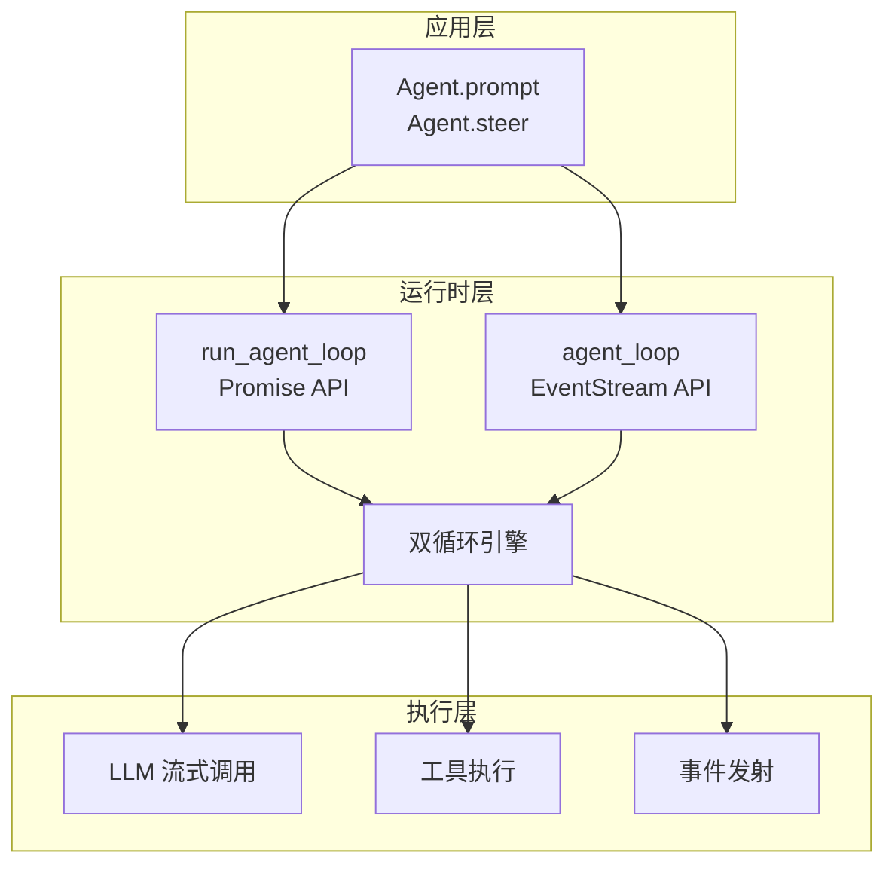
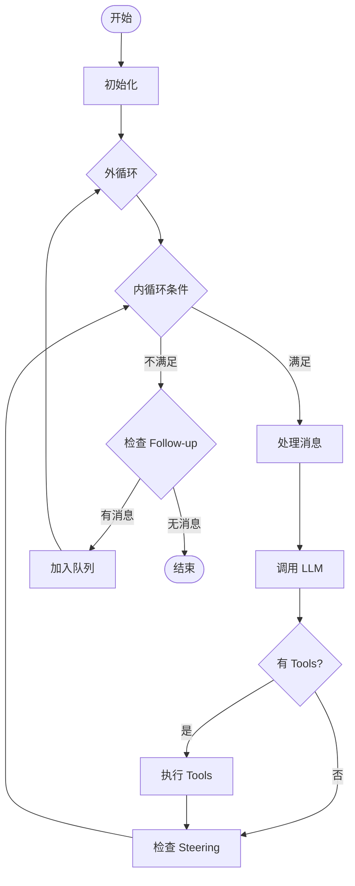
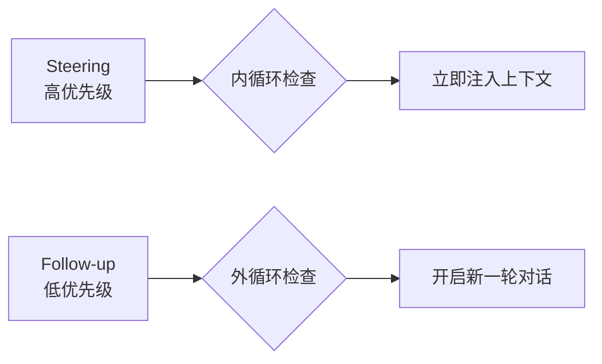

# Agent 架构设计

> 理解 `packages/agent` 的核心架构和设计理念

---

## 1. 设计目标

Agent 模块旨在提供 **流式、可插队、多轮对话** 的 AI 助手运行时：

| 特性 | 说明 | 场景 |
|------|------|------|
| **流式响应** | 实时消费 LLM 输出 | UI 实时显示生成内容 |
| **插队机制** | 用户可在等待期间插入消息 | Tool 执行时用户改变主意 |
| **多轮对话** | 支持连续的问答交互 | 复杂任务的多轮澄清 |
| **工具调用** | 顺序或并行执行外部工具 | 计算、查询、操作等 |

---

## 2. 架构总览

### 2.1 整体架构图



**关键理解**：
- **应用层**：开发者通过 `Agent` 类或直接使用 Loop 函数
- **运行时层**：核心双循环引擎，支持两种 API 风格
- **执行层**：实际的 LLM 调用和工具执行

---

### 2.2 双循环结构

这是 Agent 最核心的设计模式：



**两层含义**：

| 层级 | 职责 | 触发条件 |
|------|------|---------|
| **外循环** | 处理 Follow-up 消息 | 用户在对话结束后发送新消息 |
| **内循环** | 处理 Tools + Steering | 有 Tool 调用或 Steering 消息 |

**为什么需要双循环？**

1. **内循环**：处理单次对话的复杂性（Tool 调用 → 结果 → 可能继续 Tool）
2. **外循环**：处理对话的延续性（一轮结束 → 新一轮开始）

---

### 2.3 三大子系统

#### 2.3.1 消息队列系统

管理两类消息的优先级队列：



#### 2.3.2 事件发射系统

标准化的 AgentEvent 流：

```
agent_start
  └── turn_start
        ├── message_start
        ├── message_update (多次)
        ├── message_end
        ├── tool_execution_start
        ├── tool_execution_end
        └── turn_end
  └── agent_end
```

#### 2.3.3 工具执行系统

支持两种执行模式：

| 模式 | 特点 | 适用场景 |
|------|------|---------|
| **顺序执行** | 一个接一个，有依赖关系 | 后一个 Tool 需要前一个结果 |
| **并行执行** | 同时执行，提高效率 | 独立的多个 Tool 调用 |

---

## 3. 核心概念

### 3.1 AgentContext

运行时上下文，包含：

- **system_prompt**: 系统级指令
- **messages**: 对话历史（包含 user、assistant、toolResult）
- **tools**: 可用的工具列表

### 3.2 AgentLoopConfig

循环配置，包含：

- **model**: 使用的 LLM 模型
- **stream_fn**: 流式调用函数
- **tool_execution**: 执行模式（sequential/parallel）
- **get_steering_messages**: 获取插队消息的回调
- **get_follow_up_messages**: 获取后续消息的回调
- **before/after_tool_call**: Tool 调用前后的 Hook

### 3.3 AgentState

Agent 的运行时状态：

- **messages**: 完整对话历史
- **pending_messages**: 待处理的 Steering 消息
- **running**: 是否正在运行
- **thinking_level**: 思考等级

---

## 4. API 设计

提供两套 API 满足不同需求：

### 4.1 Promise API

适合简单场景，直接等待结果：

```python
# 伪代码
messages = await run_agent_loop(
    prompts=[user_message],
    context=context,
    config=config,
    emit=event_handler
)
```

### 4.2 EventStream API

适合需要实时消费事件的场景：

```python
# 伪代码
stream = agent_loop(prompts, context, config)

async for event in stream:
    if event.type == "message_update":
        # 实时更新 UI
        update_ui(event.message)

messages = await stream.result()
```

---

## 5. 与 Pi-Mono 的对比

| 方面 | Pi-Mono (TypeScript) | Py-Mono (Python) | 状态 |
|------|---------------------|------------------|------|
| **双循环结构** | ✅ 外循环 + 内循环 | ✅ 完全对齐 | 一致 |
| **API 风格** | Promise + EventStream | Promise + EventStream | 一致 |
| **消息队列** | Steering + Follow-up | Steering + Follow-up | 一致 |
| **事件类型** | 完整的生命周期 | 完整的生命周期 | 一致 |
| **实现细节** | `runningPromise` | `asyncio.Event` | 语言差异 |

**结论**：架构设计完全一致，仅语言实现细节不同。

---

## 6. 关键设计决策

### 6.1 为什么用双循环？

**单层循环的问题**：
- 如果只有内循环，无法优雅处理"对话结束后用户发新消息"
- 如果只有外循环，Tool 调用链会显得混乱

**双循环的优势**：
- 内循环专注处理单次对话的复杂性
- 外循环专注管理对话的生命周期

### 6.2 为什么区分 Steering 和 Follow-up？

**时序差异**：
- **Steering**：在 Tool 执行期间发送，需要立即响应
- **Follow-up**：在对话结束后发送，开启新一轮

**优先级差异**：
- Steering 是"插队"，高优先级
- Follow-up 是"续话"，正常优先级

### 6.3 为什么提供两套 API？

| API 类型 | 使用场景 | 优势 |
|---------|---------|------|
| Promise | 简单脚本、后台任务 | 代码简洁 |
| EventStream | UI 应用、实时展示 | 事件驱动 |

---

## 7. 下一步阅读

- [02-agent-loop-internals.md](02-agent-loop-internals.md) - 循环内部实现细节
- [03-message-queue-system.md](03-message-queue-system.md) - Steering 与 Follow-up 详解
