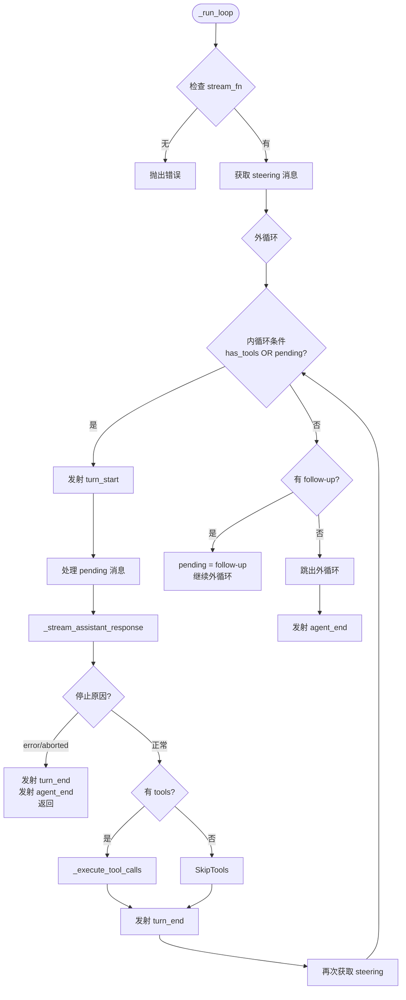
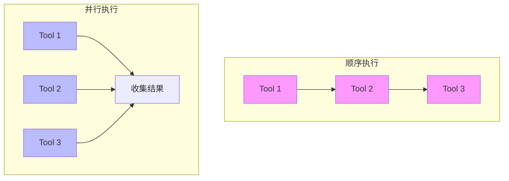
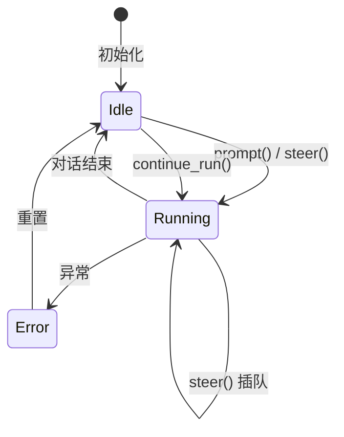

# Agent 循环内部机制

> 深入理解 `agent_loop.py` 的实现细节

---

## 1. 入口函数

### 1.1 run_agent_loop

**职责**：启动全新的 Agent 对话

```python
# 伪代码
async def run_agent_loop(prompts, context, config, emit):
    # 1. 初始化新消息列表
    new_messages = list(prompts)
    
    # 2. 构建当前上下文（复制 + 合并 prompts）
    current_context = AgentContext(
        system_prompt=context.system_prompt,
        messages=context.messages + prompts,
        tools=context.tools
    )
    
    # 3. 发射开始事件
    emit(agent_start)
    emit(turn_start)
    
    # 4. 处理初始 prompts
    for prompt in prompts:
        emit(message_start, prompt)
        emit(message_end, prompt)
    
    # 5. 进入主循环
    await _run_loop(current_context, new_messages, config, emit)
    
    return new_messages
```

**关键理解**：
- `prompts` 会立即成为 `new_messages` 的一部分
- 上下文是复制的，不会修改原始 context
- 初始 prompts 也会发射 message_start/end 事件

### 1.2 run_agent_loop_continue

**职责**：从现有上下文继续对话

```python
# 伪代码
async def run_agent_loop_continue(context, config, emit):
    # 1. 验证上下文（最后一条不能是 assistant）
    if 最后一条是 assistant:
        raise 错误
    
    # 2. 从空 new_messages 开始
    new_messages = []
    
    # 3. 直接复用 context（不复制 prompts）
    current_context = 复制 context
    
    # 4. 发射开始事件
    emit(agent_start)
    emit(turn_start)
    
    # 5. 进入主循环
    await _run_loop(current_context, new_messages, config, emit)
    
    return new_messages
```

**与 run_agent_loop 的区别**：

| 方面 | run_agent_loop | run_agent_loop_continue |
|------|---------------|------------------------|
| **初始消息** | 需要传入 prompts | 使用 context 已有消息 |
| **new_messages** | 包含 prompts | 从空开始 |
| **使用场景** | 开始新对话 | 继续已有对话 |

---

## 2. 主循环逻辑

### 2.1 _run_loop 概览



### 2.2 内循环的核心逻辑

```python
# 伪代码
while has_more_tool_calls or pending_messages:
    # 1. 处理 steering 消息（插队）
    if pending_messages:
        for msg in pending_messages:
            # 注入到 LLM 上下文
            current_context.messages.append(msg)
            new_messages.append(msg)
            emit(message_start, msg)
            emit(message_end, msg)
        pending_messages = []
    
    # 2. 调用 LLM 获取响应
    message = await _stream_assistant_response(...)
    new_messages.append(message)
    
    # 3. 检查是否出错
    if message.stop_reason in ("error", "aborted"):
        emit(turn_end, message, [])
        emit(agent_end, new_messages)
        return
    
    # 4. 检查 tool calls
    tool_calls = [c for c in message.content if c.type == "toolCall"]
    has_more_tool_calls = len(tool_calls) > 0
    
    # 5. 执行 tools（如果有）
    if has_more_tool_calls:
        tool_results = await _execute_tool_calls(...)
        for result in tool_results:
            current_context.messages.append(result)
            new_messages.append(result)
    
    # 6. 发射 turn_end
    emit(turn_end, message, tool_results)
    
    # 7. 🔴 关键点：再次检查 steering
    # 允许用户在 tool 执行期间发送消息
    pending_messages = await get_steering_messages()
```

**关键理解**：
- 内循环条件 `has_tools OR pending` 确保：
  - 有 Tool 就继续处理
  - 有 Steering 消息也继续（插队机制）
- 每次循环结束都检查 steering，这是"插队"的核心

---

## 3. 流式响应处理

### 3.1 _stream_assistant_response 流程

```mermaid
sequenceDiagram
    participant Loop as _run_loop
    participant Stream as _stream_assistant
    participant LLM as LLM Provider
    participant Event as 事件发射
    
    Loop->>Stream: 调用
    Stream->>Stream: 1. 转换消息格式
    Stream->>Stream: 2. 获取 API Key
    Stream->>LLM: 3. 发起流式请求
    LLM-->>Stream: 4. 返回 EventStream
    
    loop 异步迭代事件
        Stream->>LLM: 读取下一个事件
        LLM-->>Stream: 事件（start/delta/end/done）
        
        alt 事件类型
            Stream->>Event: start → message_start
            Stream->>Event: delta → message_update
            Stream->>Event: end → 更新 partial
            Stream->>Event: done → message_end
        end
    end
    
    Stream->>LLM: 获取最终结果
    LLM-->>Stream: AssistantMessage
    Stream-->>Loop: 返回最终结果
```

### 3.2 事件转发逻辑

```python
# 伪代码
async for event in llm_stream:
    event_type = event.type
    
    if event_type == "start":
        # LLM 开始生成，创建 partial message
        partial_message = event.partial
        context.messages.append(partial_message)
        emit(message_start, partial_message)
    
    elif event_type in ("text_delta", "thinking_delta", "toolcall_delta"):
        # 增量更新，更新 partial 并转发
        partial_message = event.partial
        context.messages[-1] = partial_message  # 更新最后一条
        emit(message_update, {
            "message": partial_message,
            "assistant_message_event": event  # 保留原始事件
        })
    
    elif event_type == "done":
        # 流结束，获取最终结果
        final_message = await llm_stream.result()
        context.messages[-1] = final_message
        emit(message_end, final_message)
        return final_message
```

**关键理解**：
- `partial_message` 是流式构建中的消息快照
- 每次 delta 事件都会更新 `context.messages` 的最后一条
- 这样确保上下文始终是最新的（用于后续 Tool 调用）

---

## 4. 工具执行系统

### 4.1 执行模式对比



### 4.2 执行流程

```python
# 伪代码
async def _execute_tool_calls(context, message, config):
    tool_calls = 提取 message 中的 toolCall
    
    if config.tool_execution == "sequential":
        # 顺序执行：一个接一个
        results = []
        for tool_call in tool_calls:
            result = await _execute_single_tool(tool_call)
            results.append(result)
        return results
    else:
        # 并行执行：同时启动所有
        tasks = []
        for tool_call in tool_calls:
            task = _execute_single_tool(tool_call)
            tasks.append(task)
        
        results = await asyncio.gather(*tasks)
        return results
```

### 4.3 单个 Tool 执行流程

```python
# 伪代码
async def _execute_single_tool(context, tool_call, config):
    tool_name = tool_call.name
    tool_args = tool_call.arguments
    
    # 1. 发射开始事件
    emit(tool_execution_start, tool_name, tool_args)
    
    # 2. 查找工具
    tool = 从 context.tools 中查找 tool_name
    
    # 3. 参数验证
    validated_args = validate_arguments(tool, tool_args)
    
    # 4. 执行 before_hook（如果配置）
    if config.before_tool_call:
        before_result = await config.before_tool_call(...)
        if before_result.block:
            # 被拦截，返回错误
            return error_result
    
    # 5. 执行工具
    try:
        result = await tool.execute(tool_call.id, validated_args)
        is_error = False
    except Exception as e:
        result = error_result(str(e))
        is_error = True
    
    # 6. 执行 after_hook（如果配置）
    if config.after_tool_call:
        after_result = await config.after_tool_call(...)
        # 可能修改 result
    
    # 7. 发射结束事件
    emit(tool_execution_end, tool_name, result, is_error)
    
    # 8. 创建 ToolResultMessage
    tool_result_msg = ToolResultMessage(
        tool_call_id=tool_call.id,
        tool_name=tool_name,
        content=result.content,
        is_error=is_error
    )
    
    emit(message_start, tool_result_msg)
    emit(message_end, tool_result_msg)
    
    return tool_result_msg
```

---

## 5. Agent 类的状态管理

### 5.1 状态转换



### 5.2 wait_for_idle 机制

```python
# 伪代码
class Agent:
    def __init__(self):
        self._idle_event = asyncio.Event()
        self._idle_event.set()  # 初始状态为 idle
    
    async def prompt(self, text):
        self._idle_event.clear()  # 标记为 running
        try:
            # 启动 loop
            await run_agent_loop(...)
        finally:
            self._idle_event.set()  # 标记为 idle
    
    async def wait_for_idle(self):
        # 等待当前对话完成
        await self._idle_event.wait()
```

**关键理解**：
- `asyncio.Event()` 是线程安全的信号量
- `clear()` 表示"正在运行"
- `set()` 表示"已完成"
- `wait()` 阻塞直到完成

---

## 6. 与 Pi-Mono 的实现差异

| 方面 | Pi-Mono (TS) | Py-Mono (Python) | 说明 |
|------|-------------|------------------|------|
| **循环结构** | 完全相同的双循环 | 完全相同的双循环 | 架构一致 |
| **状态管理** | `runningPromise` | `asyncio.Event` | 语言惯用法 |
| **消息处理** | 同样的 pending 队列 | 同样的 pending 队列 | 逻辑一致 |
| **事件发射** | 同样的 AgentEvent | 同样的 AgentEvent | 类型一致 |
| **工具执行** | 同样的顺序/并行 | 同样的顺序/并行 | 行为一致 |

**结论**：实现逻辑完全一致，只是用 Python 的语法表达了相同的算法。

---

## 7. 常见问题

### Q1: 为什么需要复制 context？

**回答**：避免副作用。Agent 可能同时处理多个对话，复制确保每个对话独立。

### Q2: 为什么 tool execution 后要检查 steering？

**回答**：Tool 执行可能需要时间（几秒），用户可能在此时发送新消息。

### Q3: 如何处理 LLM 流中断？

**回答**：通过 `signal` 参数传递 AbortSignal，在 `_stream_assistant_response` 中检查取消状态。

---

## 8. 下一步阅读

- [03-message-queue-system.md](03-message-queue-system.md) - Steering 与 Follow-up 详解
