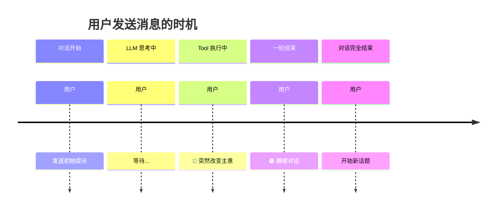
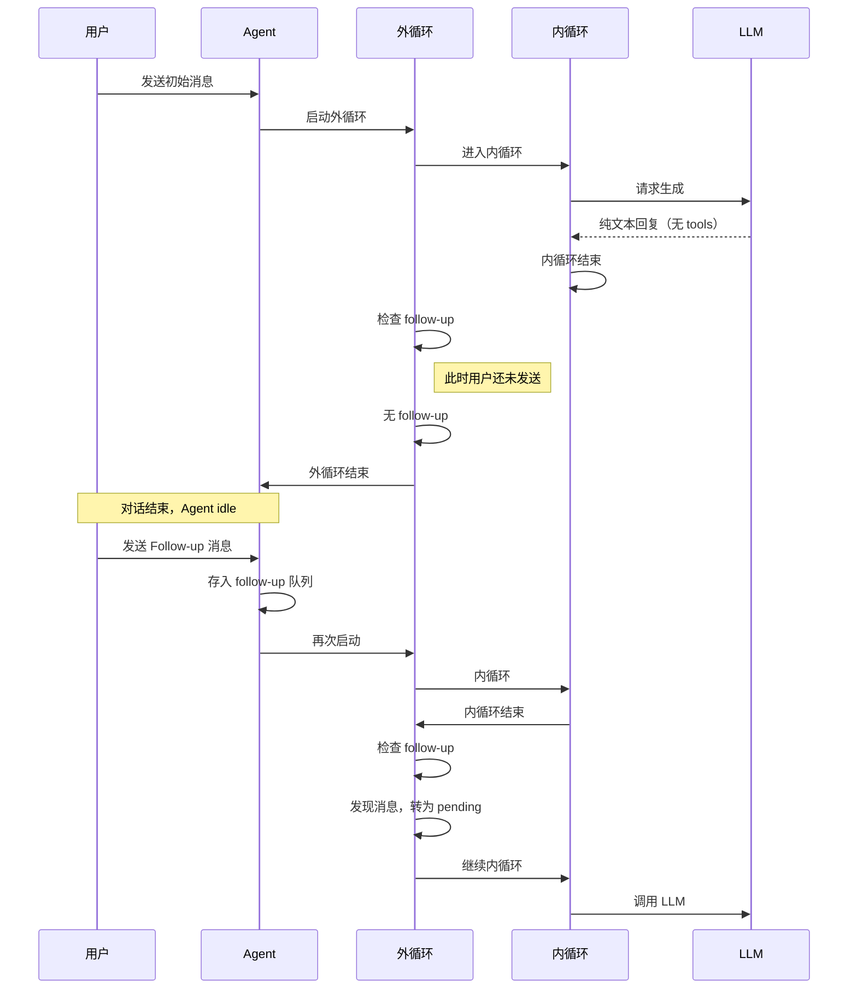
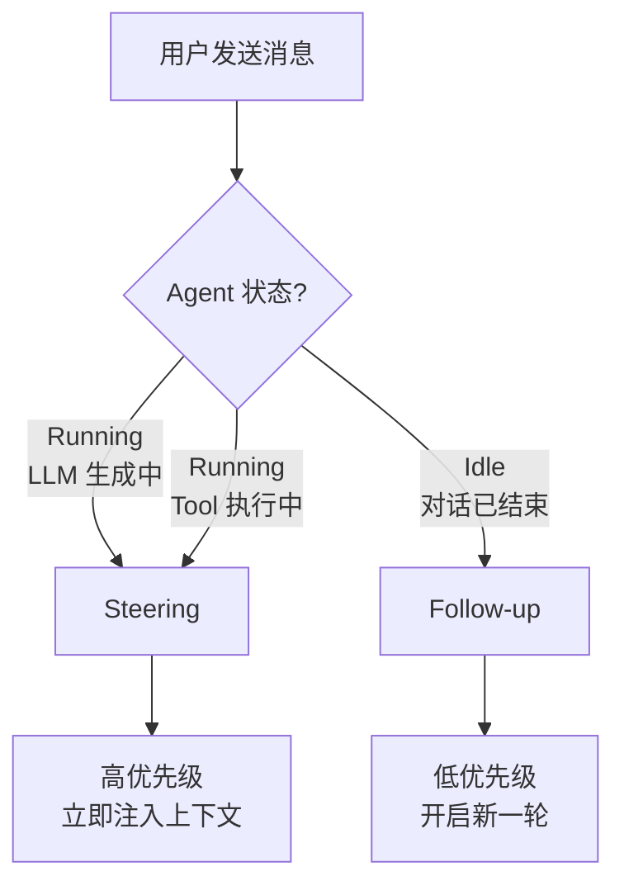
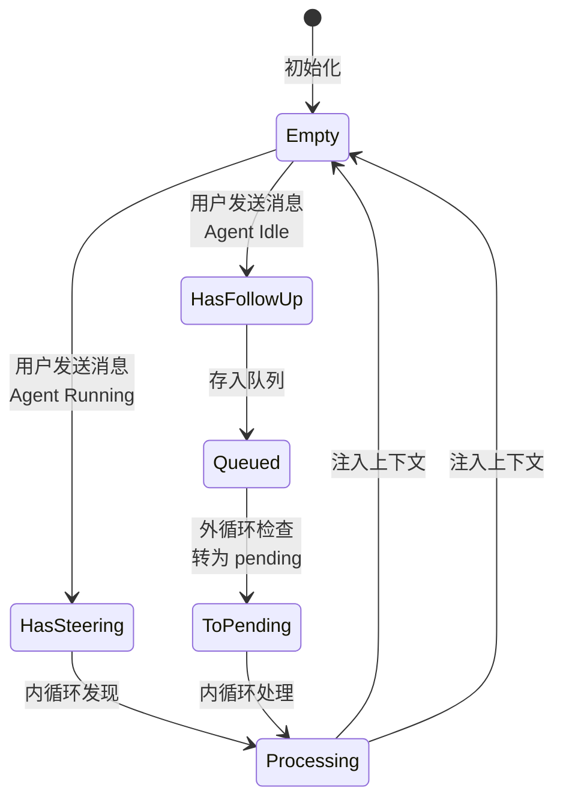
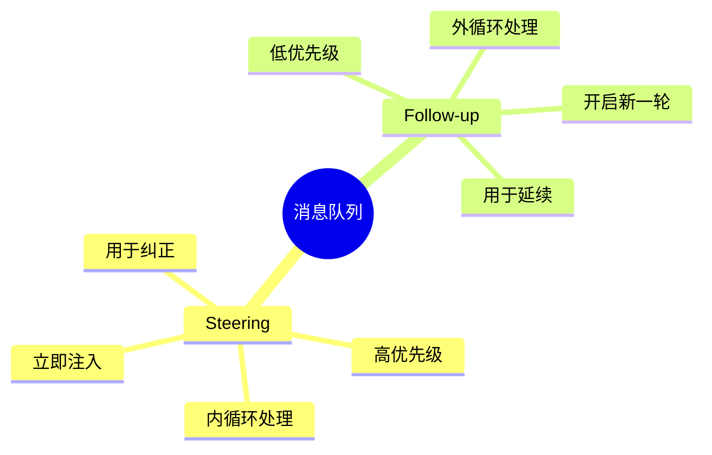

# 消息队列系统：Steering 与 Follow-up

> 深入理解 Agent 的两级消息队列机制

---

## 1. 设计动机

### 1.1 用户行为的复杂性

在 AI 对话中，用户可能在以下时机发送消息：



**问题**：
- 在 **Tool 执行中** 发送的消息需要立即响应（插队）
- 在 **一轮结束** 后发送的消息是正常延续
- 这两种消息的处理时序完全不同

### 1.2 解决方案：两级队列

| 队列类型 | 优先级 | 处理时机 | 语义 |
|---------|--------|---------|------|
| **Steering** | 🔴 高 | 内循环每次迭代 | 插队，立即响应 |
| **Follow-up** | 🟢 低 | 外循环检查点 | 续话，开启新一轮 |

---

## 2. Steering 机制详解

### 2.1 什么是 Steering？

**定义**：用户在等待 LLM 响应或 Tool 执行期间发送的"插队"消息。

**典型场景**：

```
用户: "查询北京的天气"
    ↓
Agent: 正在调用 weather API...
    ↓
（用户突然想到）
用户: "等等，查上海吧"  ← 🔴 这是 Steering
    ↓
Agent: 取消北京查询，开始查询上海
```

### 2.2 Steering 的处理流程

```mermaid
sequenceDiagram
    participant User as 用户
    participant Agent as Agent
    participant Loop as 内循环
    participant LLM as LLM
    
    User->>Agent: 发送初始消息
    Agent->>Loop: 启动内循环
    Loop->>LLM: 请求生成
    
    LLM-->>Loop: 需要调用 Tool
    Loop->>Loop: 开始执行 Tool
    
    Note over User,LLM: Tool 执行可能需要几秒
    
    User->>Agent: 发送 Steering 消息
    Agent->>Agent: 存入 pending 队列
    
    Loop->>Loop: Tool 执行完成
    Loop->>Loop: 检查 steering
    Loop->>Loop: 发现 pending 消息
    Loop->>LLM: 注入 steering 后重新调用
```

### 2.3 代码层面的实现

```python
# 伪代码：内循环中的 steering 检查

async def _run_loop(...):
    # 初始化：获取可能已有的 steering
    pending_messages = await config.get_steering_messages()
    
    while has_tools or pending_messages:
        
        # 🔴 关键：优先处理 steering
        if pending_messages:
            for msg in pending_messages:
                # 注入到 LLM 上下文
                current_context.messages.append(msg)
                new_messages.append(msg)
                emit(message_start, msg)
                emit(message_end, msg)
            pending_messages = []
        
        # 调用 LLM
        message = await _stream_assistant_response(...)
        
        # 处理 tool calls...
        
        # 🔴 关键点：再次检查 steering
        # 允许用户在 tool 执行期间发送消息
        pending_messages = await config.get_steering_messages()
```

**关键理解**：
- `pending_messages` 在 **内循环条件** 中，所以只要有 steering 就会继续循环
- 每次循环结束都检查 steering，确保不遗漏
- Steering 消息被 **注入到当前上下文**，LLM 能立即看到

### 2.4 Steering 的时序效果

```
时间线：
━━━━━━━━━━━━━━━━━━━━━━━━━━━━━━━━━━━━━━━━━━
t0: 用户发送 "计算 2+3"
t1: LLM 生成 toolCall(calculate)
t2: 开始执行 Tool
    （Tool 执行中，用户等待）
t3: 用户发送 "等等，算 2+4"  ← Steering
     ↓ 存入 pending
t4: Tool 执行完成
     ↓ 检查 steering，发现 pending
t5: 注入 steering 消息
     ↓ 重新调用 LLM
t6: LLM 生成 toolCall(calculate)
t7: 执行 Tool
t8: LLM 回复 "结果是 6"
━━━━━━━━━━━━━━━━━━━━━━━━━━━━━━━━━━━━━━━━━━
```

**结果**：用户的新消息被立即响应，之前的 Tool 结果被丢弃。

---

## 3. Follow-up 机制详解

### 3.1 什么是 Follow-up？

**定义**：一轮对话完全结束后，用户发送的后续消息。

**典型场景**：

```
用户: "今天天气怎么样？"
Agent: "今天北京晴，25度"
    ↓ 一轮结束
用户: "那明天呢？"  ← 🟢 这是 Follow-up
Agent: 开启新一轮，查询明天天气
```

### 3.2 Follow-up 的处理流程



### 3.3 代码层面的实现

```python
# 伪代码：外循环中的 follow-up 检查

async def _run_loop(...):
    pending_messages = await config.get_steering_messages()
    
    # 🔴 外循环
    while True:
        has_tools = True
        
        # 🔴 内循环
        while has_tools or pending_messages:
            # 处理 steering、调用 LLM、执行 tools...
            pass
        
        # 内循环结束：没有 tools 且没有 steering
        # 🟢 检查 follow-up
        follow_up_messages = await config.get_follow_up_messages()
        
        if follow_up_messages:
            # 转为 steering，让内循环处理
            pending_messages = follow_up_messages
            continue  # 继续外循环
        
        # 没有 follow-up，完全结束
        break
    
    emit(agent_end, messages)
```

**关键理解**：
- Follow-up 在 **外循环检查点** 处理
- Follow-up 被 **转为 pending**，然后进入内循环
- 这样复用了内循环的逻辑，代码简洁

### 3.4 Follow-up 的时序效果

```
时间线：
━━━━━━━━━━━━━━━━━━━━━━━━━━━━━━━━━━━━━━━━━━
t0: 用户发送 "今天天气？"
t1: LLM 回复 "今天晴"
     ↓ 内循环结束
     ↓ 检查 follow-up：无
     ↓ 外循环结束
     
t2: Agent 进入 idle 状态
     （用户可以发新消息）

t3: 用户发送 "明天呢？"  ← Follow-up
     ↓ 存入 follow-up 队列

t4: Agent 检测到 follow-up
     ↓ 转为 pending
     ↓ 启动新一轮
     
t5: 内循环处理 pending
     ↓ 调用 LLM
t6: LLM 回复 "明天多云"
━━━━━━━━━━━━━━━━━━━━━━━━━━━━━━━━━━━━━━━━━━
```

**结果**：对话自然延续，上下文保持完整。

---

## 4. Steering vs Follow-up 对比

### 4.1 决策矩阵



### 4.2 详细对比

| 特性 | Steering | Follow-up |
|------|----------|-----------|
| **触发时机** | Agent Running 期间 | Agent Idle 后 |
| **处理位置** | 内循环 | 外循环检查点 |
| **优先级** | 高（插队） | 低（续话） |
| **上下文处理** | 注入当前上下文 | 开启新一轮对话 |
| **语义** | "等等，我说错了" | "继续聊" |
| **实现方式** | `get_steering_messages()` | `get_follow_up_messages()` |

### 4.3 队列状态流转



---

## 5. 实际使用场景

### 5.1 代码中的配置

```python
# 伪代码：配置消息队列回调

async def get_steering_messages():
    """获取插队消息"""
    # 从 UI 输入框获取实时消息
    if ui.has_pending_input():
        return [UserMessage(text=ui.get_input())]
    return []

async def get_follow_up_messages():
    """获取后续消息"""
    # 从对话历史获取
    if conversation.has_new_messages():
        return conversation.get_new_messages()
    return []

config = AgentLoopConfig(
    model=model,
    stream_fn=stream_fn,
    get_steering_messages=get_steering_messages,
    get_follow_up_messages=get_follow_up_messages,
)
```

### 5.2 Agent 类中的集成

```python
# 伪代码：Agent 类的消息处理

class Agent:
    def __init__(self):
        self._steering_queue = []
        self._follow_up_queue = []
        self._config = None
    
    def steer(self, text):
        """用户插队"""
        if self._running:
            # Agent 运行中，加入 steering
            self._steering_queue.append(UserMessage(text=text))
        else:
            # Agent 已结束，当作 follow-up
            self._follow_up_queue.append(UserMessage(text=text))
            self._maybe_continue()
    
    def _get_steering_callback(self):
        async def callback():
            messages = self._steering_queue.copy()
            self._steering_queue.clear()
            return messages
        return callback
```

---

## 6. 与 Pi-Mono 的对比

| 方面 | Pi-Mono (TypeScript) | Py-Mono (Python) | 一致性 |
|------|---------------------|------------------|--------|
| **队列命名** | `getSteeringMessages` | `get_steering_messages` | ✅ 逻辑一致 |
| **处理位置** | 内循环 + 外循环 | 内循环 + 外循环 | ✅ 完全一致 |
| **优先级** | Steering > Follow-up | Steering > Follow-up | ✅ 完全一致 |
| **实现方式** | Promise + 数组 | asyncio + 列表 | 语言差异 |
| **时序保证** | 每次循环检查 | 每次循环检查 | ✅ 完全一致 |

**结论**：消息队列的设计完全一致，只是用 Python 的语法表达了相同的算法。

---

## 7. 最佳实践

### 7.1 何时使用 Steering？

✅ **适合场景**：
- 用户发现指令有误，需要纠正
- Tool 执行时间过长，用户想取消/修改
- 实时交互场景（如语音助手）

❌ **不适合场景**：
- 普通的多轮对话（用 Follow-up）
- 一次性任务（无需插队）

### 7.2 实现建议

1. **UI 层**：
   - 提供明显的"发送"按钮
   - 区分"插队"和"续话"的视觉提示

2. **回调实现**：
   - Steering 回调要快（立即返回）
   - Follow-up 回调可以稍慢（检查队列）

3. **错误处理**：
   - Steering 消息也要验证格式
   - 防止恶意插队导致循环无法结束

---

## 8. 总结

**核心设计原则**：

> **Steering 是"插队"，Follow-up 是"续话"**



**记住三点**：

1. **两级队列**：Steering（高）+ Follow-up（低）
2. **双循环处理**：内循环（插队）+ 外循环（续话）
3. **时序保证**：每次循环都检查，确保不遗漏

---

## 9. 相关文档

- [01-agent-architecture.md](01-agent-architecture.md) - 整体设计
- [02-agent-loop-internals.md](02-agent-loop-internals.md) - 循环内部机制
