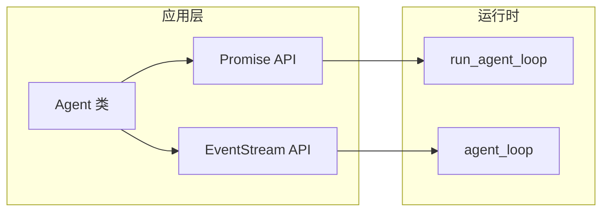
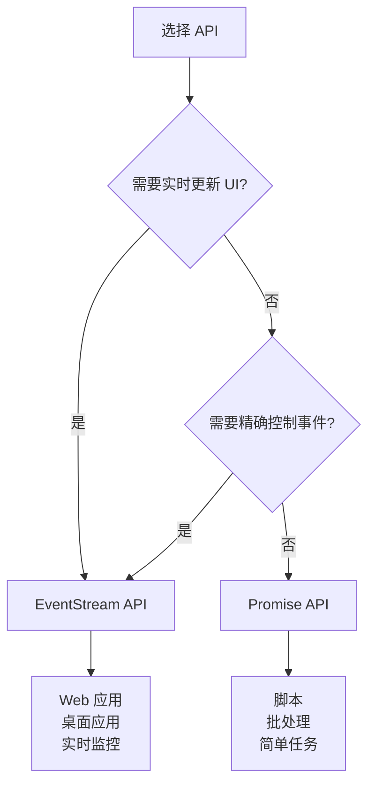

# API 使用指南

> Promise API vs EventStream API：选择合适的 Agent 接口

---

## 1. API 概览

Agent 提供两套 API，满足不同场景需求：



| API 类型 | 函数/类 | 适用场景 | 特点 |
|---------|--------|---------|------|
| **Promise API** | `run_agent_loop` | 后台任务、脚本 | 简洁、阻塞等待 |
| **EventStream API** | `agent_loop` | UI 应用、实时监控 | 事件驱动、流式消费 |

---

## 2. Promise API

### 2.1 基本用法

适合简单场景，直接等待结果：

```python
from agent import run_agent_loop, AgentContext, AgentLoopConfig

# 伪代码：配置
context = AgentContext(
    system_prompt="你是一个助手",
    messages=[],
    tools=[]
)

config = AgentLoopConfig(
    model=model,
    stream_fn=stream_fn
)

# 发送消息，等待完成
messages = await run_agent_loop(
    prompts=[user_message],
    context=context,
    config=config,
    emit=event_handler  # 可选的事件回调
)

# 获取结果
print(f"产生 {len(messages)} 条新消息")
```

### 2.2 Agent 类的封装

更简洁的高层接口：

```python
from agent import Agent, AgentOptions

# 创建 Agent
agent = Agent(AgentOptions(stream_fn=stream_fn))
agent.set_model(model)

# 订阅事件（可选）
def on_event(event):
    print(f"事件: {event['type']}")

agent.subscribe(on_event)

# 发送消息
await agent.prompt("你好")

# 等待完成
await agent.wait_for_idle()

# 获取历史
print(f"对话历史: {len(agent.state.messages)} 条")
```

### 2.3 优点和局限

**优点**：
- ✅ 代码简洁，易于理解
- ✅ 适合脚本和后台任务
- ✅ 自动管理事件订阅

**局限**：
- ❌ 无法实时消费事件
- ❌ 不适合 UI 实时更新
- ❌ 事件处理是回调式的

---

## 3. EventStream API

### 3.1 基本用法

适合需要实时消费事件的场景：

```python
from agent import agent_loop

# 创建事件流
stream = agent_loop(
    prompts=[user_message],
    context=context,
    config=config,
    stream_fn=stream_fn
)

# 实时消费事件
async for event in stream:
    event_type = event.get("type")
    
    if event_type == "message_update":
        # 更新 UI
        update_ui(event["message"])
    elif event_type == "tool_execution_start":
        # 显示工具调用
        show_tool_call(event["tool_name"])
    elif event_type == "agent_end":
        # 对话结束
        break

# 获取最终结果
messages = await stream.result()
```

### 3.2 事件过滤

只关注特定事件：

```python
async for event in stream:
    # 只处理 message_update
    if event.get("type") == "message_update":
        inner_event = event.get("assistant_message_event")
        
        if inner_event.type == "text_delta":
            # 文本增量
            print(inner_event.delta, end="")
        elif inner_event.type == "toolcall_start":
            # 工具调用开始
            print(f"\n🔧 调用 {inner_event.tool_name}")
```

### 3.3 优点和局限

**优点**：
- ✅ 实时事件消费
- ✅ 完美支持 UI 更新
- ✅ 流式展示生成过程
- ✅ 精确控制事件处理

**局限**：
- ❌ 代码稍复杂
- ❌ 需要手动管理流
- ❌ 不适合简单脚本

---

## 4. API 对比详解

### 4.1 代码量对比

**Promise API**（简洁）：
```python
# 5 行代码完成
agent = Agent(options)
agent.set_model(model)
agent.subscribe(handler)
await agent.prompt("你好")
await agent.wait_for_idle()
```

**EventStream API**（灵活）：
```python
# 15+ 行代码，但可控
stream = agent_loop(...)
async for event in stream:
    match event["type"]:
        case "message_update":
            handle_update(event)
        case "tool_execution_start":
            handle_tool_start(event)
        # ... 更多处理
messages = await stream.result()
```

### 4.2 事件消费对比

| 特性 | Promise API | EventStream API |
|------|------------|-----------------|
| **消费方式** | 回调函数 | async for 迭代 |
| **实时性** | 中等 | 高 |
| **过滤能力** | 有限 | 完全可控 |
| **UI 更新** | 间接 | 直接 |
| **代码复杂度** | 低 | 中 |

### 4.3 性能对比

```
时间线对比：

Promise API:
━━━━━━━━━━━━━━━━━━━━━━━━━━━━━━━━━━
调用 → 等待 → 完成 → 回调处理事件
━━━━━━━━━━━━━━━━━━━━━━━━━━━━━━━━━━
        ↑ 事件批量到达

EventStream API:
━━━━━━━━━━━━━━━━━━━━━━━━━━━━━━━━━━
调用 → event1 → event2 → event3 → 完成
━━━━━━━━━━━━━━━━━━━━━━━━━━━━━━━━━━
      ↑ 事件实时到达，立即处理
```

**结论**：EventStream API 延迟更低，但 CPU 使用率稍高。

---

## 5. 场景选择指南

### 5.1 使用 Promise API 的场景

✅ **适合**：
- 命令行脚本
- 后台批处理任务
- 简单的问答机器人
- 不关心实时更新的场景

**示例**：
```python
# 批量处理文件
async def process_files(files):
    agent = Agent(options)
    
    for file in files:
        await agent.prompt(f"分析文件: {file}")
        await agent.wait_for_idle()
        
    return agent.state.messages
```

### 5.2 使用 EventStream API 的场景

✅ **适合**：
- Web 应用 UI
- 桌面应用（如 Claude Code）
- 需要实时展示生成过程
- 需要精确控制事件处理

**示例**：
```python
# WebSocket 实时推送
async def chat_handler(websocket):
    stream = agent_loop(...)
    
    async for event in stream:
        # 实时推送给客户端
        await websocket.send(json.dumps(event))
        
        if event["type"] == "agent_end":
            break
```

### 5.3 决策树



---

## 6. 混合使用

在某些场景下，可以混合使用两套 API：

```python
# 主流程用 Promise API
agent = Agent(options)

# 但自定义事件处理
def custom_handler(event):
    if event["type"] == "message_update":
        # 实时保存到数据库
        save_to_db(event)
    
    # 继续调用默认处理
    default_handler(event)

agent.subscribe(custom_handler)
await agent.prompt("任务")
```

---

## 7. 与 Pi-Mono 对比

| 特性 | Pi-Mono (TypeScript) | Py-Mono (Python) |
|------|---------------------|------------------|
| Promise API | `runAgentLoop` | `run_agent_loop` |
| EventStream API | `agentLoop` | `agent_loop` |
| Agent 类 | `Agent` | `Agent` |
| 事件类型 | 完全一致 | 完全一致 |
| 使用模式 | 完全一致 | 完全一致 |

**结论**：两套 API 的设计在两种语言中完全一致。

---

## 8. 常见问题

### Q1: 能否在 EventStream 中使用回调？

**A**: 可以，但更推荐使用 async for：

```python
# 方式 1：async for（推荐）
async for event in stream:
    process(event)

# 方式 2：回调（也可以）
def callback(event):
    process(event)

while True:
    event = await stream.__anext__()
    callback(event)
```

### Q2: 如何取消正在进行的对话？

**A**: 使用 AbortSignal：

```python
import asyncio

# Promise API
signal = asyncio.Event()
await run_agent_loop(..., signal=signal)
# 取消：signal.set()

# EventStream API
stream = agent_loop(...)
async for event in stream:
    if should_cancel:
        stream.end([])  # 强制结束
        break
```

### Q3: 两套 API 性能有差异吗？

**A**: 底层实现相同，性能差异主要来自事件消费方式：
- Promise API：事件缓冲后批量处理
- EventStream API：事件立即处理

对于简单场景，差异可以忽略。

---

## 9. 下一步

- [05-examples-explained.md](./05-examples-explained.md) - 示例代码详解
- [06-ai-integration.md](./06-ai-integration.md) - 与 AI 模块集成
