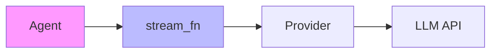
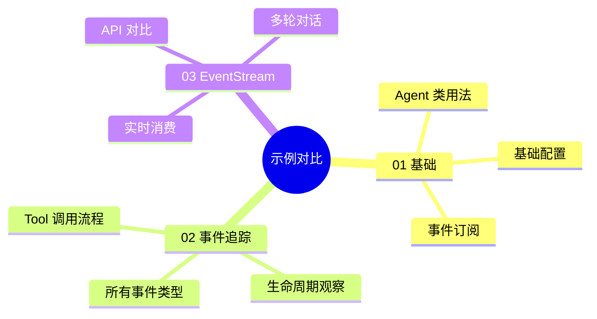

# 示例代码详解

> 深入理解 Agent 的 3 个核心示例

---

## 1. 示例概览

| 示例 | 文件 | 学习目标 | 复杂度 |
|------|------|---------|--------|
| **01** | `01_basic_agent.py` | Agent 基础用法 | ⭐ |
| **02** | `02_event_tracing.py` | 完整事件追踪 | ⭐⭐ |
| **03** | `03_event_stream_api.py` | EventStream API | ⭐⭐⭐ |

---

## 2. 示例 01：基础 Agent

### 2.1 学习目标

- 创建和配置 Agent
- 发送消息并等待响应
- 理解基本的事件订阅

### 2.2 核心代码

```python
# 伪代码：基础流程

# 1. 创建 Provider
provider = KimiProvider()

# 2. 配置 stream 函数
async def stream_fn(model, context, options):
    return provider.stream_simple(model, context, options)

# 3. 创建 Agent
agent = Agent(AgentOptions(stream_fn=stream_fn))
agent.set_model(provider.get_model())

# 4. 订阅事件（可选）
def on_event(event):
    print(f"事件: {event['type']}")

agent.subscribe(on_event)

# 5. 发送消息
await agent.prompt("你好")

# 6. 等待完成
await agent.wait_for_idle()

# 7. 查看结果
print(f"对话历史: {len(agent.state.messages)} 条")
```

### 2.3 关键点解析

**为什么需要 `stream_fn`？**



Agent 本身不直接调用 LLM，而是通过 `stream_fn` 解耦：
- Agent 负责**协调流程**
- Provider 负责**具体实现**
- 可以切换不同 Provider 而不改 Agent 代码

**为什么需要 `wait_for_idle()`？**

```
时间线：
━━━━━━━━━━━━━━━━━━━━━━━━━━━━━
await agent.prompt()    ← 启动任务
     ↓
（立即返回）            ← prompt 是非阻塞的
     ↓
await agent.wait_for_idle()  ← 等待真正完成
━━━━━━━━━━━━━━━━━━━━━━━━━━━━━
```

Agent 的 `prompt()` 是**异步启动**，不会等待对话完成。`wait_for_idle()` 确保对话结束后再继续。

---

## 3. 示例 02：事件追踪

### 3.1 学习目标

- 验证所有事件类型都能正确发出
- 观察 text/thinking/toolcall 的 start/delta/end 事件
- 理解事件的生命周期

### 3.2 核心代码

```python
# 伪代码：事件日志记录器

def create_event_logger():
    event_counts = {}
    
    def on_event(event):
        # 统计事件类型
        event_type = event.get("type")
        event_counts[event_type] = event_counts.get(event_type, 0) + 1
        
        # 详细打印
        if event_type == "message_update":
            inner = event.get("assistant_message_event")
            print(f"  📤 {inner.type}")
        elif event_type == "tool_execution_start":
            print(f"  🔧 开始: {event['tool_name']}")
        elif event_type == "tool_execution_end":
            print(f"  ✅ 完成: {event['tool_name']}")
    
    return on_event, print_summary
```

### 3.3 事件流程分析

**典型 Tool 调用的事件序列**：

```
agent_start
  └── turn_start
        ├── message_start          ← 用户消息
        ├── message_end
        ├── message_start          ← Assistant 开始生成
        ├── message_update
        │     ├── text_start       ← 文本块开始
        │     ├── text_delta       ← 文本增量（多次）
        │     └── text_end         ← 文本块结束
        ├── message_update
        │     ├── toolcall_start   ← 工具调用开始
        │     ├── toolcall_delta   ← 参数增量（多次）
        │     └── toolcall_end     ← 工具调用结束
        ├── message_end
        ├── tool_execution_start   ← 开始执行工具
        ├── tool_execution_end     ← 工具执行完成
        ├── message_start          ← ToolResult 消息
        ├── message_end
        └── turn_end
  └── agent_end
```

### 3.4 关键验证点

示例会验证以下事件是否都被发出：

| 事件组 | 包含事件 | 用途 |
|--------|---------|------|
| **Text** | start/delta/end | 文本流式展示 |
| **Thinking** | start/delta/end | 思考过程展示 |
| **ToolCall** | start/delta/end | 工具调用参数流式解析 |
| **ToolExec** | start/end | 工具执行生命周期 |
| **Lifecycle** | agent/turn/message | 会话结构 |

---

## 4. 示例 03：EventStream API

### 4.1 学习目标

- 使用 EventStream API 消费 Agent 事件
- 对比 Promise API 和 EventStream API
- 理解 agent_loop 和 agent_loop_continue

### 4.2 核心代码

```python
# 伪代码：EventStream 使用

# 创建配置
config = AgentLoopConfig(
    model=provider.get_model(),
    # 注意：不需要传入 stream_fn
)

# 创建 EventStream
stream = agent_loop(
    prompts=[user_message],
    context=context,
    config=config,
    stream_fn=stream_fn  # 作为独立参数传递
)

# 实时消费事件
event_count = 0
async for event in stream:
    event_count += 1
    event_type = event.get("type")
    
    if event_type == "message_update":
        inner = event.get("assistant_message_event")
        print(f"  [{event_count}] {event_type} -> {inner.type}")
    elif event_type in ["tool_execution_start", "tool_execution_end"]:
        print(f"  [{event_count}] {event_type} -> {event['tool_name']}")

# 获取最终结果
messages = await stream.result()
```

### 4.3 Promise vs EventStream 对比

```python
# Promise API 方式
agent = Agent(options)
agent.subscribe(handler)
await agent.prompt("你好")
await agent.wait_for_idle()

print("对话完成")
```

```python
# EventStream API 方式
stream = agent_loop([msg], context, config, stream_fn)

async for event in stream:
    # 实时处理每个事件
    update_ui(event)
    
    if event["type"] == "agent_end":
        print("对话完成")

messages = await stream.result()
```

**关键差异**：

| 方面 | Promise | EventStream |
|------|---------|-------------|
| **代码量** | 少 | 多 |
| **实时性** | 低 | 高 |
| **控制能力** | 弱 | 强 |
| **适用场景** | 脚本 | UI |

### 4.4 agent_loop_continue 的使用

```python
# 第一次调用
stream1 = agent_loop([msg1], context, config, stream_fn)
async for event in stream1:
    ...
messages1 = await stream1.result()

# 继续对话（复用 context）
stream2 = agent_loop_continue(
    context=context,  # 包含之前的对话
    config=config,
    stream_fn=stream_fn
)
async for event in stream2:
    ...
messages2 = await stream2.result()
```

**使用场景**：
- 用户分多次发送消息
- 需要在对话中途插入逻辑
- 长时间对话的分段处理

---

## 5. 示例对比总结



---

## 6. 如何选择示例学习？

| 你的需求 | 学习示例 | 时间 |
|---------|---------|------|
| 快速上手 Agent | 01 | 5 分钟 |
| 理解事件系统 | 02 | 15 分钟 |
| 开发 UI 应用 | 03 | 20 分钟 |
| 完整掌握 | 全部 | 40 分钟 |

---

## 7. 运行示例

```bash
# 基础示例
uv run python examples/01_basic_agent.py

# 事件追踪
uv run python examples/02_event_tracing.py

# EventStream API
uv run python examples/03_event_stream_api.py
```

---

## 8. 下一步

- [06-ai-integration.md](./06-ai-integration.md) - 与 AI 模块集成
- [07-tool-development.md](./07-tool-development.md) - 工具开发指南
