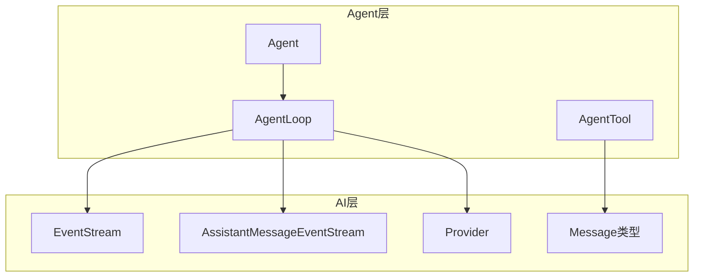
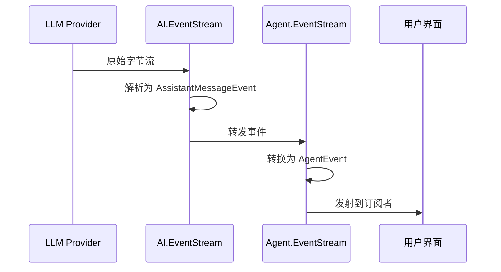
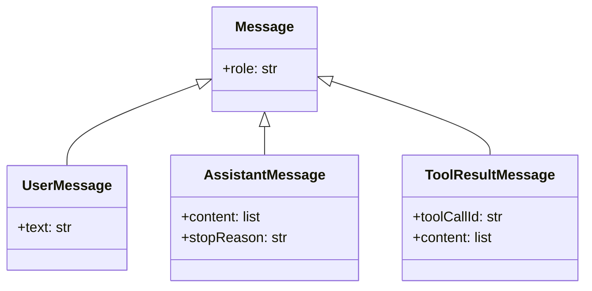
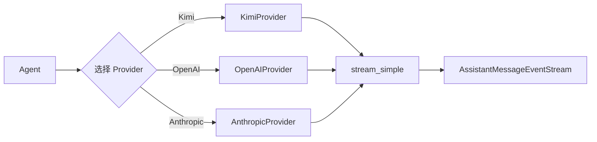

# 与 AI 模块集成

> Agent 如何使用 ai.stream 和 ai.types

---

## 1. 模块关系



**依赖关系**：
- Agent 依赖 AI 模块的**流式事件系统**
- Agent 依赖 AI 模块的**消息类型**
- Agent 通过 Provider 调用 LLM

---

## 2. EventStream 集成

### 2.1 事件流传递

```python
# AI 模块提供
from ai.stream import EventStream, AssistantMessageEventStream

# Agent 使用
from agent import AgentEventStream

# 关系：AgentEventStream 继承 EventStream
class AgentEventStream(EventStream[AgentEvent, list[AgentMessage]]):
    pass
```

**数据流**：



### 2.2 事件类型映射

| AI 层事件 | Agent 层事件 | 说明 |
|-----------|-------------|------|
| `EventStart` | `message_start` | 流开始 |
| `EventTextDelta` | `message_update` | 文本增量 |
| `EventToolCallStart` | `message_update` | 工具调用开始 |
| `EventDone` | `message_end` | 流结束 |
| `EventError` | `message_end` | 错误结束 |

**转换逻辑**：

```python
# 伪代码：事件转换

async for ai_event in ai_stream:
    if ai_event.type == "text_delta":
        agent_event = {
            "type": "message_update",
            "assistant_message_event": ai_event,
            "message": ai_event.partial
        }
        emit(agent_event)
```

---

## 3. 消息类型集成

### 3.1 类型层次



### 3.2 Agent 扩展

Agent 在 AI 类型基础上添加：

```python
# AI 模块的基础类型
from ai.types import Message, AssistantMessage, ToolCall

# Agent 的扩展
AgentMessage = Union[Message, CustomMessage]

class AgentTool:
    name: str
    description: str
    parameters: dict
    
    async def execute(...) -> AgentToolResult:
        pass
```

### 3.3 消息转换

**AgentMessage → LLM Message**：

```python
# 伪代码：转换流程

async def convert_to_llm(messages: list[AgentMessage]) -> list[Message]:
    llm_messages = []
    
    for msg in messages:
        if isinstance(msg, CustomMessage):
            # 自定义消息需要转换
            llm_msg = await msg.convert()
        else:
            # 标准消息直接使用
            llm_msg = msg
        
        llm_messages.append(llm_msg)
    
    return llm_messages
```

---

## 4. Provider 集成

### 4.1 StreamFn 协议

Agent 通过 `stream_fn` 调用 Provider：

```python
# 类型定义
StreamFn = Callable[
    [Model, Context, SimpleStreamOptions],
    Awaitable[AssistantMessageEventStream]
]

# 使用示例
async def stream_fn(model, context, options):
    return provider.stream_simple(model, context, options)
```

### 4.2 Provider 选择



### 4.3 配置示例

```python
# 伪代码：配置 Provider

from ai.providers import KimiProvider

provider = KimiProvider()

async def stream_fn(model, context, options):
    # 可以在这里添加拦截逻辑
    return provider.stream_simple(model, context, options)

agent = Agent(AgentOptions(stream_fn=stream_fn))
agent.set_model(provider.get_model())
```

---

## 5. 工具类型集成

### 5.1 工具定义

Agent 工具使用 AI 模块的类型：

```python
from ai.types import Tool, ToolCall, TextContent

class CalculatorTool:
    # Agent 侧定义
    name = "calculate"
    description = "计算表达式"
    parameters = {...}
    
    async def execute(self, tool_call_id, params, signal, on_update):
        # 返回 AI 模块的类型
        return AgentToolResult(
            content=[TextContent(text="结果")],
            details={}
        )
```

### 5.2 工具转换

```python
# 伪代码：AgentTool → AITool

llm_tools = None
if context.tools:
    llm_tools = [
        Tool(
            name=t.name,
            description=t.description,
            parameters=t.parameters
        )
        for t in context.tools
    ]
```

---

## 6. 完整数据流

```mermaid
sequenceDiagram
    participant User as 用户
    participant Agent as Agent
    participant Loop as AgentLoop
    participant AI as AI模块
    participant LLM as LLM服务
    
    User->>Agent: prompt("你好")
    Agent->>Loop: run_agent_loop
    
    Loop->>Loop: 转换消息格式
    Loop->>AI: 构建 Context
    AI->>LLM: HTTP 请求
    
    loop 流式响应
        LLM-->>AI: SSE 数据块
        AI->>AI: 解析为 Event
        AI-->>Loop: AssistantMessageEvent
        Loop->>Loop: 转换为 AgentEvent
        Loop-->>Agent: emit(event)
        Agent-->>User: UI 更新
    end
    
    LLM-->>AI: 流结束
    AI-->>Loop: EventDone
    Loop-->>Agent: agent_end
    Agent-->>User: 对话完成
```

---

## 7. 关键集成点

### 7.1 事件转发

```python
# agent_loop.py 中的关键代码

async for event in ai_stream:
    event_type = getattr(event, "type", "")
    
    if event_type in ("text_delta", "thinking_delta", "toolcall_delta"):
        # 转发到 Agent 层
        await emit({
            "type": "message_update",
            "assistant_message_event": event,
            "message": event.partial
        })
```

### 7.2 结果收集

```python
# 流结束时获取最终结果

elif event_type == "done":
    final_message = await ai_stream.result()
    # final_message 是 AI 模块的 AssistantMessage
    context.messages[-1] = final_message
    await emit({"type": "message_end", "message": final_message})
    return final_message
```

### 7.3 工具结果转换

```python
# Tool 执行结果转换为消息

tool_result_message = ToolResultMessage(
    role="toolResult",
    tool_call_id=tool_call_id,
    tool_name=tool_name,
    content=result.content,  # AI 模块的 Content 列表
    is_error=is_error
)
```

---

## 8. 与 Pi-Mono 对比

| 方面 | Pi-Mono | Py-Mono | 说明 |
|------|---------|---------|------|
| **导入路径** | `@mariozechner/pi-ai` | `ai` | 包名差异 |
| **事件流** | `EventStream<T, R>` | `EventStream[T, R]` | 泛型语法差异 |
| **类型系统** | TypeScript | Python + Pydantic | 实现方式差异 |
| **集成方式** | 完全一致 | 完全一致 | 架构一致 |

---

## 9. 常见问题

### Q1: 可以绕过 AI 模块直接使用 Provider 吗？

**A**: 技术上可以，但不推荐。AI 模块提供了：
- 统一的事件格式
- 类型安全
- 错误处理
- 流式解析

### Q2: 如何添加自定义 Provider？

**A**: 实现 `stream_simple` 函数：

```python
class MyProvider:
    async def stream_simple(self, model, context, options):
        # 返回 AssistantMessageEventStream
        stream = AssistantMessageEventStream()
        
        # 异步填充事件
        asyncio.create_task(self._fill_stream(stream))
        
        return stream
```

### Q3: 事件类型如何扩展？

**A**: 继承基础事件：

```python
class MyCustomEvent(AgentEvent):
    type: Literal["my_event"]
    custom_data: str
```

---

## 10. 下一步

- [07-tool-development.md](./07-tool-development.md) - 工具开发指南
- [08-best-practices.md](./08-best-practices.md) - 最佳实践
