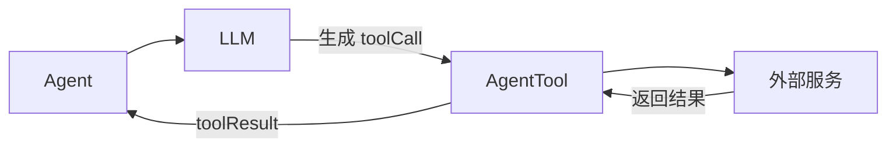

# 工具开发指南

> 如何编写 AgentTool 扩展 Agent 能力

---

## 1. 工具基础

### 1.1 什么是 AgentTool？

AgentTool 是 Agent 调用外部能力的接口：



**常见用途**：
- 计算（计算器）
- 查询（天气、数据库）
- 操作（文件、API）
- 搜索（搜索引擎）

### 1.2 工具接口

```python
# 伪代码：AgentTool 接口

class AgentTool:
    # 元数据
    name: str                    # 工具名称
    label: str                   # 显示标签
    description: str             # 功能描述
    parameters: dict             # JSON Schema 参数定义
    
    # 执行方法
    async def execute(
        self,
        tool_call_id: str,       # 调用 ID
        params: dict,            # 参数
        signal: Any,             # 取消信号
        on_update: Callable      # 进度回调
    ) -> AgentToolResult:        # 返回结果
        pass
```

---

## 2. 开发步骤

### 2.1 步骤 1：定义工具类

```python
class CalculatorTool:
    """计算器工具"""
    
    name = "calculate"
    label = "计算器"
    description = "计算数学表达式，如 2+3, sin(0.5)"
    
    # JSON Schema 参数定义
    parameters = {
        "type": "object",
        "properties": {
            "expression": {
                "type": "string",
                "description": "要计算的数学表达式"
            }
        },
        "required": ["expression"]
    }
```

**关键理解**：
- `name`：LLM 通过这个名字识别工具
- `description`：帮助 LLM 理解何时使用
- `parameters`：定义参数结构（JSON Schema）

### 2.2 步骤 2：实现执行方法

```python
    async def execute(
        self,
        tool_call_id: str,
        params: dict[str, Any],
        signal: Any = None,
        on_update: Any = None
    ) -> AgentToolResult:
        """执行计算"""
        # 1. 获取参数
        expression = params.get("expression", "")
        
        try:
            # 2. 执行业务逻辑
            result = eval(expression, {"__builtins__": {}}, {})
            
            # 3. 构建返回结果
            from ai.types import TextContent
            return AgentToolResult(
                content=[TextContent(text=f"{expression} = {result}")],
                details={"expression": expression, "result": result}
            )
            
        except Exception as e:
            # 4. 错误处理
            return AgentToolResult(
                content=[TextContent(text=f"错误: {e}")],
                details={"error": str(e)},
                is_error=True
            )
```

### 2.3 步骤 3：注册到 Agent

```python
from agent import Agent, AgentOptions

# 创建工具实例
calculator = CalculatorTool()

# 创建 Agent
agent = Agent(AgentOptions(stream_fn=stream_fn))

# 设置工具列表
agent.set_tools([calculator])

# 现在 LLM 可以使用 calculate 工具了
await agent.prompt("计算 2+3*4")
```

---

## 3. 参数设计

### 3.1 JSON Schema 示例

**简单参数**：
```json
{
  "type": "object",
  "properties": {
    "city": {
      "type": "string",
      "description": "城市名称"
    }
  },
  "required": ["city"]
}
```

**复杂参数**：
```json
{
  "type": "object",
  "properties": {
    "operation": {
      "type": "string",
      "enum": ["read", "write", "delete"],
      "description": "操作类型"
    },
    "path": {
      "type": "string",
      "description": "文件路径"
    },
    "content": {
      "type": "string",
      "description": "写入内容（write 时需要）"
    }
  },
  "required": ["operation", "path"]
}
```

### 3.2 参数验证

Agent 会自动验证参数：

```python
# 如果 LLM 传入错误参数
tool_call = {
    "name": "calculate",
    "arguments": {"expr": "2+3"}  # 错误：应该是 expression
}

# Agent 会返回验证错误
result = AgentToolResult(
    content=[TextContent(text="参数错误: 缺少 required 字段 'expression'")],
    is_error=True
)
```

---

## 4. 返回结果

### 4.1 AgentToolResult 结构

```python
class AgentToolResult:
    content: list[Content]      # 内容块列表
    details: dict               # 详细信息
    is_error: bool = False      # 是否错误
```

### 4.2 内容块类型

| 类型 | 用途 | 示例 |
|------|------|------|
| `TextContent` | 文本结果 | 计算结果、查询结果 |
| `ImageContent` | 图像结果 | 截图、图表 |
| `ThinkingContent` | 思考过程 | 推理步骤 |

### 4.3 返回示例

**成功结果**：
```python
return AgentToolResult(
    content=[TextContent(text="结果是 42")],
    details={"result": 42, "time": 0.1}
)
```

**错误结果**：
```python
return AgentToolResult(
    content=[TextContent(text="文件不存在")],
    details={"path": "/tmp/file.txt"},
    is_error=True
)
```

**多模态结果**：
```python
return AgentToolResult(
    content=[
        TextContent(text="生成的图表："),
        ImageContent(data=image_base64, mime_type="image/png")
    ],
    details={"chart_type": "line"}
)
```

---

## 5. 高级特性

### 5.1 取消信号

支持中途取消：

```python
async def execute(self, tool_call_id, params, signal, on_update):
    for i in range(100):
        # 检查是否被取消
        if signal and signal.is_set():
            raise asyncio.CancelledError("用户取消")
        
        await asyncio.sleep(0.1)
```

### 5.2 进度回调

长任务报告进度：

```python
async def execute(self, tool_call_id, params, signal, on_update):
    total = 100
    for i in range(total):
        # 执行工作
        await do_work(i)
        
        # 报告进度
        if on_update:
            on_update(AgentToolResult(
                content=[TextContent(text=f"进度: {i}/{total}")],
                details={"progress": i / total}
            ))
```

### 5.3 异步操作

支持异步 IO：

```python
async def execute(self, ...):
    # 异步 HTTP 请求
    async with aiohttp.ClientSession() as session:
        async with session.get(url) as response:
            data = await response.json()
            return AgentToolResult(...)
```

---

## 6. 常见工具示例

### 6.1 天气查询工具

```python
class WeatherTool:
    name = "get_weather"
    label = "天气查询"
    description = "查询指定城市的天气"
    parameters = {
        "type": "object",
        "properties": {
            "city": {"type": "string", "description": "城市名称"}
        },
        "required": ["city"]
    }
    
    async def execute(self, tool_call_id, params, ...):
        city = params["city"]
        
        # 调用天气 API
        weather = await self._fetch_weather(city)
        
        return AgentToolResult(
            content=[TextContent(text=f"{city}天气：{weather}")],
            details={"city": city, "weather": weather}
        )
```

### 6.2 文件操作工具

```python
class FileTool:
    name = "file_operation"
    label = "文件操作"
    description = "读写文件"
    parameters = {
        "type": "object",
        "properties": {
            "action": {"enum": ["read", "write"]},
            "path": {"type": "string"},
            "content": {"type": "string"}
        },
        "required": ["action", "path"]
    }
    
    async def execute(self, tool_call_id, params, ...):
        action = params["action"]
        path = params["path"]
        
        if action == "read":
            content = await self._read_file(path)
            return AgentToolResult(...)
        elif action == "write":
            await self._write_file(path, params["content"])
            return AgentToolResult(...)
```

---

## 7. 最佳实践

### 7.1 命名规范

- **name**：小写 + 下划线，如 `get_weather`
- **label**：中文，用户友好，如 `天气查询`
- **description**：清晰说明用途和使用场景

### 7.2 错误处理

```python
async def execute(self, ...):
    try:
        result = await self._do_work()
        return AgentToolResult(content=[...])
    except FileNotFoundError:
        return AgentToolResult(
            content=[TextContent(text="文件不存在")],
            is_error=True
        )
    except Exception as e:
        return AgentToolResult(
            content=[TextContent(text=f"未知错误: {e}")],
            is_error=True
        )
```

### 7.3 安全性

```python
async def execute(self, ...):
    # 1. 验证路径（防止目录遍历）
    if ".." in params["path"]:
        return error_result("非法路径")
    
    # 2. 限制操作范围
    if not params["path"].startswith("/safe/dir"):
        return error_result("超出允许范围")
    
    # 3. 超时控制
    try:
        result = await asyncio.wait_for(
            self._do_work(),
            timeout=30
        )
    except asyncio.TimeoutError:
        return error_result("操作超时")
```

---

## 8. 调试技巧

### 8.1 本地测试

```python
# 单独测试工具
tool = CalculatorTool()
result = await tool.execute(
    tool_call_id="test-1",
    params={"expression": "2+3"},
    signal=None,
    on_update=None
)
print(result.content[0].text)  # "2+3 = 5"
```

### 8.2 日志记录

```python
async def execute(self, tool_call_id, params, ...):
    logger.info(f"执行工具: {self.name}, 参数: {params}")
    
    try:
        result = await self._do_work()
        logger.info(f"工具成功: {tool_call_id}")
        return result
    except Exception as e:
        logger.error(f"工具失败: {tool_call_id}, 错误: {e}")
        return error_result(str(e))
```

---

## 9. 下一步

- [08-best-practices.md](./08-best-practices.md) - 最佳实践总结
