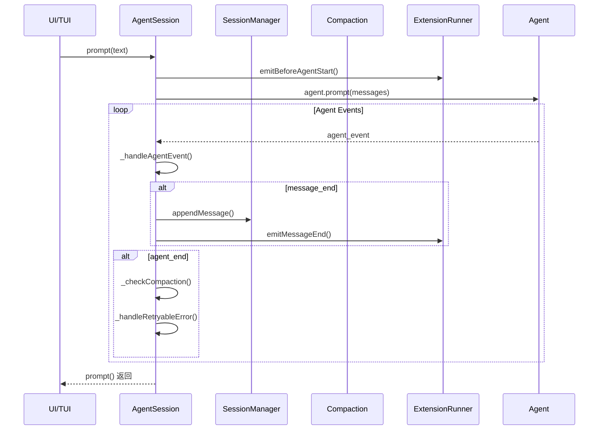

# AgentSession 实现计划

> 对标 pi-mono TypeScript 实现，分阶段实现完整功能

---

## 1. 当前状态

### 1.1 已实现功能

| 功能 | 文件 | 状态 | 说明 |
|------|------|------|------|
| Agent 初始化 | `agent_session.py` | ✅ 完整 | 集成 KimiProvider |
| prompt() | `agent_session.py` | ✅ 基础 | 直接调用 agent.prompt() |
| 工具注册 | `agent_session.py` | ✅ 完整 | 支持 read/write/edit/bash |
| 事件订阅 | `agent_session.py` | ✅ 简单转发 | 透传到 listeners |
| 模型获取 | `agent_session.py` | ✅ 完整 | `state.model` |
| SessionManager | `session/manager.py` | ✅ 完整 | JSONL 持久化 |
| Session 类型 | `session/types.py` | ✅ 完整 | 9 种条目类型 |
| Compaction | `compaction/compaction.py` | ✅ 纯函数 | Token 估算、压缩判断 |

### 1.2 未实现功能

| 功能 | 优先级 | 依赖 |
|------|--------|------|
| 消息持久化集成 | P0 | SessionManager |
| 自动压缩触发 | P1 | Phase 1 |
| 工具钩子 (before/after) | P1 | Agent |
| 模型切换 API | P2 | Agent |
| 思考级别控制 | P2 | Agent |
| ExtensionRunner 集成 | P2 | Phase 1-2 |
| Slash 命令系统 | P2 | ExtensionRunner |
| 自动重试逻辑 | P2 | Phase 1 |
| 流式消息队列 | P2 | Phase 1 |
| 会话统计 | P3 | Phase 1 |

---

## 2. pi-mono AgentSession 架构分析

### 2.1 核心职责 (pi-mono ~3182 行)

```
AgentSession
├── 事件订阅系统
│   ├── _handleAgentEvent()      # 核心事件处理器
│   ├── _processAgentEvent()     # 事件处理（持久化、自动压缩、重试）
│   └── _emitExtensionEvent()    # 扩展事件转发
│
├── 会话持久化
│   ├── sessionManager.appendMessage()
│   ├── sessionManager.appendCustomMessageEntry()
│   └── sessionManager.append*Entry()
│
├── 自动压缩
│   ├── _checkCompaction()       # 检查触发条件
│   ├── _handleAutoCompaction()  # 执行压缩
│   └── compaction.prepare() / compaction.compact()
│
├── 自动重试
│   ├── _isRetryableError()      # 判断是否可重试
│   ├── _handleRetryableError() # 执行重试
│   └── _retryPromise / _retryResolve
│
├── 模型管理
│   ├── model                    # 当前模型
│   ├── cycleModel()            # 循环切换
│   └── setThinkingLevel()       # 思考级别
│
├── 工具系统
│   ├── _installAgentToolHooks() # 安装 before/after 钩子
│   └── _baseToolRegistry       # 工具注册表
│
└── Extension 系统
    ├── _extensionRunner         # 扩展运行器
    ├── emitBeforeAgentStart()
    └── emit*ExtensionEvent()
```

### 2.2 事件处理流程 (pi-mono)



### 2.3 py-mono 现状差距

| 组件 | pi-mono | py-mono | 差距分析 |
|------|---------|---------|----------|
| **事件处理** | 完整处理流程 | 简单转发 | `_processAgentEvent` 未实现 |
| **持久化集成** | `sessionManager.appendMessage()` | ❌ 未集成 | prompt 未持久化 |
| **自动压缩** | `_checkCompaction()` | ❌ 未触发 | compaction 函数存在但未调用 |
| **重试逻辑** | `_handleRetryableError()` | ❌ 未实现 | 需要错误判断和重试循环 |
| **工具钩子** | `_installAgentToolHooks()` | ❌ 未实现 | 需要 `setBeforeToolCall`/`setAfterToolCall` |
| **Extension** | 完整集成 | ❌ 未实现 | ExtensionRunner 已实现但未绑定 |
| **模型管理** | `cycleModel()` | ❌ 未实现 | 只暴露了 model property |
| **思考级别** | `setThinkingLevel()` | ❌ 未实现 | 需要 `set_thinking_level()` |

---

## 3. 分阶段实现计划

### Phase 1: 核心集成（最小可用 MVP）

**目标**：让 AgentSession 能够持久化消息，重新加载历史上下文

#### 1.1 任务清单

| 任务 | 工作量 | 依赖 | 文件 |
|------|--------|------|------|
| 1.1.1 集成 SessionManager | 小 | 已实现 | `agent_session.py` |
| 1.1.2 实现消息持久化 | 中 | SessionManager | `agent_session.py` |
| 1.1.3 实现上下文重建 | 中 | SessionManager | `agent_session.py` |
| 1.1.4 集成 Compaction 设置 | 小 | CompactionSettings | `settings_manager.py` |

#### 1.1.1 集成 SessionManager

```python
# 目标接口
class AgentSession:
    def __init__(self, config: AgentSessionConfig) -> None:
        # 新增：初始化 SessionManager
        self._session_manager = config.session_manager or SessionManager.create(cwd)
        
    # 暴露 session_manager
    @property
    def session_manager(self) -> SessionManager:
        return self._session_manager
```

#### 1.1.2 实现消息持久化

```python
# 在事件处理中追加消息
async def _handle_agent_event(self, event: dict) -> None:
    if event["type"] == "message_end":
        message = event["message"]
        if message.role in ("user", "assistant", "tool_result"):
            self._session_manager.append_message(message)
```

#### 1.1.3 实现上下文重建

```python
# 从会话文件重建 Agent 上下文
def build_context(self) -> list[AgentMessage]:
    """从当前叶子节点回溯构建消息列表"""
    entries = self._session_manager.get_branch()
    messages = []
    for entry in entries:
        if entry.type == "message":
            messages.append(entry.message)
        elif entry.type == "compaction":
            messages.append(create_compaction_summary_message(entry))
    return messages
```

#### 1.1.4 验收标准

- [ ] 创建会话后，发送消息会自动持久化到 JSONL
- [ ] 重启后可以从 JSONL 加载历史消息
- [ ] `build_context()` 返回的消息格式正确

---

### Phase 2: 事件系统增强

**目标**：实现自动压缩触发和工具钩子

#### 2.1 任务清单

| 任务 | 工作量 | 依赖 | 文件 |
|------|--------|------|------|
| 2.1.1 实现 `_processAgentEvent` | 中 | Phase 1 | `agent_session.py` |
| 2.1.2 实现自动压缩触发 | 中 | Compaction | `agent_session.py` |
| 2.1.3 集成工具 before/after 钩子 | 小 | Agent | `agent_session.py` |
| 2.1.4 实现压缩结果持久化 | 小 | Phase 2.2 | `session/manager.py` |

#### 2.1.2 自动压缩触发

```python
async def _check_compaction(self, last_assistant: Any) -> None:
    """检查并触发自动压缩"""
    settings = self._settings_manager.get_compaction_settings()
    if not settings.enabled:
        return
    
    entries = self._session_manager.get_entries()
    if should_compact(entries, settings):
        result = compact(entries, settings, self._generate_summary)
        if result:
            self._session_manager.append_compaction_entry(result)
```

#### 2.1.3 工具钩子

```python
def _install_tool_hooks(self) -> None:
    """安装工具执行前后的钩子"""
    self._agent.set_before_tool_call(self._before_tool_call)
    self._agent.set_after_tool_call(self._after_tool_call)

async def _before_tool_call(self, ctx, signal):
    # 可以在这里做权限检查、日志等
    return None

async def _after_tool_call(self, ctx, signal):
    # 可以在这里过滤结果、记录日志等
    return None
```

#### 2.1.4 验收标准

- [ ] `message_end` 事件会自动追加到 SessionManager
- [ ] Token 超阈值时自动触发压缩
- [ ] 压缩结果正确持久化为 `CompactionEntry`
- [ ] 工具执行前后可以触发钩子

---

### Phase 3: 模型管理

**目标**：支持模型切换和思考级别

#### 3.1 任务清单

| 任务 | 工作量 | 依赖 | 文件 |
|------|--------|------|------|
| 3.1.1 实现 `cycle_model()` | 小 | Agent | `agent_session.py` |
| 3.1.2 实现 `set_thinking_level()` | 小 | Agent | `agent_session.py` |
| 3.1.3 实现模型切换持久化 | 小 | SessionManager | `agent_session.py` |
| 3.1.4 实现思考级别持久化 | 小 | SessionManager | `agent_session.py` |

#### 3.1.1 模型循环切换

```python
def cycle_model(self) -> ModelCycleResult:
    """在 scopedModels 或所有可用模型间循环"""
    if self._scoped_models:
        # 从 scopedModels 循环
        pass
    else:
        # 从所有可用模型循环
        pass
```

#### 3.1.2 思考级别控制

```python
def set_thinking_level(self, level: ThinkingLevel) -> None:
    """设置思考级别并持久化"""
    self._agent.set_thinking_level(level)
    self._session_manager.append_thinking_level_change(level)
```

#### 3.1.3 验收标准

- [ ] `cycle_model()` 正确切换模型
- [ ] `set_thinking_level()` 生效并持久化
- [ ] 模型/思考级别变更记录到会话

---

### Phase 4: ExtensionRunner 集成

**目标**：支持扩展系统

#### 4.1 任务清单

| 任务 | 工作量 | 依赖 | 文件 |
|------|--------|------|------|
| 4.1.1 集成 ExtensionRunner | 大 | Phase 1-2 | `agent_session.py` |
| 4.1.2 实现扩展命令处理 | 中 | ExtensionRunner | `agent_session.py` |
| 4.1.3 实现扩展事件转发 | 中 | Phase 4.1 | `agent_session.py` |

#### 4.1.1 ExtensionRunner 绑定

```python
def __init__(self, config: AgentSessionConfig) -> None:
    # ... 现有初始化 ...
    
    # 绑定 ExtensionRunner
    if config.extension_runner:
        self._extension_runner = config.extension_runner
        self._extension_runner.bind_session(self)
        self._install_tool_hooks()  # 扩展可以拦截工具调用
```

#### 4.1.2 验收标准

- [ ] 扩展可以注册工具和命令
- [ ] 扩展可以订阅 Agent 事件
- [ ] 扩展的 `before_tool_call`/`after_tool_call` 生效

---

### Phase 5: 高级功能

**目标**：完整对标 pi-mono

#### 5.1 任务清单

| 任务 | 工作量 | 依赖 | 文件 |
|------|--------|------|------|
| 5.1.1 实现自动重试 | 中 | Phase 1 | `agent_session.py` |
| 5.1.2 实现 steer/followUp 队列 | 中 | Phase 1 | `agent_session.py` |
| 5.1.3 实现会话统计 | 小 | Phase 1 | `agent_session.py` |
| 5.1.4 实现 Slash 命令解析 | 中 | Phase 4 | `slash_commands.py` |

#### 5.1.1 自动重试

```python
def _is_retryable_error(self, message: AssistantMessage) -> bool:
    """判断是否为可重试错误"""
    # overload, rate_limit, server_error 等
    pass

async def _handle_retryable_error(self, message: AssistantMessage) -> bool:
    """处理可重试错误，返回是否成功重试"""
    pass
```

#### 5.1.2 steer/followUp 队列

```python
async def _queue_steer(self, text: str, images: list) -> None:
    """将消息加入 steering 队列（插队）"""
    self._steering_messages.append(text)

async def _queue_follow_up(self, text: str, images: list) -> None:
    """将消息加入 follow-up 队列（等待）"""
    self._follow_up_messages.append(text)
```

#### 5.1.3 验收标准

- [ ] 自动重试逻辑正确
- [ ] steering 消息会中断当前执行
- [ ] follow-up 消息会在当前完成后执行
- [ ] `/session` 命令显示统计信息

---

## 4. 实施依赖关系图

```
Phase 1: 核心集成
├── 1.1 集成 SessionManager
├── 1.2 消息持久化
│   └── 依赖 1.1
├── 1.3 上下文重建
│   └── 依赖 1.1, 1.2
└── 1.4 Compaction 设置集成
    └── 依赖 1.1

Phase 2: 事件增强
├── 2.1 事件处理流程
│   └── 依赖 1.2
├── 2.2 自动压缩触发
│   └── 依赖 1.3, 1.4
├── 2.3 工具钩子
│   └── 依赖 Phase 1
└── 2.4 压缩持久化
    └── 依赖 2.2

Phase 3: 模型管理
├── 3.1 模型循环
│   └── 依赖 Phase 1
├── 3.2 思考级别
│   └── 依赖 Phase 1
└── 3.3 变更持久化
    └── 依赖 3.1, 3.2

Phase 4: Extension
├── 4.1 ExtensionRunner 集成
│   └── 依赖 Phase 2
└── 4.2 命令/事件
    └── 依赖 4.1

Phase 5: 高级功能
├── 5.1 自动重试
│   └── 依赖 Phase 1
├── 5.2 消息队列
│   └── 依赖 Phase 1
├── 5.3 会话统计
│   └── 依赖 Phase 1
└── 5.4 Slash 命令
    └── 依赖 Phase 4
```

---

## 5. 文件对应关系

| pi-mono 文件 | py-mono 文件 | 对齐状态 |
|--------------|--------------|----------|
| `core/agent-session.ts` | `agent_session.py` | 部分实现 |
| `core/session-manager.ts` | `session/manager.py` | ✅ 完整 |
| `core/compaction/*.ts` | `compaction/compaction.py` | ✅ 纯函数完整 |
| `core/extensions/runner.ts` | `extensions/runner.py` | ✅ 完整 |
| `core/bash-executor.ts` | `bash_executor.py` | ✅ 完整 |
| `core/model-registry.ts` | `model_registry.py` | ✅ 完整 |
| `core/system-prompt.ts` | `system_prompt.py` | ✅ 完整 |
| `core/tools/*.ts` | `tools/*.py` | ✅ 完整 |

---

## 6. 推荐实施路径

### 最小可行路径（2-3 周）

```
Phase 1.1 → Phase 1.2 → Phase 1.3 → Phase 1.4
```

**完成目标**：
- 可以创建会话并持久化消息
- 可以从文件加载历史继续对话
- 基本框架可运行

### 完整 MVP 路径（4-6 周）

```
Phase 1 全部 → Phase 2 全部 → Phase 3 部分
```

**完成目标**：
- 完整的事件处理
- 自动压缩工作
- 模型管理基本功能

### 完整实现路径（8-10 周）

```
Phase 1 → Phase 2 → Phase 3 → Phase 4 → Phase 5
```

---

## 7. 下一步行动

### 立即开始 (Phase 1.1)

1. 修改 `AgentSession.__init__` 接收 SessionManager 参数
2. 创建 `create_session_context()` 方法
3. 在 `prompt()` 调用后追加消息

### 本周完成 (Phase 1)

1. 完成消息持久化
2. 实现上下文重建
3. 集成 Compaction 设置

---

## 8. 附录：关键代码片段

### A. SessionManager 追加消息

```python
# session/manager.py 需要添加的方法
def append_message(self, message: AgentMessage) -> SessionMessageEntry:
    """追加消息条目"""
    entry = SessionMessageEntry(
        id=generate_id(set(self._by_id.keys())),
        parent_id=self._leaf_id,
        timestamp=datetime.now().isoformat(),
        message=message,
    )
    self._append_entry(entry)
    return entry
```

### B. 事件处理框架

```python
async def _handle_agent_event(self, event: dict) -> None:
    """核心事件处理"""
    # 1. 转发给扩展
    await self._emit_extension_event(event)
    
    # 2. 通知监听器
    self._emit(event)
    
    # 3. 持久化
    if event["type"] == "message_end":
        self._persist_message(event["message"])
    
    # 4. 自动压缩检查
    if event["type"] == "agent_end":
        await self._check_compaction()
```

### C. Compaction 集成

```python
async def _check_compaction(self) -> None:
    """检查是否需要压缩"""
    settings = self._settings_manager.get_compaction_settings()
    if not settings.enabled:
        return
    
    entries = self._session_manager.get_entries()
    if should_compact(entries, settings):
        await self._execute_compaction()

async def _execute_compaction(self) -> None:
    """执行压缩"""
    entries = self._session_manager.get_entries()
    settings = self._settings_manager.get_compaction_settings()
    
    result = compact(entries, settings, self._generate_summary)
    if result:
        self._session_manager.append_compaction_entry(result)
```
