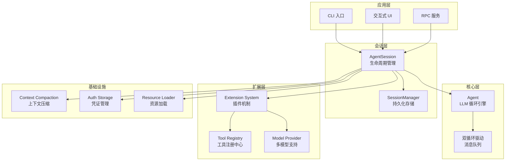

# Coding Agent 架构设计

> 基于 Pi-Mono 的 AI 编程助手高层设计方案

---

## 1. 定位与目标

Coding Agent 是**面向编程场景的垂直 Agent**，不是通用聊天机器人：

| 特性 | 说明 | 核心能力 |
|------|------|---------|
| **代码感知** | 理解项目结构、语言特性 | 读代码、改代码、写代码 |
| **工具集成** | 深度集成开发工具链 | 执行命令、管理文件、调用 API |
| **上下文管理** | 长会话 + 智能压缩 | 保持长时间对话的连贯性 |
| **可扩展** | 插件化架构 | 自定义工具、命令、Provider |

---

## 2. 整体架构

### 2.1 分层架构



### 2.2 数据流

```
用户输入
    │
    ▼
┌─────────────┐
│ AgentSession │ ← 协调中心，管理会话状态
└──────┬──────┘
       │
       ▼
┌─────────────┐     ┌─────────────┐
│   Agent     │────▶│  LLM 调用   │
│  核心循环   │     │ (pi-ai)     │
└──────┬──────┘     └─────────────┘
       │
       ▼
┌─────────────┐     ┌─────────────┐
│   Tools     │◀───▶│ 文件/命令   │
│  工具执行   │     │ 外部系统    │
└──────┬──────┘     └─────────────┘
       │
       ▼
┌─────────────┐
│ SessionManager│ ← 持久化到 JSONL
└─────────────┘
```

---

## 3. 核心组件

### 3.1 AgentSession - 会话 orchestrator

**职责**：会话生命周期管理、组件协调、事件转发

```
AgentSession
├── agent: Agent              # 核心 Agent（来自 pi-agent-core）
├── sessionManager: SessionManager  # 持久化层
├── modelRegistry: ModelRegistry    # 模型发现
├── settingsManager: SettingsManager # 配置管理
├── extensionRunner: ExtensionRunner # 扩展系统
└── compactionManager: CompactionManager # 上下文压缩
```

**关键能力**：
- 模型切换（Model Change）
- 思考等级调整（Thinking Level）
- 自动压缩触发
- 重试逻辑（Retry Logic）
- 分支导航（Tree Navigation）

### 3.2 Agent - 核心 LLM 循环

**职责**：低层 LLM 交互、消息流处理、工具调用编排

**核心方法**：
- `runAgentLoop()` - 启动全新对话
- `runAgentLoopContinue()` - 从已有上下文继续

**事件流**：
```
agent_start
  └── turn_start
        ├── message_start
        ├── message_update (多次)
        ├── message_end
        ├── tool_execution_start
        ├── tool_execution_update (流式更新)
        ├── tool_execution_end
        └── turn_end
  └── agent_end
```

### 3.3 SessionManager - 会话持久化

**存储格式**：JSONL（JSON Lines）

**条目类型**：
| 类型 | 说明 | LLM 可见 |
|------|------|---------|
| `SessionHeader` | 会话元数据（ID、CWD、时间戳） | ❌ |
| `SessionMessageEntry` | 对话消息（user/assistant/toolResult） | ✅ |
| `ThinkingLevelChangeEntry` | 思考等级变更 | ✅ |
| `ModelChangeEntry` | 模型切换记录 | ✅ |
| `CompactionEntry` | 上下文压缩摘要 | ✅ |
| `BranchSummaryEntry` | 分支导航摘要 | ✅ |
| `CustomEntry` | 扩展私有数据 | ❌ |
| `CustomMessageEntry` | 扩展消息 | ✅ |
| `LabelEntry` | 用户书签 | ❌ |

**树形结构**：
```
Session (根)
├── Message (user)
│   └── Message (assistant)
│       └── Message (user) [分支点]
│           ├── Message (assistant) [分支 A]
│           │   └── ...
│           └── Message (assistant) [分支 B]
│               └── ...
```

---

## 4. 上下文压缩（Context Compaction）

### 4.1 问题背景

长会话会超过 LLM 的上下文窗口限制，需要智能压缩历史消息。

### 4.2 压缩策略

```
压缩前：
[Messages... 很多 Token] -> [Recent Messages]
      ^ 截断点

压缩后：
[Summary Entry] -> [保留的最近消息]
      ^ 包含结构化摘要的压缩条目
```

### 4.3 摘要格式

```markdown
## 目标
[用户试图完成什么]

## 约束与偏好
- [用户提到的约束]

## 进度
### 已完成
- [x] [已完成任务]

### 进行中
- [ ] [当前工作]

### 阻塞
- [阻碍进展的问题]

## 关键决策
- **[决策]**: [理由]

## 下一步
1. [有序的后续行动]

## 关键上下文
- [继续所需的数据]
```

### 4.4 压缩流程

1. **prepareCompaction()** - 计算截断点，提取需摘要的消息
2. **generateSummary()** - 使用 LLM 生成结构化摘要
3. **compact()** - 持久化压缩条目，重新加载消息
4. **buildSessionContext()** - 从叶节点重建对话上下文

---

## 5. 工具系统

### 5.1 内置工具

| 工具 | 功能 | 安全级别 |
|------|------|---------|
| `read` | 读取文件内容（支持截断） | 只读 |
| `bash` | 执行 Shell 命令 | 危险 |
| `edit` | 字符串替换修改文件 | 危险 |
| `write` | 写入新文件 | 危险 |
| `grep` | 搜索文件内容 | 只读 |
| `find` | 按模式查找文件 | 只读 |
| `ls` | 列出目录内容 | 只读 |

### 5.2 工具工厂

```typescript
// 根据场景创建工具集
createCodingTools(cwd, options)   // [read, bash, edit, write]
createReadOnlyTools(cwd, options) // [read, grep, find, ls]
createAllTools(cwd, options)      // 所有工具
```

### 5.3 扩展工具注册

```typescript
pi.registerTool({
  name: "my_tool",
  label: "My Tool",
  description: "工具描述",
  parameters: Type.Object({...}),
  execute: async (toolCallId, params, signal, onUpdate, ctx) => {
    // 执行逻辑
    return { content: [...], details: {...} };
  }
});
```

---

## 6. 扩展系统（Extension System）

### 6.1 ExtensionAPI

扩展通过 `pi` 对象与核心交互：

**事件订阅**：
```typescript
pi.on(event, handler)  // 订阅生命周期事件
// 事件: agent_start/end, turn_start/end, 
//       message_start/update/end, tool_execution, session events...
```

**工具注册**：
```typescript
pi.registerTool(toolDef)  // 注册 LLM 可调用的工具
```

**命令注册**：
```typescript
pi.registerCommand(name, options)  // 注册斜杠命令
pi.registerShortcut(key, options)  // 注册快捷键
pi.registerFlag(name, options)     // 注册 CLI 参数
```

**UI 交互**：
```typescript
pi.ui.select/confirm/input/editor  // UI 原语
pi.ui.setWidget/setFooter/setHeader // 自定义组件
pi.ui.setEditorComponent            // 替换输入编辑器
```

**会话控制**：
```typescript
pi.sendMessage()       // 注入自定义消息
pi.sendUserMessage()   // 发送用户消息
pi.appendEntry()       // 持久化扩展状态
```

**Provider 注册**：
```typescript
pi.registerProvider()   // 添加自定义 LLM Provider
pi.unregisterProvider() // 移除动态 Provider
```

### 6.2 扩展加载流程

```
loadExtensions
    │
    ▼
发现 .ts/.js 文件
    │
    ▼
执行 ExtensionFactory(pi)
收集注册信息
    │
    ▼
ExtensionRunner
包装工具、绑定上下文、发射事件
    │
    ▼
bindExtensions(AgentSession)
附加 UI 上下文、命令处理器
```

---

## 7. 模型集成

### 7.1 ModelRegistry

```
ModelRegistry
├── 内置模型（来自 pi-ai）
│   ├── Anthropic (Claude)
│   ├── OpenAI (GPT)
│   ├── Google (Gemini)
│   └── ...
├── 自定义模型（~/.pi/agent/models.json）
│   ├── Provider 覆盖（baseUrl、headers）
│   ├── 模型覆盖（cost、contextWindow）
│   └── 完整自定义模型定义
└── 动态 Provider（来自扩展）
    └── pi.registerProvider() API
```

### 7.2 AuthStorage

凭证管理支持多种后端：
- **FileAuthStorageBackend** - 持久化 JSON 存储
- **InMemoryAuthStorageBackend** - 临时存储
- **OAuth 支持** - Token 刷新流程

---

## 8. Agent 生命周期

### 8.1 完整生命周期

```
┌─────────┐     ┌─────────────┐     ┌─────────────────┐
│  初始化  │────▶│  SDK 设置   │────▶│ AgentSession    │
│         │     │createAgent  │     │   创建          │
└─────────┘     │  Session()  │     └─────────────────┘
                └─────────────┘              │
                                             ▼
┌─────────┐     ┌─────────────┐     ┌─────────────────┐
│ 清理    │◀────│   事件      │◀────│  Agent Loop     │
│         │     │   发射      │     │  (pi-agent-core)│
└─────────┘     └─────────────┘     └─────────────────┘
                                             │
                              ┌──────────────┼──────────────┐
                              ▼              ▼              ▼
                         ┌────────┐    ┌─────────┐    ┌──────────┐
                         │ Prompt │    │  Tool   │    │   Auto   │
                         │处理    │    │执行     │    │Compaction│
                         └────────┘    └─────────┘    └──────────┘
```

### 8.2 Agent Loop 流程

```
┌─────────────┐
│   Prompt    │
│   (User)    │
└──────┬──────┘
       ▼
┌─────────────────┐
│  before_agent_  │◀── 扩展 Hook
│   start 事件    │
└──────┬──────────┘
       ▼
┌─────────────────┐
│  transformCtx   │◀── 上下文转换
│  convertToLlm   │◀── 过滤为 LLM 兼容格式
└──────┬──────────┘
       ▼
┌─────────────────┐
│   streamSimple  │◀── 调用 LLM Provider
│   (pi-ai)       │
└──────┬──────────┘
       ▼
┌─────────────────┐
│  Stream Events  │──▶ message_start/update/end
│  (Assistant)    │
└──────┬──────────┘
       ▼
┌─────────────────┐
│  Tool Calls?    │──▶ tool_execution_start/update/end
└──────┬──────────┘
       ▼
┌─────────────────┐
│  Execute Tools  │
│  (parallel/seq) │
└──────┬──────────┘
       ▼
┌─────────────────┐
│  turn_end 事件  │
└──────┬──────────┘
       ▼
┌─────────────────┐
│ Steering Queue? │──▶ 出队并继续
│ Follow-up Queue?│──▶ 出队并继续
└──────┬──────────┘
       ▼
┌─────────────────┐
│   agent_end     │
└─────────────────┘
```

---

## 9. 资源加载

**DefaultResourceLoader** 发现和加载：

| 资源类型 | 发现位置 |
|---------|---------|
| Extensions | `~/.pi/agent/extensions/`, `./.pi/extensions/`, packages |
| Skills | `~/.pi/agent/skills/`, `./.pi/skills/`, SKILL.md files |
| Prompt Templates | `~/.pi/agent/prompts/`, `./.pi/prompts/` |
| Themes | `~/.pi/agent/themes/`, `./.pi/themes/` |
| Context Files | `AGENTS.md`, `CLAUDE.md`（祖先目录） |
| System Prompt | `~/.pi/agent/SYSTEM.md`, `./.pi/SYSTEM.md` |

---

## 10. 关键设计决策

### 10.1 为什么使用 JSONL 存储？

- **追加写入**：高效、原子化
- **树形结构**：天然支持分支和时间旅行
- **人类可读**：便于调试和手动修复

### 10.2 为什么区分 Steering 和 Follow-up？

| 特性 | Steering | Follow-up |
|------|----------|-----------|
| **时序** | Tool 执行期间 | 对话结束后 |
| **优先级** | 高（插队） | 正常 |
| **用途** | 用户改变主意 | 开启新一轮对话 |

### 10.3 为什么使用双循环？

- **内循环**：处理单次对话的复杂性（Tool 链）
- **外循环**：管理对话的延续性（多轮对话）

---

## 11. 实现要点

### 11.1 Python 实现注意事项

从 TypeScript 迁移到 Python 时：

| TypeScript | Python | 说明 |
|-----------|--------|------|
| `async/await` | `async/await` | 相同语法 |
| `EventEmitter` | `asyncio.Event` + callbacks | 语言差异 |
| `Promise` | `asyncio.Future` | 概念相同 |
| `interface` | `Protocol` | 结构子类型 |
| `Type.Object()` | `pydantic.BaseModel` | 运行时验证 |

### 11.2 核心依赖

- **pi-ai**: LLM Provider 抽象
- **pi-agent-core**: Agent 核心循环
- **pydantic**: 数据验证和序列化
- **anyio**: 异步 I/O 抽象

---

## 12. 扩展阅读

### 12.1 相关文档

- [01-agent-architecture.md](../agent/docs/details/01-agent-architecture.md) - Agent 核心架构
- [02-agent-loop-internals.md](../agent/docs/details/02-agent-loop-internals.md) - 循环内部机制
- [03-message-queue-system.md](../agent/docs/details/03-message-queue-system.md) - 消息队列详解

### 12.2 参考源码

```
refer/pi-mono/packages/coding-agent/src/
├── core/
│   ├── agent-session.ts      # AgentSession 实现
│   ├── session-manager.ts    # SessionManager 实现
│   ├── model-registry.ts     # ModelRegistry 实现
│   ├── compaction/           # 上下文压缩
│   │   ├── compaction.ts
│   │   ├── utils.ts
│   │   └── branch-summarization.ts
│   ├── extensions/           # 扩展系统
│   │   ├── types.ts          # ExtensionAPI 定义
│   │   ├── runner.ts         # ExtensionRunner
│   │   └── wrapper.ts        # 工具包装器
│   └── tools/                # 工具定义
│       └── index.ts
├── cli.ts                    # CLI 入口
└── main.ts                   # 主入口
```

---

## 13. 总结

Coding Agent 是一个**分层、可扩展、事件驱动**的 AI 编程助手架构：

1. **分层清晰**：应用层 → 会话层 → 核心层 → 扩展层 → 基础设施
2. **可扩展强**：Extension System 允许自定义工具、命令、Provider
3. **上下文智能**：Compaction 系统解决长会话的上下文限制
4. **事件驱动**：完整的事件流支持实时 UI 更新
5. **持久化可靠**：JSONL 存储支持时间旅行和分支导航

这个架构既保持了核心逻辑的简洁，又提供了丰富的扩展点，适合构建生产级的 AI 编程助手。
