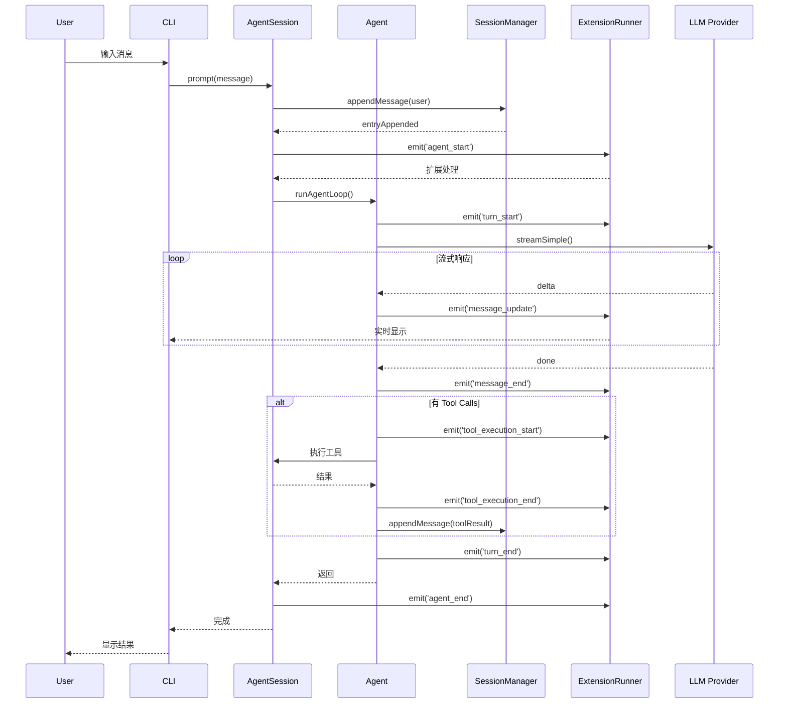
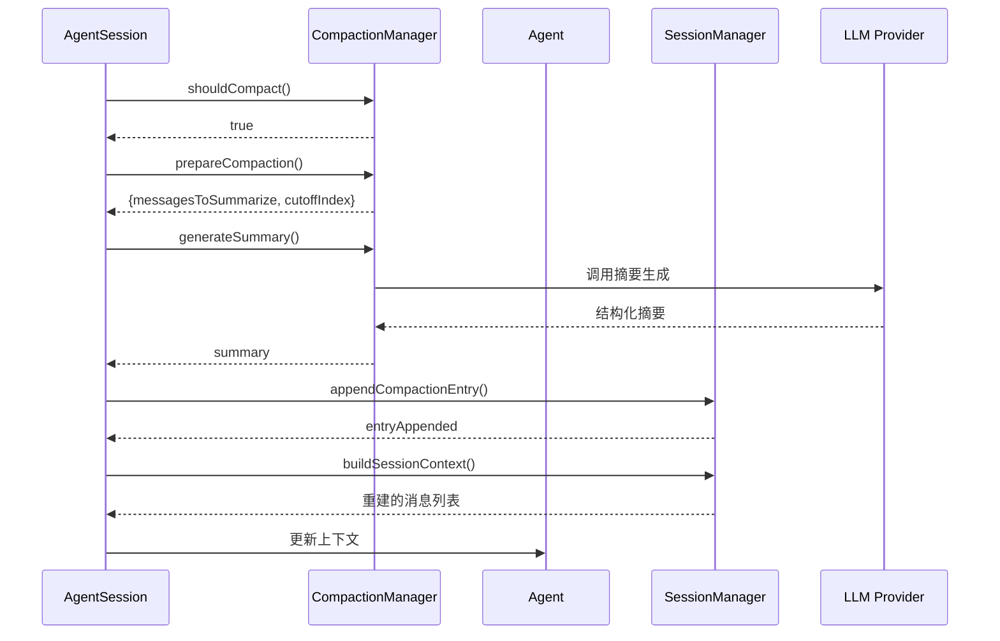

# Coding Agent 组件详解

> 核心组件的设计与交互

---

## 1. AgentSession - 会话 orchestrator

### 1.1 职责定位

AgentSession 是**整个系统的协调中心**，不是简单的代理：

- **状态管理**：维护会话完整状态（模型、工具、上下文）
- **事件协调**：将底层 Agent 事件转发给 UI 和扩展
- **生命周期控制**：启动、暂停、恢复、结束会话
- **异常处理**：重试逻辑、错误恢复

### 1.2 核心状态

```typescript
class AgentSession {
  // 核心组件
  agent: Agent;                          // LLM 循环引擎
  sessionManager: SessionManager;        // 持久化
  settingsManager: SettingsManager;      // 配置
  modelRegistry: ModelRegistry;          // 模型注册表
  extensionRunner: ExtensionRunner;      // 扩展系统
  
  // 运行状态
  currentModel: ResolvedModel;           // 当前模型
  currentThinkingLevel: number;          // 思考等级
  tools: AgentTool[];                    // 可用工具
  
  // 事件队列（用于 UI 更新）
  eventQueue: AgentEvent[];              // 待处理事件
  
  // 压缩状态
  compactionState: CompactionState;      // 压缩管理器状态
  
  // 重试状态
  retryState: RetryState;                // 自动重试配置
}
```

### 1.3 初始化流程

```
AgentSession.create()
    │
    ├── 1. 初始化 SessionManager
    │   └── 加载或创建新的会话文件
    │
    ├── 2. 初始化 ModelRegistry
    │   └── 加载内置模型 + 用户自定义模型
    │
    ├── 3. 初始化 SettingsManager
    │   └── 加载用户设置（自动压缩阈值等）
    │
    ├── 4. 加载扩展
    │   └── ExtensionRunner.loadExtensions()
    │
    ├── 5. 构建工具列表
    │   ├── 内置工具（codingTools）
    │   └── 扩展注册的工具
    │
    ├── 6. 初始化 Agent
    │   └── 配置 system prompt、tools、model
    │
    └── 7. 绑定扩展
        └── 将 UI 上下文附加到扩展
```

### 1.4 事件处理

AgentSession 作为**事件总线**，处理三类事件：

**来自 Agent 的事件**（底层 LLM 循环）：
```typescript
agent.on('agent_start', handleAgentStart);
agent.on('turn_start', handleTurnStart);
agent.on('message_start', handleMessageStart);
agent.on('message_update', handleMessageUpdate);
agent.on('message_end', handleMessageEnd);
agent.on('tool_execution_start', handleToolStart);
agent.on('tool_execution_update', handleToolUpdate);
agent.on('tool_execution_end', handleToolEnd);
agent.on('turn_end', handleTurnEnd);
agent.on('agent_end', handleAgentEnd);
```

**来自 SessionManager 的事件**（持久化层）：
```typescript
sessionManager.on('entryAppended', handleEntryAppended);
sessionManager.on('compactionApplied', handleCompactionApplied);
```

**来自 Extension 的事件**（扩展系统）：
```typescript
extensionRunner.on('toolRegistered', handleToolRegistered);
extensionRunner.on('commandRegistered', handleCommandRegistered);
```

### 1.5 模型切换

```typescript
async switchModel(modelId: string): Promise<void> {
  // 1. 解析模型
  const resolvedModel = this.modelRegistry.resolveModel(modelId);
  
  // 2. 验证 API Key
  const apiKey = await this.authStorage.getApiKey(resolvedModel.provider);
  if (!apiKey) {
    throw new Error('API key not found');
  }
  
  // 3. 更新 Agent 配置
  this.agent.setModel(resolvedModel);
  
  // 4. 记录模型变更到 Session
  await this.sessionManager.appendModelChange(resolvedModel);
  
  // 5. 发射事件
  this.emit('modelChanged', resolvedModel);
}
```

---

## 2. SessionManager - 会话持久化

### 2.1 存储模型

**文件格式**：JSONL（每行一个 JSON 对象）

**文件位置**：`~/.pi/sessions/{sessionId}.jsonl`

**示例文件**：
```jsonl
{"type":"header","id":"root","timestamp":1234567890,"cwd":"/home/user/project"}
{"type":"message","id":"msg-1","parentId":"root","role":"user","content":[{"type":"text","text":"Hello"}]}
{"type":"message","id":"msg-2","parentId":"msg-1","role":"assistant","content":[{"type":"text","text":"Hi there!"}]}
{"type":"thinkingLevelChange","id":"tl-1","parentId":"msg-2","level":2}
{"type":"compaction","id":"compact-1","parentId":"msg-2","summary":"...","compressedCount":10}
```

### 2.2 树形结构

SessionManager 使用**双亲表示法**存储树：

```typescript
interface SessionEntry {
  id: string;           // 唯一标识
  type: EntryType;      // 条目类型
  parentId: string;     // 父节点 ID
  timestamp: number;    // 创建时间
  // ... 类型特定字段
}

// 内存中的表示
class SessionManager {
  entries: Map<string, SessionEntry>;  // ID -> Entry
  currentLeafId: string;               // 当前叶节点
  rootId: string;                      // 根节点
}
```

**树操作**：

```typescript
// 追加消息（当前叶节点的子节点）
async appendMessage(message: Message): Promise<void> {
  const entry = {
    id: generateId(),
    type: 'message',
    parentId: this.currentLeafId,
    ...message
  };
  
  this.entries.set(entry.id, entry);
  this.currentLeafId = entry.id;
  
  await this.persist(entry);
}

// 分支（移动到历史节点，开启新分支）
async branch(targetEntryId: string): Promise<void> {
  // 验证目标节点存在
  if (!this.entries.has(targetEntryId)) {
    throw new Error('Entry not found');
  }
  
  // 移动叶节点到目标
  this.currentLeafId = targetEntryId;
  
  // 后续 append 会在新分支上
}

// 构建上下文（从叶节点回溯到根）
buildSessionContext(): Message[] {
  const messages: Message[] = [];
  let currentId = this.currentLeafId;
  
  while (currentId !== this.rootId) {
    const entry = this.entries.get(currentId);
    
    switch (entry.type) {
      case 'message':
        messages.unshift(entry.toMessage());
        break;
      case 'compaction':
        // 插入压缩摘要作为 system message
        messages.unshift(entry.toSummaryMessage());
        break;
      case 'thinkingLevelChange':
      case 'modelChange':
        // 这些不直接成为消息，但影响后续处理
        break;
    }
    
    currentId = entry.parentId;
  }
  
  return messages;
}
```

### 2.3 原子性保证

SessionManager 使用**追加写入**保证原子性：

```typescript
async persist(entry: SessionEntry): Promise<void> {
  // 1. 序列化
  const line = JSON.stringify(entry) + '\n';
  
  // 2. 追加到文件（操作系统保证原子性）
  await fs.appendFile(this.sessionFilePath, line, 'utf-8');
  
  // 3. 更新内存索引
  this.entries.set(entry.id, entry);
  
  // 4. 发射事件
  this.emit('entryAppended', entry);
}
```

### 2.4 会话迁移

支持将分支提取为新会话：

```typescript
async createBranchedSession(
  sourceSessionId: string,
  targetEntryId: string
): Promise<string> {
  // 1. 加载源会话
  const sourceManager = await SessionManager.load(sourceSessionId);
  
  // 2. 创建新会话
  const newSessionId = generateSessionId();
  const newManager = await SessionManager.create(newSessionId);
  
  // 3. 复制从根到目标节点的路径
  const path = sourceManager.getPathToRoot(targetEntryId);
  for (const entry of path) {
    await newManager.appendEntry(entry.clone());
  }
  
  // 4. 添加分支摘要
  await newManager.appendBranchSummary({
    sourceSessionId,
    branchedAt: targetEntryId
  });
  
  return newSessionId;
}
```

---

## 3. Compaction System - 上下文压缩

### 3.1 压缩触发

**自动触发条件**：
- Token 数超过阈值（默认：模型上下文窗口的 80%）
- 消息数超过阈值（默认：50 条）
- 手动触发（用户命令）

```typescript
interface CompactionConfig {
  tokenThreshold: number;      // Token 阈值
  messageThreshold: number;    // 消息阈值
  minMessagesToCompact: number; // 最少压缩消息数
  preserveRecentMessages: number; // 保留最近消息数
}

class CompactionManager {
  shouldCompact(context: AgentContext): boolean {
    const tokenCount = this.estimateTokenCount(context.messages);
    const messageCount = context.messages.length;
    
    return (
      tokenCount > this.config.tokenThreshold ||
      messageCount > this.config.messageThreshold
    );
  }
}
```

### 3.2 压缩流程

```
prepareCompaction()
    │
    ├── 1. 计算保留点
    │   └── 保留最近的 N 条消息
    │
    ├── 2. 提取待压缩消息
    │   └── cutoffIndex 之前的所有消息
    │
    └── 3. 准备压缩上下文
        └── { messagesToSummarize, preservedMessages }

    │
    ▼
generateSummary()
    │
    ├── 1. 构建摘要提示
    │   └── 使用结构化模板
    │
    ├── 2. 调用 LLM
    │   └── 生成结构化摘要
    │
    └── 3. 解析响应
        └── 提取关键信息

    │
    ▼
compact()
    │
    ├── 1. 创建 CompactionEntry
    │   └── 包含摘要和元数据
    │
    ├── 2. 截断消息列表
    │   └── 移除已压缩的消息
    │
    ├── 3. 插入摘要条目
    │   └── 作为 system message
    │
    ├── 4. 持久化
    │   └── SessionManager.appendCompactionEntry()
    │
    └── 5. 重建上下文
        └── 从 SessionManager 重新加载
```

### 3.3 摘要生成

**提示模板**：

```typescript
const SUMMARY_PROMPT = `You are a conversation summarizer. Analyze the following conversation and create a structured summary.

The summary must follow this exact format:

## Goal
[What is the user trying to accomplish?]

## Constraints & Preferences
- [List any constraints mentioned]

## Progress
### Done
- [x] [Completed tasks]

### In Progress
- [ ] [Current work]

### Blocked
- [Issues preventing progress]

## Key Decisions
- **[Decision]**: [Rationale]

## Next Steps
1. [Ordered next actions]

## Critical Context
- [Data needed to continue]

Conversation to summarize:
{conversation}
`;
```

### 3.4 压缩条目格式

```typescript
interface CompactionEntry extends SessionEntry {
  type: 'compaction';
  summary: string;              // Markdown 格式摘要
  compressedCount: number;      // 压缩的消息数
  originalTokenCount: number;   // 原始 Token 数
  summaryTokenCount: number;    // 摘要 Token 数
  compressedMessageIds: string[]; // 被压缩的消息 ID 列表
}

// 转换为 LLM 消息
function toSummaryMessage(entry: CompactionEntry): SystemMessage {
  return {
    role: 'system',
    content: `## Previous Conversation Summary\n\n${entry.summary}\n\n---\n\nThe conversation continues...`,
    name: 'compaction_summary'
  };
}
```

### 3.5 压缩恢复

**场景**：用户想查看被压缩的原始消息

```typescript
async expandCompaction(compactionId: string): Promise<Message[]> {
  // 1. 查找压缩条目
  const entry = this.sessionManager.getEntry(compactionId);
  
  // 2. 获取被压缩的消息 ID
  const messageIds = entry.compressedMessageIds;
  
  // 3. 从归档加载（可选：单独存储压缩前的完整对话）
  const archivedMessages = await this.archiveStorage.load(messageIds);
  
  return archivedMessages;
}
```

---

## 4. Extension System - 扩展机制

### 4.1 架构设计

Extension System 采用**钩子（Hook）+ 注册表（Registry）**模式：

```
┌─────────────────────────────────────────────────────────┐
│                  ExtensionRunner                        │
├─────────────────────────────────────────────────────────┤
│  Hook Registry        │  Tool Registry                  │
│  ├── agent_start      │  ├── built-in tools             │
│  ├── turn_start       │  └── extension tools            │
│  ├── message_start    │                                 │
│  └── ...              │  Command Registry               │
│                       │  ├── slash commands             │
│  Provider Registry    │  └── keyboard shortcuts         │
│  └── custom LLM       │                                 │
│                       │  Flag Registry                  │
│                       │  └── CLI arguments              │
└─────────────────────────────────────────────────────────┘
```

### 4.2 Extension API

扩展通过 `pi` 对象与系统交互：

```typescript
interface ExtensionAPI {
  // 元数据
  version: string;
  
  // 事件订阅
  on<T extends AgentEventType>(
    event: T,
    handler: AgentEventHandler<T>
  ): Unsubscribe;
  
  // 工具注册
  registerTool<TParams extends TSchema, TDetails>(
    tool: AgentTool<TParams, TDetails>
  ): Unregister;
  
  // 命令注册
  registerCommand(
    name: string,
    handler: CommandHandler,
    options?: CommandOptions
  ): Unregister;
  
  registerShortcut(
    key: string,
    handler: ShortcutHandler,
    options?: ShortcutOptions
  ): Unregister;
  
  registerFlag(
    name: string,
    options: FlagOptions
  ): void;
  
  // Provider 注册
  registerProvider(provider: ModelProvider): Unregister;
  unregisterProvider(providerId: string): void;
  
  // UI 交互
  ui: UIAPI;
  
  // 会话控制
  sendMessage(message: Message): Promise<void>;
  sendUserMessage(text: string): Promise<void>;
  appendEntry(entry: CustomEntry): Promise<void>;
}
```

### 4.3 扩展加载

```typescript
class ExtensionRunner {
  private extensions: Map<string, Extension> = new Map();
  private hooks: Map<AgentEventType, Set<Handler>> = new Map();
  private tools: Map<string, AgentTool> = new Map();
  
  async loadExtensions(): Promise<void> {
    // 1. 发现扩展文件
    const extensionFiles = await this.discoverExtensions();
    
    // 2. 加载每个扩展
    for (const file of extensionFiles) {
      await this.loadExtension(file);
    }
  }
  
  private async loadExtension(filePath: string): Promise<void> {
    // 1. 导入扩展模块
    const module = await import(filePath);
    
    // 2. 获取工厂函数
    const factory: ExtensionFactory = module.default || module.activate;
    
    if (!factory) {
      throw new Error(`Extension ${filePath} has no factory function`);
    }
    
    // 3. 创建 ExtensionAPI 实例
    const api = this.createExtensionAPI(filePath);
    
    // 4. 执行工厂函数
    const context: ExtensionContext = {};
    await factory(api, context);
    
    // 5. 保存扩展
    this.extensions.set(filePath, {
      path: filePath,
      api,
      context
    });
  }
  
  private createExtensionAPI(extensionPath: string): ExtensionAPI {
    const api: ExtensionAPI = {
      version: '1.0.0',
      
      on: (event, handler) => {
        if (!this.hooks.has(event)) {
          this.hooks.set(event, new Set());
        }
        this.hooks.get(event)!.add(handler);
        
        return () => {
          this.hooks.get(event)?.delete(handler);
        };
      },
      
      registerTool: (tool) => {
        const wrappedTool = this.wrapTool(tool, extensionPath);
        this.tools.set(tool.name, wrappedTool);
        
        return () => {
          this.tools.delete(tool.name);
        };
      },
      
      // ... 其他 API 方法
    };
    
    return api;
  }
}
```

### 4.4 工具包装

扩展注册的工具需要包装以添加上下文：

```typescript
private wrapTool(
  tool: AgentTool,
  extensionPath: string
): WrappedAgentTool {
  return {
    ...tool,
    execute: async (toolCallId, params, signal, onUpdate, ctx) => {
      // 1. 注入扩展上下文
      const extensionCtx = {
        ...ctx,
        extensionPath,
        extensionStorage: this.getExtensionStorage(extensionPath)
      };
      
      // 2. 执行原始工具
      const result = await tool.execute(
        toolCallId,
        params,
        signal,
        onUpdate,
        extensionCtx
      );
      
      // 3. 返回结果
      return result;
    }
  };
}
```

### 4.5 事件发射

ExtensionRunner 负责将底层事件转发给扩展：

```typescript
async emitEvent(event: AgentEvent): Promise<void> {
  const handlers = this.hooks.get(event.type);
  
  if (!handlers) return;
  
  // 并行执行所有处理器
  const promises = Array.from(handlers).map(async (handler) => {
    try {
      await handler(event);
    } catch (error) {
      console.error(`Extension handler error:`, error);
      // 不阻断其他处理器
    }
  });
  
  await Promise.all(promises);
}
```

---

## 5. 组件交互图

### 5.1 完整会话流程



### 5.2 压缩流程



---

## 6. 关键设计原则

### 6.1 单一职责

每个组件有明确的职责边界：

| 组件 | 职责 | 不职责 |
|------|------|--------|
| AgentSession | 协调、状态管理、事件转发 | LLM 调用、持久化逻辑 |
| Agent | LLM 循环、流处理、工具编排 | 会话管理、UI 更新 |
| SessionManager | 持久化、树结构、原子写入 | LLM 交互、工具执行 |
| CompactionManager | 压缩策略、摘要生成 | 存储、上下文重建 |
| ExtensionRunner | 扩展加载、API 提供、事件转发 | 核心逻辑、LLM 调用 |

### 6.2 事件驱动

所有状态变化都通过事件传播：

- **松耦合**：组件间不直接依赖
- **可观测**：易于调试和监控
- **可扩展**：扩展可以响应任何事件

### 6.3 不可变性

- **Session Entry**：追加写入，不修改历史
- **Agent Context**：循环内复制，不污染原始
- **Tool 参数**：验证后使用，类型安全

### 6.4 容错性

- **重试逻辑**：AgentSession 自动重试失败的 LLM 调用
- **扩展隔离**：一个扩展崩溃不影响其他
- **持久化安全**：原子写入防止数据丢失

---

## 7. 与 Py-Mono Agent 的关系

```
Pi-Mono Coding Agent          Py-Mono Agent
────────────────────────────────────────────
AgentSession                  Agent（类包装）
Agent (pi-agent-core)         agent_loop（函数）
SessionManager                SessionManager（需实现）
CompactionManager             CompactionManager（需实现）
ExtensionRunner               ExtensionRunner（需实现）
ModelRegistry                 ModelRegistry（需实现）
```

**复用**：Py-Mono Agent 的核心循环可以直接使用

**扩展**：需要在之上构建 Coding Agent 特有的组件
