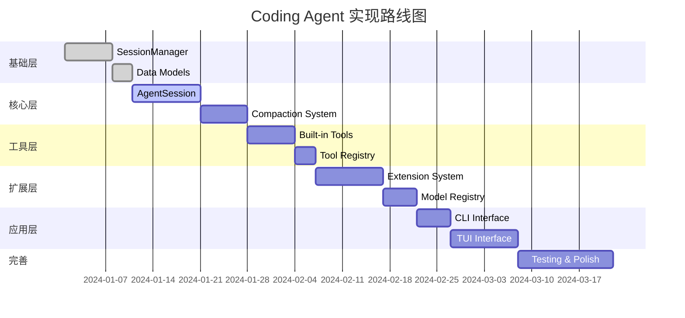

# Coding Agent 实现路线图

> 分阶段实施计划，从零到可运行的 Coding Agent

---

## 阶段概览



---

## Phase 1: 基础层（Week 1-2）

### 1.1 SessionManager - 会话持久化

**目标**：实现 JSONL 格式的会话存储和树形结构管理

**任务清单**：
- [ ] 定义 SessionEntry 数据类
- [ ] 实现 JSONL 文件的读写
- [ ] 实现树形结构（parentId 关联）
- [ ] 实现 buildSessionContext() 方法
- [ ] 实现分支功能（branch）
- [ ] 添加单元测试

**文件结构**：
```
packages/coding-agent/src/coding_agent/
├── session/
│   ├── __init__.py
│   ├── manager.py          # SessionManager 主类
│   ├── entry.py            # SessionEntry 定义
│   ├── tree.py             # 树操作
│   └── storage.py          # 文件存储
```

**关键代码模板**：
```python
class SessionManager:
    def __init__(self, session_id: str, storage_path: Path):
        self.session_id = session_id
        self.storage_path = storage_path
        self.entries: dict[str, SessionEntry] = {}
        self.current_leaf_id: str = ""
        self.root_id: str = ""
    
    async def append_message(self, message: Message) -> SessionMessageEntry:
        """追加消息到当前叶节点"""
        entry = SessionMessageEntry(
            id=generate_uuid(),
            parent_id=self.current_leaf_id,
            role=message.role,
            content=message.content
        )
        await self._persist(entry)
        self.current_leaf_id = entry.id
        return entry
    
    def build_session_context(self) -> list[Message]:
        """从叶节点回溯构建上下文"""
        messages = []
        current_id = self.current_leaf_id
        
        while current_id != self.root_id:
            entry = self.entries[current_id]
            if isinstance(entry, SessionMessageEntry):
                messages.insert(0, entry.to_message())
            elif isinstance(entry, CompactionEntry):
                messages.insert(0, entry.to_summary_message())
            current_id = entry.parent_id
        
        return messages
```

**验收标准**：
- ✅ 可以创建新会话并追加消息
- ✅ 可以从文件加载会话
- ✅ 可以构建正确的上下文（从叶到根）
- ✅ 分支功能正常工作
- ✅ 所有操作都是原子性的

---

### 1.2 数据模型定义

**目标**：定义所有核心数据类

**任务清单**：
- [ ] SessionEntry 基类及所有子类
- [ ] Message 和 ContentBlock 定义
- [ ] Tool 定义
- [ ] AgentConfig 定义
- [ ] AgentEvent 定义
- [ ] Model 相关定义

**文件结构**：
```
packages/coding-agent/src/coding_agent/
├── types/
│   ├── __init__.py
│   ├── entry.py            # SessionEntry 类型
│   ├── message.py          # Message 类型
│   ├── tool.py             # Tool 类型
│   ├── config.py           # Config 类型
│   └── event.py            # Event 类型
```

**依赖关系**：
```
types/entry.py ──▶ types/message.py ──▶ types/tool.py
                                      ──▶ types/config.py
                                      ──▶ types/event.py
```

---

## Phase 2: 核心层（Week 3-4）

### 2.1 AgentSession - 会话 orchestrator

**目标**：实现 AgentSession 协调层

**任务清单**：
- [ ] AgentSession 类框架
- [ ] 初始化流程（加载 SessionManager、ModelRegistry）
- [ ] 事件转发机制
- [ ] 模型切换功能
- [ ] 思考等级调整
- [ ] 与 packages/agent 的集成

**文件结构**：
```
packages/coding-agent/src/coding_agent/
├── core/
│   ├── __init__.py
│   └── session.py          # AgentSession 主类
```

**关键接口**：
```python
class AgentSession:
    def __init__(
        self,
        session_manager: SessionManager,
        model_registry: ModelRegistry,
        config: SessionConfig
    ):
        self.session_manager = session_manager
        self.model_registry = model_registry
        self.agent: Agent | None = None
        self.current_model: ResolvedModel | None = None
        
    async def initialize(self) -> None:
        """初始化 AgentSession"""
        # 加载当前模型
        self.current_model = await self._resolve_model()
        
        # 创建 Agent 实例
        self.agent = Agent(
            system_prompt=await self._load_system_prompt(),
            tools=self._build_tools(),
            model=self.current_model
        )
        
        # 绑定事件
        self._bind_events()
    
    async def prompt(self, text: str) -> None:
        """发送用户消息"""
        # 1. 持久化用户消息
        user_message = UserMessage(content=text)
        await self.session_manager.append_message(user_message)
        
        # 2. 启动 Agent 循环
        await self._run_agent_loop()
    
    async def switch_model(self, model_id: str) -> None:
        """切换模型"""
        resolved = self.model_registry.resolve_model(model_id)
        await self.session_manager.append_model_change(resolved)
        self.current_model = resolved
        if self.agent:
            self.agent.set_model(resolved)
```

**验收标准**：
- ✅ 可以初始化并加载已有会话
- ✅ 可以发送消息并触发 Agent 循环
- ✅ 可以切换模型并记录变更
- ✅ 事件正确转发

---

### 2.2 Compaction System - 上下文压缩

**目标**：实现上下文压缩和摘要生成

**任务清单**：
- [ ] CompactionManager 类
- [ ] Token 计数估算
- [ ] 压缩触发逻辑
- [ ] 摘要生成（LLM 调用）
- [ ] 压缩条目持久化
- [ ] 上下文重建

**文件结构**：
```
packages/coding-agent/src/coding_agent/
├── compaction/
│   ├── __init__.py
│   ├── manager.py          # CompactionManager
│   ├── summarizer.py       # 摘要生成器
│   ├── utils.py            # 工具函数
│   └── prompts.py          # 摘要提示词模板
```

**关键流程**：
```python
class CompactionManager:
    def __init__(
        self,
        session_manager: SessionManager,
        llm_client: LlmClient,
        config: CompactionConfig
    ):
        self.session_manager = session_manager
        self.llm_client = llm_client
        self.config = config
    
    async def maybe_compact(self, context: AgentContext) -> bool:
        """检查并执行压缩"""
        if not self._should_compact(context):
            return False
        
        # 计算截断点
        cutoff_index = self._calculate_cutoff(context)
        messages_to_summarize = context.messages[:cutoff_index]
        
        # 生成摘要
        summary = await self._generate_summary(messages_to_summarize)
        
        # 创建压缩条目
        compaction_entry = CompactionEntry(
            summary=summary,
            compressed_count=len(messages_to_summarize),
            original_token_count=self._estimate_tokens(messages_to_summarize),
            summary_token_count=self._estimate_tokens([summary]),
            compressed_message_ids=[m.id for m in messages_to_summarize]
        )
        
        # 持久化
        await self.session_manager.append_compaction(compaction_entry)
        
        return True
    
    async def _generate_summary(
        self, 
        messages: list[Message]
    ) -> str:
        """使用 LLM 生成摘要"""
        prompt = self._build_summary_prompt(messages)
        response = await self.llm_client.complete(prompt)
        return response.text
```

**验收标准**：
- ✅ Token 超标时自动触发压缩
- ✅ 摘要质量可接受（保留关键信息）
- ✅ 压缩后上下文正确重建
- ✅ 可以查看压缩历史

---

## Phase 3: 工具层（Week 5-6）

### 3.1 Built-in Tools - 内置工具

**目标**：实现所有内置工具

**任务清单**：
- [ ] read 工具（读取文件）
- [ ] bash 工具（执行命令）
- [ ] edit 工具（字符串替换）
- [ ] write 工具（写入文件）
- [ ] grep 工具（搜索内容）
- [ ] find 工具（查找文件）
- [ ] ls 工具（列出目录）

**文件结构**：
```
packages/coding-agent/src/coding_agent/
├── tools/
│   ├── __init__.py
│   ├── read.py
│   ├── bash.py
│   ├── edit.py
│   ├── write.py
│   ├── grep.py
│   ├── find.py
│   ├── ls.py
│   ├── path_utils.py       # 路径处理
│   └── truncate.py         # 内容截断
```

**工具工厂**：
```python
def create_coding_tools(
    cwd: str | Path,
    options: ToolOptions | None = None
) -> list[AgentTool]:
    """创建编程工具集"""
    return [
        ReadTool(cwd, options),
        BashTool(cwd, options),
        EditTool(cwd, options),
        WriteTool(cwd, options),
    ]

def create_readonly_tools(
    cwd: str | Path,
    options: ToolOptions | None = None
) -> list[AgentTool]:
    """创建只读工具集"""
    return [
        ReadTool(cwd, options),
        GrepTool(cwd, options),
        FindTool(cwd, options),
        LsTool(cwd, options),
    ]
```

**验收标准**：
- ✅ 所有工具可以正确执行
- ✅ 工具参数验证正确
- ✅ 错误处理完善
- ✅ 输出格式符合规范

---

### 3.2 Tool Registry - 工具注册中心

**目标**：管理工具的注册和查询

**任务清单**：
- [ ] ToolRegistry 类
- [ ] 工具注册/注销
- [ ] 工具查询
- [ ] 工具模式（Schema）生成

**文件结构**：
```
packages/coding-agent/src/coding_agent/
├── tools/
│   ├── registry.py         # ToolRegistry
```

---

## Phase 4: 扩展层（Week 7-9）

### 4.1 Extension System - 扩展系统

**目标**：实现可扩展的插件架构

**任务清单**：
- [ ] ExtensionRunner 类
- [ ] ExtensionAPI 实现
- [ ] 事件订阅机制
- [ ] 工具注册包装
- [ ] 命令注册
- [ ] 扩展加载器
- [ ] 扩展存储

**文件结构**：
```
packages/coding-agent/src/coding_agent/
├── extensions/
│   ├── __init__.py
│   ├── runner.py           # ExtensionRunner
│   ├── api.py              # ExtensionAPI 实现
│   ├── loader.py           # 扩展加载器
│   ├── types.py            # 类型定义
│   └── storage.py          # 扩展存储
```

**关键接口**：
```python
class ExtensionRunner:
    def __init__(self):
        self.extensions: dict[str, Extension] = {}
        self.hooks: dict[str, set[Callable]] = {}
        self.tools: dict[str, AgentTool] = {}
    
    async def load_extensions(self, paths: list[Path]) -> None:
        """加载扩展"""
        for path in paths:
            await self._load_extension(path)
    
    def create_api(self, extension_path: str) -> ExtensionAPI:
        """为扩展创建 API 对象"""
        return ExtensionAPIImpl(self, extension_path)
    
    async def emit_event(self, event: AgentEvent) -> None:
        """发射事件到所有订阅者"""
        handlers = self.hooks.get(event.type, set())
        await asyncio.gather(*[
            handler(event) for handler in handlers
        ])
```

**验收标准**：
- ✅ 可以加载 Python 扩展
- ✅ 扩展可以注册工具和命令
- ✅ 事件正确转发给扩展
- ✅ 扩展错误不影响主程序

---

### 4.2 Model Registry - 模型注册表

**目标**：管理模型发现和配置

**任务清单**：
- [ ] ModelRegistry 类
- [ ] 内置模型定义
- [ ] 用户自定义模型加载
- [ ] Provider 管理
- [ ] API Key 管理

**文件结构**：
```
packages/coding-agent/src/coding_agent/
├── models/
│   ├── __init__.py
│   ├── registry.py         # ModelRegistry
│   ├── builtin.py          # 内置模型定义
│   ├── loader.py           # 用户配置加载器
│   └── auth.py             # 认证管理
```

---

## Phase 5: 应用层（Week 10-11）

### 5.1 CLI Interface - 命令行界面

**目标**：实现命令行交互

**任务清单**：
- [ ] CLI 参数解析
- [ ] 会话列表/切换
- [ ] 交互式对话
- [ ] 配置文件管理

**文件结构**：
```
packages/coding-agent/src/coding_agent/
├── cli/
│   ├── __init__.py
│   ├── main.py             # CLI 入口
│   ├── args.py             # 参数解析
│   └── commands/
│       ├── session.py      # 会话管理命令
│       ├── config.py       # 配置命令
│       └── interactive.py  # 交互模式
```

---

### 5.2 TUI Interface - 终端用户界面

**目标**：实现 Rich/Textual 的交互界面

**任务清单**：
- [ ] 消息显示组件
- [ ] 输入框组件
- [ ] 工具执行状态显示
- [ ] Token 使用显示
- [ ] 模型切换 UI
- [ ] 历史消息浏览

**文件结构**：
```
packages/coding-agent/src/coding_agent/
├── ui/
│   ├── __init__.py
│   ├── app.py              # TUI 应用主类
│   ├── components/
│   │   ├── chat.py         # 聊天区域
│   │   ├── input.py        # 输入框
│   │   ├── sidebar.py      # 侧边栏
│   │   └── status.py       # 状态栏
│   └── events.py           # UI 事件处理
```

**验收标准**：
- ✅ 可以实时显示流式响应
- ✅ 可以显示工具执行进度
- ✅ 可以切换会话和模型
- ✅ 可以浏览历史消息

---

## Phase 6: 完善（Week 12-13）

### 6.1 Testing - 测试

**测试策略**：
```
tests/
├── unit/
│   ├── test_session_manager.py
│   ├── test_compaction.py
│   ├── test_tools.py
│   └── test_extensions.py
├── integration/
│   ├── test_agent_session.py
│   └── test_end_to_end.py
└── fixtures/
    └── sample_sessions/
```

**测试目标**：
- [ ] 单元测试覆盖率 > 80%
- [ ] 核心流程集成测试
- [ ] 性能测试（大会话处理）

---

### 6.2 Documentation - 文档

- [ ] API 文档（docstrings）
- [ ] 用户手册
- [ ] 扩展开发指南
- [ ] 架构设计文档（已完成 ✅）

---

### 6.3 Polish - 优化

- [ ] 性能优化（并发、缓存）
- [ ] 错误处理完善
- [ ] 日志系统
- [ ] 配置验证

---

## 依赖关系图

```
Phase 1: 基础层
├── SessionManager
│   └── Data Models
└── Data Models
    └── (None)

Phase 2: 核心层
├── AgentSession
│   ├── SessionManager ✅
│   ├── packages/agent ✅ (已存在)
│   └── ModelRegistry (Phase 4)
└── Compaction System
    ├── SessionManager ✅
    └── LLM Client (packages/ai ✅)

Phase 3: 工具层
├── Built-in Tools
│   └── (独立)
└── Tool Registry
    └── Built-in Tools ✅

Phase 4: 扩展层
├── Extension System
│   ├── AgentSession ✅
│   └── Tool Registry ✅
└── Model Registry
    └── (独立)

Phase 5: 应用层
├── CLI Interface
│   └── AgentSession ✅
└── TUI Interface
    └── AgentSession ✅
```

---

## 开发顺序建议

### 最小可行产品（MVP）

**核心路径**（2-3 周）：
1. SessionManager（基础存储）
2. AgentSession（协调层）
3. Built-in Tools（基础工具）
4. CLI Interface（命令行）

**MVP 验收**：
- ✅ 可以创建会话并对话
- ✅ 工具可以执行
- ✅ 会话持久化

### 完整功能

按上述 Phase 逐步完成。

---

## 风险与应对

| 风险 | 概率 | 影响 | 应对 |
|------|------|------|------|
| 与 packages/agent API 不兼容 | 中 | 高 | 早期集成测试 |
| Token 估算不准确 | 中 | 中 | 使用 tiktoken 或 heuristics |
| 扩展系统复杂度过高 | 低 | 高 | 先实现简单版本，逐步增强 |
| 性能问题（大会话） | 中 | 中 | 提前设计缓存和分页 |
| LLM 响应解析错误 | 高 | 中 | 完善的错误处理和重试 |

---

## 下一步行动

1. **立即开始**：Phase 1.1 SessionManager
2. **本周完成**：数据模型定义
3. **下周开始**：AgentSession 集成

需要我详细展开某个 Phase 的实现细节吗？
