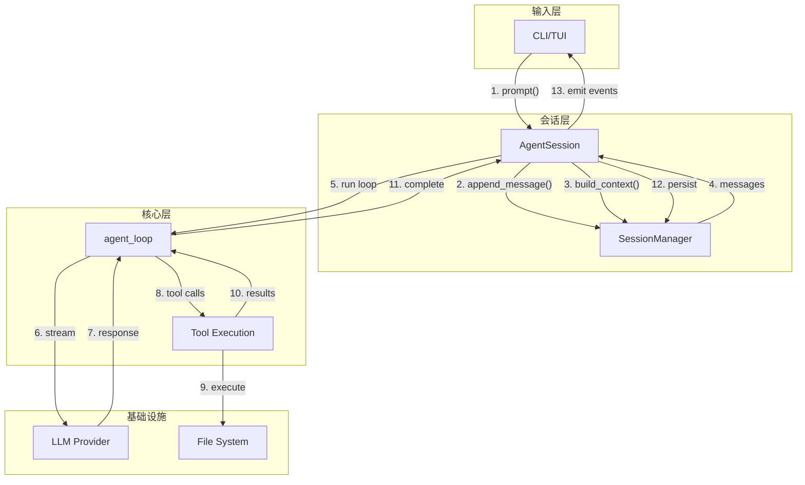

# Coding Agent 集成指南

> 如何将各组件集成为完整的 Coding Agent 系统

---

## 1. 系统组装架构

### 1.1 组装顺序

```
┌─────────────────────────────────────────────────────────────┐
│                     系统组装流程                              │
├─────────────────────────────────────────────────────────────┤
│                                                             │
│  1. 初始化基础设施                                            │
│     ├── 配置加载 (ConfigLoader)                              │
│     ├── 认证存储 (AuthStorage)                               │
│     └── 资源加载器 (ResourceLoader)                          │
│                          │                                  │
│                          ▼                                  │
│  2. 初始化核心服务                                            │
│     ├── SessionManager (持久化层)                            │
│     ├── ModelRegistry (模型发现)                             │
│     └── ExtensionRunner (扩展系统)                           │
│                          │                                  │
│                          ▼                                  │
│  3. 组装 AgentSession                                         │
│     ├── 绑定 SessionManager                                  │
│     ├── 绑定 ModelRegistry                                   │
│     ├── 加载 Extensions                                      │
│     └── 初始化 Agent (来自 packages/agent)                    │
│                          │                                  │
│                          ▼                                  │
│  4. 启动应用层                                                │
│     ├── CLI / TUI 初始化                                     │
│     └── 绑定事件处理器                                        │
│                                                             │
└─────────────────────────────────────────────────────────────┘
```

### 1.2 依赖注入模式

Coding Agent 采用**构造函数注入**的依赖注入模式：

```python
# 推荐方式：显式依赖
class AgentSession:
    def __init__(
        self,
        session_manager: SessionManager,
        model_registry: ModelRegistry,
        extension_runner: ExtensionRunner,
        config: SessionConfig,
    ):
        self.session_manager = session_manager
        self.model_registry = model_registry
        self.extension_runner = extension_runner
        self.config = config

# 不推荐：全局状态或隐式依赖
class BadAgentSession:
    def __init__(self):
        self.session_manager = get_global_session_manager()  # ❌
```

**好处**：
- 可测试性：易于 mock 依赖
- 可理解性：依赖关系清晰
- 可替换性：组件可以独立替换

---

## 2. 组件集成模式

### 2.1 SessionManager 集成

**职责边界**：
```
AgentSession        SessionManager         File System
     │                    │                    │
     │ 1. append_message() │                    │
     │────────────────────▶│                    │
     │                    │ 2. serialize()     │
     │                    │────────────────────▶
     │                    │                    │ 3. append to JSONL
     │                    │◀───────────────────│
     │◀───────────────────│                    │
     │ 4. update cache     │                    │
```

**关键原则**：
- SessionManager 只负责**持久化**和**树形结构**
- AgentSession 负责**业务逻辑**和**事件转发**
- 任何对历史的修改都通过 SessionManager

### 2.2 Agent 集成

**与 packages/agent 的关系**：

```
Pi-Mono Coding Agent                    Py-Mono Agent
────────────────────                    ─────────────
AgentSession                            Agent (类包装)
    │                                       │
    ├── Agent (pi-agent-core) ───────▶  agent_loop (函数)
    │                                       │
    │   职责：高层协调                      职责：底层循环
    │                                       │
    ├── SessionManager (持久化)             ├── AgentContext (运行时上下文)
    ├── ModelRegistry (模型)                ├── AgentConfig (配置)
    ├── ExtensionRunner (扩展)              └── 流式处理、工具执行
    └── CompactionManager (压缩)
```

**集成点**：

```python
class AgentSession:
    async def _run_agent_loop(self) -> None:
        """包装 packages/agent 的 agent_loop"""
        
        # 1. 构建上下文
        messages = self.session_manager.build_session_context()
        context = AgentContext(
            system_prompt=self.system_prompt,
            messages=messages,
            tools=self.tools,
        )
        
        # 2. 构建配置
        config = AgentLoopConfig(
            model=self.current_model,
            stream_fn=self._stream_fn,
            tool_execution="parallel",
            get_steering_messages=self._get_steering,
            get_follow_up_messages=self._get_follow_up,
        )
        
        # 3. 启动循环
        stream = agent_loop(
            prompts=[],  # 已包含在 context 中
            context=context,
            config=config,
        )
        
        # 4. 转发事件
        async for event in stream:
            await self._emit_event(event)
            await self.extension_runner.emit_event(event)
```

### 2.3 扩展系统集成

**扩展生命周期**：

```
ExtensionRunner
    │
    ├── 1. Discovery (发现)
    │   └── 扫描 ~/.pi/agent/extensions/
    │
    ├── 2. Loading (加载)
    │   └── import_extension() -> factory function
    │
    ├── 3. Activation (激活)
    │   └── factory(pi, context)
    │       └── 扩展注册工具和钩子
    │
    ├── 4. Runtime (运行时)
    │   └── emit_event() -> 调用所有注册的钩子
    │
    └── 5. Deactivation (停用)
        └── cleanup()
```

**事件流**：

```
Agent Loop Event
        │
        ▼
┌──────────────────┐
│ AgentSession     │
│ (业务逻辑处理)    │
└────────┬─────────┘
         │
         ▼
┌──────────────────┐
│ ExtensionRunner  │
│ (分发给扩展)      │
└──┬───────┬───────┘
   │       │
   ▼       ▼
┌──────┐ ┌──────┐
│Ext 1 │ │Ext 2 │
└──────┘ └──────┘
```

### 2.4 压缩系统集成

**触发时机**：

```python
class AgentSession:
    async def _on_message_end(self, event: MessageEndEvent) -> None:
        """消息结束时检查是否需要压缩"""
        
        # 获取当前上下文
        context = self._build_context()
        
        # 检查是否需要压缩
        if self.compaction_manager.should_compact(context):
            # 执行压缩
            await self.compaction_manager.compact(context)
            
            # 重新加载上下文
            await self._reload_context()
```

**压缩与 Agent 循环的协调**：

```
Normal Flow              With Compaction
───────────              ───────────────
User Input               User Input
    │                        │
    ▼                        ▼
Agent Loop               Agent Loop
    │                        │
    ▼                        ▼
Message End              Message End
    │                        │
    ▼                        ▼
Next Turn                Check Compaction?
                             │
                         Yes ▼
                         Compact
                             │
                             ▼
                         Update Context
                             │
                             ▼
                         Next Turn
```

---

## 3. 数据流设计

### 3.1 请求处理流



### 3.2 事件流设计

**事件传播策略**：

```
┌───────────────────────────────────────────────────────┐
│                    Event Bus                          │
├───────────────────────────────────────────────────────┤
│                                                       │
│   Agent Loop ──────▶ AgentSession ──────▶ UI         │
│       │                  │                   │        │
│       │                  ▼                   │        │
│       │           ExtensionRunner            │        │
│       │                  │                   │        │
│       │                  ▼                   │        │
│       │              Extensions              │        │
│       │                                       │        │
│       └───────────────▶ Logging               │        │
│                                                       │
└───────────────────────────────────────────────────────┘
```

**事件类型分类**：

| 类别 | 事件 | 监听者 |
|------|------|--------|
| **生命周期** | agent_start/end | UI, Extensions, Logging |
| **对话** | turn_start/end | UI, Extensions |
| **消息** | message_start/update/end | UI, Extensions |
| **工具** | tool_execution_start/update/end | UI, Extensions |
| **会话** | entry_appended | UI, Extensions |

### 3.3 状态管理

**状态分层**：

```
┌──────────────────────────────────────────────┐
│  Global State (全局状态)                      │
│  ├── Configuration (配置)                     │
│  ├── Model Registry (模型注册表)              │
│  └── Extension Registry (扩展注册表)          │
└──────────────────────────────────────────────┘
                      │
                      ▼
┌──────────────────────────────────────────────┐
│  Session State (会话状态)                     │
│  ├── SessionManager (持久化状态)              │
│  ├── AgentContext (运行时上下文)              │
│  └── UI State (界面状态)                      │
└──────────────────────────────────────────────┘
                      │
                      ▼
┌──────────────────────────────────────────────┐
│  Transient State (临时状态)                   │
│  ├── Streaming Message (流式消息)             │
│  ├── Tool Execution (工具执行中)              │
│  └── Pending Steering (待处理插队消息)        │
└──────────────────────────────────────────────┘
```

**状态同步原则**：
- **单一数据源**：SessionManager 是会话的唯一数据源
- **派生状态**：AgentContext 从 SessionManager 派生
- **本地状态**：UI 状态是本地派生，不直接修改数据源

---

## 4. 错误处理策略

### 4.1 错误分层

```
┌─────────────────────────────────────────────────────────┐
│ Layer 1: User Input Errors                              │
│ - Invalid commands                                      │
│ - Missing arguments                                     │
│ - Permission denied                                     │
│                                                         │
│ Strategy: Show helpful message, retry                   │
├─────────────────────────────────────────────────────────┤
│ Layer 2: Business Logic Errors                          │
│ - Model not found                                       │
│ - API key missing                                       │
│ - Session not found                                     │
│                                                         │
│ Strategy: Graceful degradation, suggest alternatives    │
├─────────────────────────────────────────────────────────┤
│ Layer 3: Infrastructure Errors                          │
│ - LLM API failure                                       │
│ - Network timeout                                       │
│ - File system error                                     │
│                                                         │
│ Strategy: Retry with exponential backoff, or fail safe  │
├─────────────────────────────────────────────────────────┤
│ Layer 4: System Errors                                  │
│ - Programming errors (bugs)                             │
│ - Resource exhaustion                                   │
│                                                         │
│ Strategy: Log and crash, or attempt recovery            │
└─────────────────────────────────────────────────────────┘
```

### 4.2 错误传播

```python
# 错误包装模式
class AgentError(Exception):
    """基础错误类"""
    def __init__(
        self, 
        message: str, 
        code: str,
        recoverable: bool = False,
        context: dict | None = None
    ):
        self.message = message
        self.code = code
        self.recoverable = recoverable
        self.context = context or {}
        super().__init__(message)

class LLMError(AgentError):
    """LLM 调用错误"""
    pass

class ToolError(AgentError):
    """工具执行错误"""
    pass

class SessionError(AgentError):
    """会话操作错误"""
    pass
```

### 4.3 恢复策略

| 错误类型 | 自动重试 | 降级方案 | 用户介入 |
|---------|---------|---------|---------|
| LLM API 失败 | ✅ 指数退避 | 切换备用模型 | 检查 API Key |
| 工具超时 | ✅ 1次 | 返回部分结果 | 确认继续 |
| 网络错误 | ✅ 3次 | 离线模式 | 检查网络 |
| 文件系统错误 | ❌ | 使用内存存储 | 检查权限 |
| 编程错误 | ❌ | ❌ | 报告 Bug |

---

## 5. 性能设计

### 5.1 大会话处理

**问题**：长会话可能包含数千条消息，加载和渲染会变慢。

**解决方案**：

```python
class SessionManager:
    def __init__(self):
        self._cache: LRUCache[str, SessionEntry] = LRUCache(maxsize=1000)
        self._index: dict[str, int] = {}  # ID -> file offset
    
    async def get_entry(self, entry_id: str) -> SessionEntry:
        """带缓存的条目获取"""
        if entry_id in self._cache:
            return self._cache[entry_id]
        
        # 从文件特定位置读取
        offset = self._index[entry_id]
        entry = await self._read_at_offset(offset)
        
        self._cache[entry_id] = entry
        return entry
    
    def build_session_context(
        self, 
        max_messages: int = 100  # 限制加载数量
    ) -> list[Message]:
        """限制上下文大小"""
        messages = []
        current_id = self.current_leaf_id
        count = 0
        
        while current_id != self.root_id and count < max_messages:
            entry = self.get_entry(current_id)
            if isinstance(entry, (SessionMessageEntry, CompactionEntry)):
                messages.insert(0, entry.to_message())
                count += 1
            current_id = entry.parent_id
        
        return messages
```

### 5.2 并发控制

**并发模型**：

```
┌──────────────────────────────────────────────┐
│ Main Thread                                  │
│ ├── Event Loop                               │
│ │   ├── AgentSession (协调)                   │
│ │   ├── UI Updates (UI 更新)                  │
│ │   └── User Input (用户输入)                 │
│ │                                            │
│ └── Background Tasks                         │
│     ├── LLM Stream (LLM 流式)                │
│     ├── Tool Execution (工具执行)            │
│     └── File I/O (文件 I/O)                  │
└──────────────────────────────────────────────┘
```

**并发原则**：
- 所有 I/O 操作都是异步的
- CPU 密集型任务使用线程池
- 共享状态使用锁保护

### 5.3 内存管理

**内存优化策略**：

```python
class AgentSession:
    def __init__(self):
        self._message_cache: WeakValueDictionary[str, Message] = \
            WeakValueDictionary()
        self._context_window: deque[Message] = deque(maxlen=1000)
    
    def _cleanup_old_entries(self) -> None:
        """清理旧条目释放内存"""
        # 只保留最近 1000 条消息在内存
        # 其他条目按需从文件加载
        pass
```

---

## 6. 安全设计

### 6.1 工具沙箱

**危险工具限制**：

```python
class BashTool:
    DANGEROUS_COMMANDS = [
        'rm -rf /',
        'mkfs',
        'dd',
        'format',
    ]
    
    async def execute(self, command: str) -> ToolResult:
        # 1. 命令检查
        if self._is_dangerous(command):
            return ToolResult.error("Dangerous command blocked")
        
        # 2. 路径限制
        if not self._is_within_cwd(command):
            return ToolResult.error("Path outside working directory")
        
        # 3. 执行
        return await self._run_safe(command)
```

### 6.2 凭证管理

```
┌──────────────────────────────────────────────┐
│ AuthStorage                                  │
│ ├── FileBackend (加密存储)                    │
│ ├── MemoryBackend (临时)                      │
│ └── KeychainBackend (系统钥匙串)              │
└──────────────────────────────────────────────┘
```

**安全原则**：
- API Key 绝不硬编码
- 敏感数据加密存储
- 内存中不长期保留凭证

---

## 7. 扩展点设计

### 7.1 可扩展组件

| 组件 | 扩展方式 | 接口 |
|------|---------|------|
| **工具** | 注册新工具 | `pi.registerTool()` |
| **模型** | 注册新 Provider | `pi.registerProvider()` |
| **命令** | 注册斜杠命令 | `pi.registerCommand()` |
| **钩子** | 订阅生命周期事件 | `pi.on()` |
| **UI** | 自定义组件 | `pi.ui.setWidget()` |
| **存储** | 扩展私有数据 | `pi.appendEntry()` |

### 7.2 扩展示例

```python
# 扩展示例：代码统计工具
async def activate(pi: ExtensionAPI, context: ExtensionContext):
    """扩展激活函数"""
    
    # 1. 注册工具
    pi.register_tool(
        name="code_stats",
        description="统计代码行数",
        parameters={
            "path": {"type": "string", "description": "代码路径"}
        },
        execute=code_stats_executor
    )
    
    # 2. 注册命令
    pi.register_command(
        name="stats",
        handler=stats_command_handler
    )
    
    # 3. 订阅事件
    pi.on("agent_start", on_agent_start)
    
    # 4. 自定义 UI
    pi.ui.set_footer(MyCustomFooter())
```

---

## 8. 配置管理

### 8.1 配置层次

```
优先级从高到低：

1. 命令行参数
   └── --model claude-3-opus
   
2. 环境变量
   └── ANTHROPIC_API_KEY=xxx
   
3. 项目配置
   └── ./.pi/config.json
   
4. 用户配置
   └── ~/.pi/config.json
   
5. 默认配置
   └── 代码中的默认值
```

### 8.2 配置合并

```python
class ConfigLoader:
    def load(self) -> AppConfig:
        """加载并合并配置"""
        config = {}
        
        # 1. 默认配置
        config.update(self._load_defaults())
        
        # 2. 用户配置
        config.update(self._load_user_config())
        
        # 3. 项目配置
        config.update(self._load_project_config())
        
        # 4. 环境变量
        config.update(self._load_env_vars())
        
        # 5. 命令行参数
        config.update(self._load_cli_args())
        
        return AppConfig(**config)
```

---

## 9. 测试策略

### 9.1 测试金字塔

```
         ┌─────────┐
         │   E2E   │  <-- 少量，完整流程
         │  (10%)  │
        ┌┴─────────┴┐
        │ Integration│  <-- 组件集成
        │   (30%)   │
       ┌┴───────────┴┐
       │    Unit      │  <-- 大量，核心业务
       │    (60%)     │
       └──────────────┘
```

### 9.2 关键测试场景

| 场景 | 类型 | 重点 |
|------|------|------|
| 会话 CRUD | Unit | 树形结构正确性 |
| 压缩逻辑 | Unit | Token 计算、摘要质量 |
| Agent 循环 | Integration | 事件顺序、工具执行 |
| 扩展加载 | Integration | 隔离性、错误处理 |
| 端到端对话 | E2E | 完整用户流程 |

---

## 10. 部署与运维

### 10.1 运行模式

```
┌──────────────────────────────────────────────┐
│  Mode 1: CLI Mode                            │
│  ├── 适合：脚本、自动化、CI/CD                │
│  └── 命令：pi agent "prompt"                  │
├──────────────────────────────────────────────┤
│  Mode 2: Interactive Mode                    │
│  ├── 适合：日常开发、探索性工作               │
│  └── 命令：pi agent                           │
├──────────────────────────────────────────────┤
│  Mode 3: RPC Mode                            │
│  ├── 适合：IDE 集成、第三方工具               │
│  └── 命令：pi agent --rpc                     │
└──────────────────────────────────────────────┘
```

### 10.2 日志与监控

```python
# 结构化日志
logger.info(
    "agent_session_started",
    session_id=session_id,
    model=model_id,
    tool_count=len(tools),
)

logger.debug(
    "tool_executed",
    tool_name=tool_name,
    duration_ms=duration,
    success=not result.is_error,
)
```

---

## 11. 最佳实践

### 11.1 设计原则

1. **单一职责**：每个组件只做一件事
2. **依赖反转**：依赖接口，不依赖实现
3. **事件驱动**：状态变化通过事件传播
4. **防御编程**：假设输入都是不可信的
5. **优雅降级**：部分失败不影响整体

### 11.2 代码组织

```
packages/coding-agent/src/coding_agent/
├── __init__.py
├── __main__.py              # CLI 入口
├── cli/                     # 命令行界面
├── ui/                      # TUI 界面
├── core/                    # 核心组件
│   ├── session.py           # AgentSession
│   └── ...
├── session/                 # 会话管理
├── compaction/              # 上下文压缩
├── extensions/              # 扩展系统
├── models/                  # 模型管理
├── tools/                   # 内置工具
├── types/                   # 类型定义
└── utils/                   # 工具函数
```

### 11.3 常见陷阱

| 陷阱 | 问题 | 解决方案 |
|------|------|---------|
| 循环依赖 | 组件 A 依赖 B，B 又依赖 A | 使用接口、事件、或重构 |
| 全局状态 | 难以测试、难以理解 | 依赖注入、显式传递 |
| 过度工程 | 过早抽象、复杂设计 | 先简单实现，再重构 |
| 忽略错误 | 静默失败、难以调试 | 显式错误处理、日志 |
| 阻塞 I/O | 界面卡顿 | 使用异步、并发 |

---

## 12. 总结

Coding Agent 的集成设计遵循以下核心思想：

1. **分层清晰**：应用层 → 会话层 → 核心层 → 基础设施
2. **组件解耦**：通过接口和事件实现松耦合
3. **可扩展**：Extension System 提供丰富的扩展点
4. **可观测**：完整的事件流和日志
5. **容错**：多层错误处理和恢复策略

**下一步**：根据路线图，从 SessionManager 开始实现！
