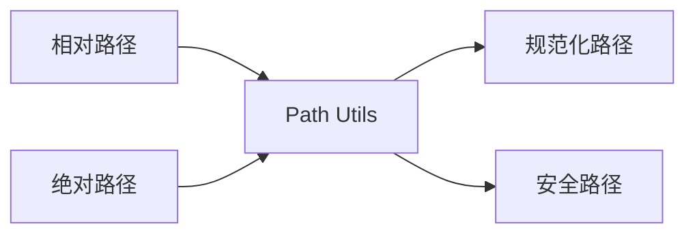
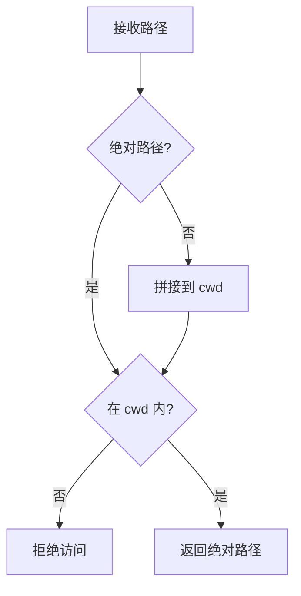

# Path Utils 工具详解

> Path Utils 是路径处理工具集，提供路径规范化、解析、验证等功能。

## 1. 高层设计

### 1.1 核心功能



| 功能 | 说明 |
|------|------|
| **resolve_to_cwd** | 将相对路径解析为绝对路径 |
| **normalize_path** | 规范化路径（去除冗余成分） |
| **validate_path** | 验证路径安全性 |
| **is_path_inside** | 检查路径是否在指定目录内 |

### 1.2 安全设计



**安全原则**：所有文件操作必须在 `cwd` 指定的工作目录内，防止路径穿越攻击。

## 2. 核心函数

### 2.1 resolve_to_cwd

```python
def resolve_to_cwd(path: str, cwd: str) -> str:
    """将相对路径解析为绝对路径.

    Args:
        path: 相对路径或绝对路径
        cwd: 工作目录

    Returns:
        绝对路径

    """
```

### 2.2 validate_path

```python
def validate_path(path: str, cwd: str) -> bool:
    """验证路径是否安全.

    Args:
        path: 要验证的路径
        cwd: 工作目录

    Returns:
        是否安全

    """
```

### 2.3 is_path_inside

```python
def is_path_inside(path: str, parent: str) -> bool:
    """检查路径是否在父目录内.

    Args:
        path: 要检查的路径
        parent: 父目录

    Returns:
        是否在父目录内

    """
```

## 3. 使用示例

```python
from coding_agent.tools.path_utils import (
    resolve_to_cwd,
    normalize_path,
    validate_path,
    is_path_inside,
)

# 解析相对路径
abs_path = resolve_to_cwd("src/main.py", "/project")
# -> "/project/src/main.py"

# 验证路径安全
is_safe = validate_path("/project/../etc/passwd", "/project")
# -> False

# 检查路径是否在目录内
is_inside = is_path_inside("/project/src/main.py", "/project")
# -> True
```

## 4. 安全机制

| 攻击类型 | 防护方式 |
|----------|----------|
| 路径穿越 | `../` 检测 + `realpath` 解析 |
| 符号链接 | `realpath` 解析到真实路径 |
| 绝对路径逃逸 | 检查解析后路径是否在 cwd 内 |

## 5. 扩展阅读

- [Read 工具](./03-read-tool.md) - 文件读取工具
- [Write 工具](./02-write-tool.md) - 文件写入工具
