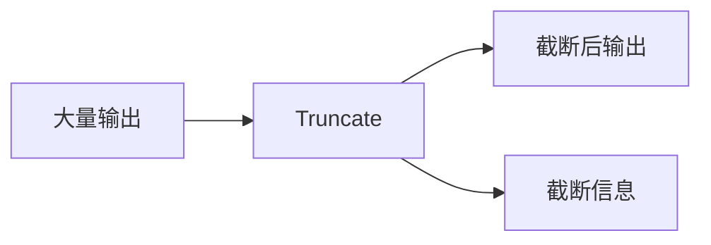
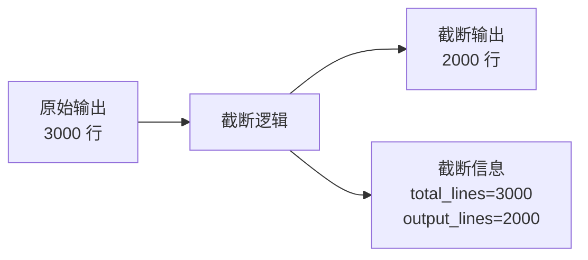
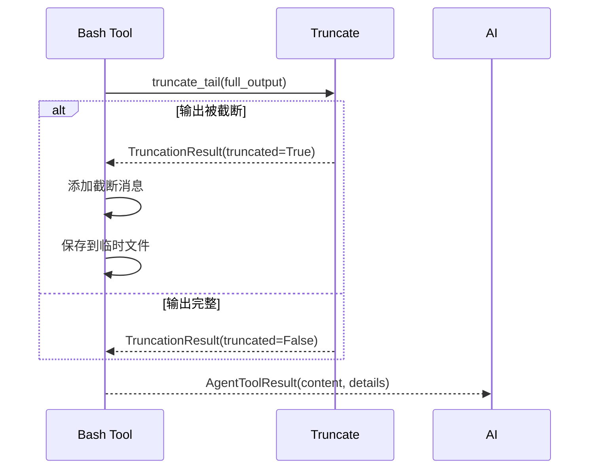

# Truncate 工具详解

> Truncate 是输出截断工具集，提供尾部截断、头部截断、行截断等功能，用于处理大量输出。

## 1. 高层设计

### 1.1 核心功能



| 功能 | 说明 |
|------|------|
| **truncate_tail** | 尾部截断，保留最后 N 行/字节 |
| **truncate_head** | 头部截断，保留开头 N 行/字节 |
| **truncate_line** | 单行截断，限制最大行长度 |

### 1.2 默认限制

| 限制项 | 默认值 |
|--------|--------|
| 最大行数 | 2000 行 |
| 最大字节 | 30KB |
| Grep 最大行长度 | 10KB |

## 2. 截断策略

### 2.1 尾部截断 (truncate_tail)



**算法**：
1. 按行分割
2. 计算总行数和总字节
3. 从尾部保留最大行数
4. 返回截断信息和截断后内容

### 2.2 截断结果结构

```python
@dataclass
class TruncationResult:
    """截断结果."""
    
    content: str | None           # 截断后的内容
    truncated: bool                # 是否被截断
    truncated_by: str              # 截断方式: "lines" | "bytes" | "partial"
    total_lines: int               # 总行数
    output_lines: int             # 输出行数
    output_bytes: int             # 输出字节数
    last_line_partial: bool       # 最后一行是否被部分截断
```

## 3. 使用示例

```python
from coding_agent.tools.truncate import (
    truncate_tail,
    truncate_head,
    truncate_line,
    DEFAULT_MAX_LINES,
    DEFAULT_MAX_BYTES,
)

# 尾部截断
result = truncate_tail("line1\nline2\nline3\n..." * 1000)
print(result.content)       # 最后 2000 行
print(result.truncated)     # True
print(result.total_lines)   # 原始总行数

# 带截断信息的输出
if result.truncated:
    print(f"显示 {result.output_lines}/{result.total_lines} 行")
```

## 4. 消息格式

### 4.1 尾部截断消息

```python
# 按行截断
"[显示第 1001-3000 行（共 3000 行）。完整输出: /tmp/xxx.log]"

# 按字节截断
"[显示第 1001-3000 行（共 3000 行），限制 30KB。完整输出: /tmp/xxx.log]"

# 单行过长
"[显示第 3000 行的最后 15KB（该行共 20KB）。完整输出: /tmp/xxx.log]"
```

## 5. 与 Bash 工具集成



## 6. 扩展阅读

- [Bash 工具](./03-bash-tool.md) - 使用 truncate_tail 的主要工具
- [Edit 工具](./01-edit-tool.md) - 文件编辑工具
