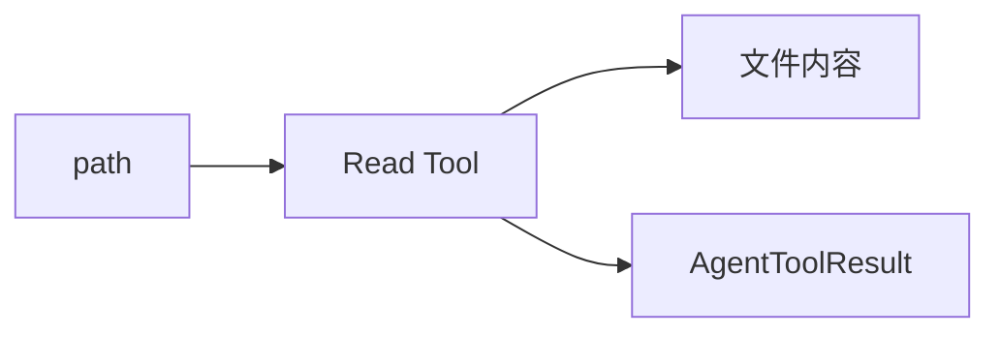
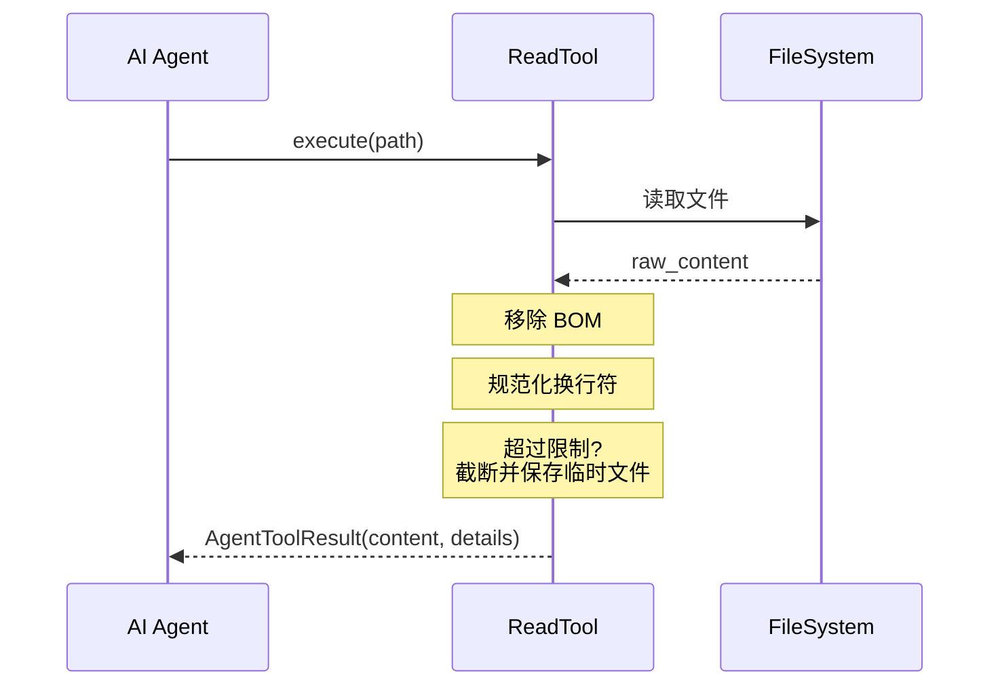

# Read 工具详解

> Read 工具是文件读取工具，支持读取文件内容、处理大文件、输出截断。

## 1. 高层设计

### 1.1 核心功能



| 功能 | 说明 |
|------|------|
| **文件读取** | 读取指定路径的文件内容 |
| **大文件截断** | 超过限制时截断并保存到临时文件 |
| **换行符处理** | 规范化换行符 |
| **BOM 处理** | 支持 UTF-8 BOM 文件 |

### 1.2 工作流程



### 1.3 关键设计决策

| 决策 | 选择 | 理由 |
|------|------|------|
| 大文件处理 | 截断 + 临时文件 | 防止内存溢出 |
| 换行符 | 转为 LF | 统一处理 |
| BOM | 读取时移除 | 避免干扰 LLM |

## 2. 错误处理机制

### 2.1 错误场景

| 场景 | 处理 |
|------|------|
| 文件不存在 | 返回 error result |
| 无权限读取 | 返回 error result |
| 取消信号 | raise CancelledError |

## 3. 与 pi-mono 差异

| 方面 | pi-mono (TS) | py-mono (Python) |
|------|--------------|------------------|
| 错误处理 | `reject(Error)` | `return AgentToolResult(is_error=True)` |
| 取消处理 | `reject(Error)` | `raise CancelledError` |
| 实现模式 | Promise + 事件监听 | 类 + Protocol |

## 4. 使用示例

```python
from coding_agent.tools.read import create_read_tool

tool = create_read_tool("/project")
result = await tool.execute("call_1", {
    "path": "src/main.py"
})

print(result.content[0].text)
print(result.details)  # 如果被截断
```

## 5. 扩展阅读

- [Path Utils](./01-path-utils.md) - 路径处理工具
- [Truncate](./02-truncate.md) - 输出截断工具
- [Write 工具](./04-write-tool.md) - 文件写入工具
