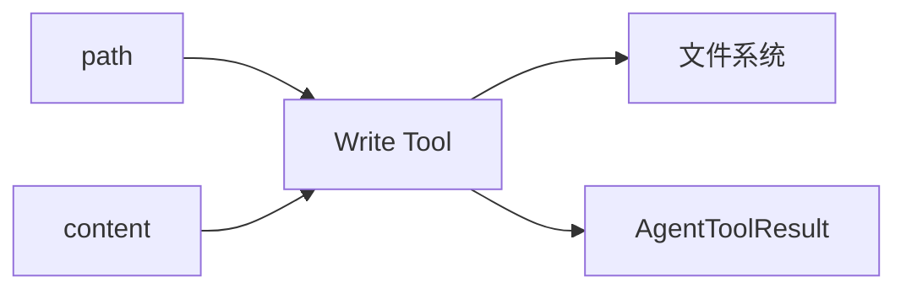
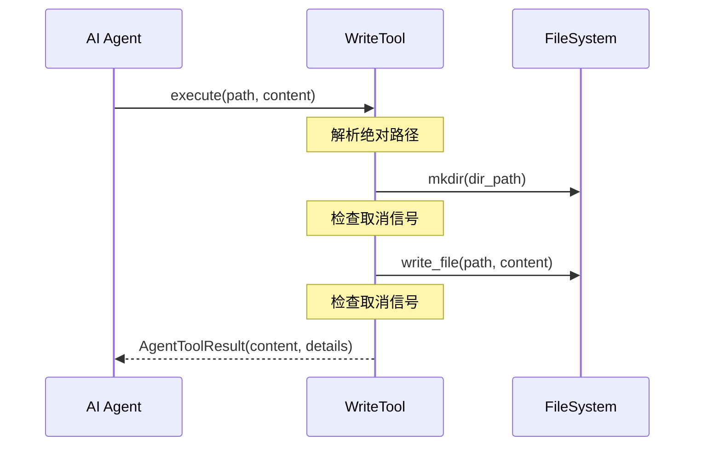

# Write 工具详解

> Write 工具是文件写入工具，支持创建新文件、覆盖文件、自动创建父目录。

## 1. 高层设计

### 1.1 核心功能



| 功能 | 说明 |
|------|------|
| **创建文件** | 将 content 写入指定路径 |
| **覆盖文件** | 直接覆盖现有文件内容 |
| **自动创建目录** | 写入时自动创建父目录 |
| **原子操作 | 使用临时文件保证原子性 |

### 1.2 工作流程



### 1.3 关键设计决策

| 决策 | 选择 | 理由 |
|------|------|------|
| 自动创建目录 | 默认开启 | 简化 AI 操作 |
| 覆盖已有文件 | 允许 | AI 需要能修改文件 |
| 原子性写入 | 临时文件 | 防止写入失败导致文件损坏 |
| 取消检查点 | mkdir 后、write 后 | 平衡响应性与安全性 |

## 2. 错误处理机制

### 2.1 错误场景

| 场景 | 处理 |
|------|------|
| 目录创建失败 | 返回 error result |
| 文件写入失败 | 返回 error result |
| 取消信号 | raise CancelledError |

### 2.2 错误处理约定

根据 `AgentTool` Protocol：

```python
# 错误返回 error result
return self._error_result(f"创建目录失败: {e}")

# 取消抛出 CancelledError
raise asyncio.CancelledError("操作已取消")
```

## 3. 与 pi-mono 差异

| 方面 | pi-mono (TS) | py-mono (Python) |
|------|--------------|------------------|
| 错误处理 | `reject(Error)` | `return AgentToolResult(is_error=True)` |
| 取消处理 | `reject(Error)` | `raise CancelledError` |
| 实现模式 | Promise + 事件监听 | 类 + Protocol |

## 4. 测试覆盖

| 测试类 | 用例数 | 覆盖场景 |
|--------|--------|----------|
| TestWriteNewFile | 3 | 简单内容、空文件、二进制内容 |
| TestOverwriteFile | 1 | 覆盖已有文件 |
| TestAutoCreateDirectories | 2 | 多级目录、单级目录 |
| TestWriteReadRoundtrip | 1 | 写入后读取验证 |
| TestToolAttributes | 4 | name、label、description、parameters |

## 5. 使用示例

```python
from coding_agent.tools.write import create_write_tool

tool = create_write_tool("/project")
result = await tool.execute("call_1", {
    "path": "src/utils/helper.py",
    "content": "# Helper functions\n\ndef foo(): pass"
})

print(result.content[0].text)  # "成功写入 45 字节到 src/utils/helper.py"
```

## 6. 扩展阅读

- [Read 工具](./03-read-tool.md) - 文件读取工具
- [Edit 工具](./05-edit-tool.md) - 文件编辑工具
- [Bash 工具](./06-bash-tool.md) - 命令执行工具
