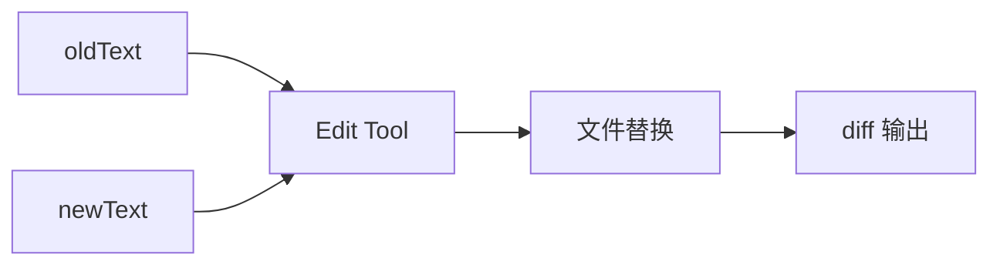
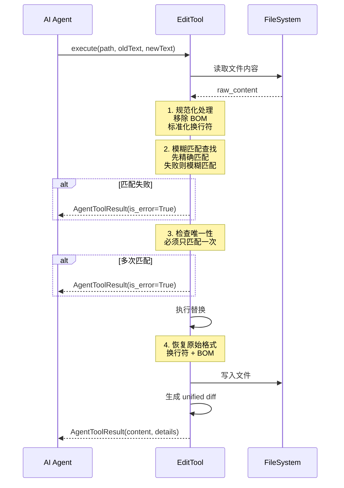

# Edit 工具详解

> Edit 工具是 AI 编程助手的核心文件修改工具，支持精确文本替换、模糊匹配和统一 diff 输出。

## 1. 高层设计

### 1.1 核心功能



| 功能 | 说明 |
|------|------|
| **精确替换** | 在文件中将 oldText 替换为 newText |
| **模糊匹配** | 忽略智能引号等差异，提高 LLM 成功率 |
| **唯一性检查** | 确保替换目标唯一，防止歧义 |
| **换行符保留** | 检测并恢复原始换行符类型 |
| **BOM 处理** | 支持 UTF-8 BOM 文件 |
| **Diff 输出** | 返回 unified diff 格式，便于 AI 理解变更 |

### 1.2 工作流程



### 1.3 关键设计决策

| 决策 | 选择 | 理由 |
|------|------|------|
| 精确优先 | 先 exact match，再 fuzzy | 保证安全替换 |
| 唯一性检查 | oldText 必须唯一 | 防止歧义，AI 需提供更多上下文 |
| 换行符保留 | 检测并恢复 | 保持文件历史一致性 |
| BOM 处理 | 写入时恢复 | 兼容需要 BOM 的场景 |

## 2. 错误处理机制

### 2.1 错误处理约定

根据 `AgentTool` Protocol：

- **业务错误**：返回 `AgentToolResult(content=[...], details=None)`
- **取消信号**：raise `asyncio.CancelledError`
- **系统错误**：根据情况选择返回或抛出

### 2.2 错误场景

| 场景 | 返回 | 消息 |
|------|------|------|
| 文件不存在 | error result | "文件不存在或无权限" |
| 文本未找到 | error result | "无法找到精确的文本" |
| 多次匹配 | error result | "找到了 N 处匹配的文本" |
| 无变化 | error result | "未对文件进行任何更改" |
| 写入失败 | error result | "写入文件失败" |

## 3. 实现细节

### 3.1 核心组件

```
src/coding_agent/tools/
├── edit.py              # 主实现
├── edit_diff.py         # diff 生成
├── edit_fuzzy.py        # 模糊匹配算法
└── edit_normalize.py    # 规范化处理
```

### 3.2 规范化处理

```python
# 处理流程
raw_content = read_file(path)
bom, content = strip_bom(raw_content)          # 移除 BOM
original_ending = detect_line_ending(content)   # 记录原始换行符
normalized = normalize_to_lf(content)          # 转为 LF
```

### 3.3 模糊匹配

```python
# 匹配策略
1. exact_match(content, oldText)           # 精确匹配
2. fuzzy_match(content, oldText)           # 模糊匹配
   - 忽略引号类型差异：' " ｀
   - 忽略空白差异
```

### 3.4 Diff 生成

```python
# unified diff 格式
diff = generate_diff_string(old_content, new_content)
# 返回 first_changed_line 供 UI 高亮使用
```

## 4. 与 pi-mono 差异

| 方面 | pi-mono (TS) | py-mono (Python) |
|------|--------------|------------------|
| 错误处理 | `reject(Error)` | `return AgentToolResult(is_error=True)` |
| 取消处理 | `reject(Error)` | `raise CancelledError` |
| 实现模式 | Promise + 内部函数 | 类 + Protocol |

**关键差异**：pi-mono 违反 Protocol 约定（工具不应抛出异常），py-mono 修复了此问题。

## 5. 测试覆盖

| 测试类 | 用例数 | 覆盖场景 |
|--------|--------|----------|
| TestExactReplace | 2 | 简单替换、多行替换 |
| TestFuzzyMatch | 1 | 智能引号匹配 |
| TestErrorHandling | 3 | 文件不存在、文本未找到、多次匹配 |
| TestLineEndings | 1 | CRLF 换行符保留 |
| TestDiffOutput | 1 | diff 详情输出 |
| TestToolAttributes | 3 | name、label、parameters |

## 6. 使用示例

### 6.1 基本用法

```python
from coding_agent.tools.edit import create_edit_tool

tool = create_edit_tool("/project")
result = await tool.execute("call_1", {
    "path": "src/main.py",
    "oldText": "print('hello')",
    "newText": "print('hello world')"
})

print(result.content[0].text)  # "成功在 src/main.py 中替换文本。"
print(result.details.diff)      # unified diff
```

### 6.2 多行替换

```python
result = await tool.execute("call_2", {
    "path": "config.yaml",
    "oldText": "server:\n  port: 8080",
    "newText": "server:\n  port: 3000"
})
```

## 7. 扩展阅读

- [Write 工具](./04-write-tool.md) - 文件写入工具
- [Bash 工具](./06-bash-tool.md) - 命令执行工具
