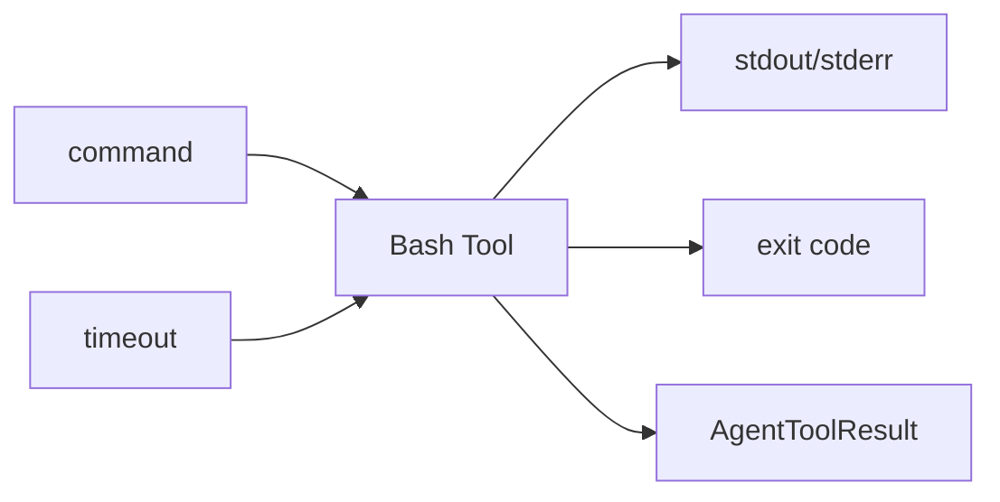
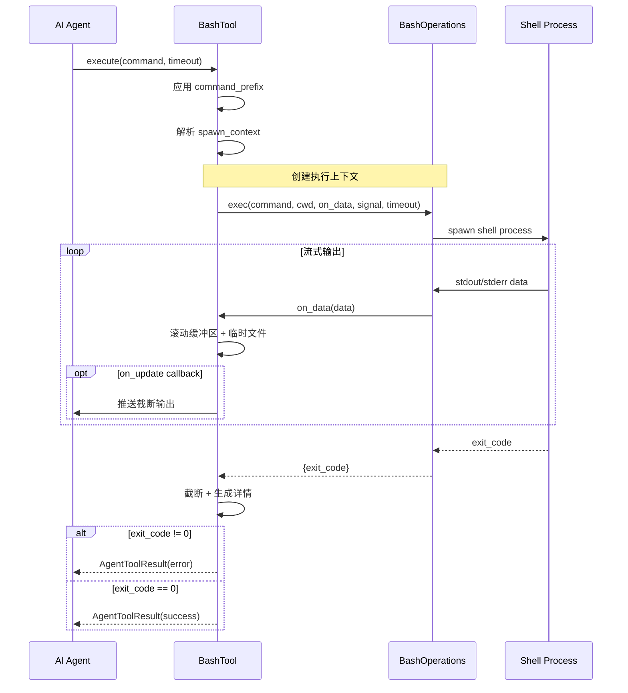

# Bash 工具详解

> Bash 工具是命令执行工具，支持安全执行 shell 命令、超时控制、输出截断和流式更新。

## 1. 高层设计

### 1.1 核心功能



| 功能 | 说明 |
|------|------|
| **命令执行** | 在指定目录执行 shell 命令 |
| **超时控制** | 可选超时时间，自动终止进程 |
| **输出截断** | 大量输出时截断并保存到临时文件 |
| **流式更新** | 通过 `on_update` 回调实时推送输出 |
| **环境变量** | 继承当前进程环境变量 |
| **进程组终止** | 超时/取消时终止整个进程树 |

### 1.2 工作流程



### 1.3 关键设计决策

| 决策 | 选择 | 理由 |
|------|------|------|
| 进程组 | `start_new_session=True` | 整体终止子进程 |
| 超时 | `signal.SIGALRM` | POSIX 标准超时机制 |
| 截断策略 | 尾部截断 + 临时文件 | 保留最新输出 |
| 缓冲策略 | 滚动缓冲区 | 控制内存使用 |

## 2. 错误处理机制

### 2.1 错误场景

| 场景 | 处理 |
|------|------|
| 超时 | 返回 error result + "命令超时" |
| 取消 | raise CancelledError |
| 非零退出码 | 返回 error result + "命令退出码: N" |
| 执行失败 | 返回 error result |

### 2.2 可插拔架构

```python
class BashOperations(Protocol):
    """可插拔的 bash 操作接口."""

    def exec(
        command: str,
        cwd: str,
        on_data: Callable[[bytes], None],
        signal: Any = None,
        timeout: int | None = None,
        env: dict[str, str] | None = None,
    ) -> dict[str, Any]:
        """执行命令并流式输出."""
        ...
```

支持自定义实现（如 SSH 远程执行）。

## 3. 输出截断机制

### 3.1 截断策略

| 限制 | 默认值 |
|------|--------|
| 最大行数 | 2000 行 |
| 最大字节 | 30KB |
| 临时文件 | 超过阈值时写入 |

### 3.2 截断消息格式

```python
# 尾部截断
output_text += "\n\n[显示第 1001-3000 行（共 3000 行）。完整输出: /tmp/xxx.log]"

# 单行过长
output_text += "\n\n[显示第 3000 行的最后 15KB（该行共 20KB）。完整输出: /tmp/xxx.log]"
```

## 4. 与 pi-mono 差异

| 方面 | pi-mono (TS) | py-mono (Python) |
|------|--------------|------------------|
| 错误处理 | `reject(Error)` | `return AgentToolResult(is_error=True)` |
| 取消处理 | `reject(Error)` | `raise CancelledError` |
| 实现模式 | Promise + 事件监听 | 类 + Protocol |
| 返回类型 | dict | AgentToolResult |

## 5. 测试覆盖

| 测试类 | 用例数 | 覆盖场景 |
|--------|--------|----------|
| TestBasicExecution | 2 | echo、pwd |
| TestErrorHandling | 2 | 退出码错误、无效命令 |
| TestTimeout | 1 | 超时功能 |
| TestWorkingDirectory | 1 | 工作目录切换 |
| TestOutputTruncation | 1 | 大量输出截断 |
| TestEnvironment | 1 | 环境变量继承 |
| TestToolAttributes | 3 | name、label、parameters |

## 6. 使用示例

### 6.1 基本用法

```python
from coding_agent.tools.bash import create_bash_tool

tool = create_bash_tool("/project")
result = await tool.execute("call_1", {
    "command": "git status",
    "timeout": 30
})

print(result.content[0].text)
print(result.details.truncation)  # 如果被截断
```

### 6.2 流式更新

```python
async def on_update(partial_result):
    print(partial_result.content[0].text, end="")

result = await tool.execute(
    "call_2",
    {"command": "pip install -r requirements.txt"},
    on_update=on_update
)
```

## 7. 扩展阅读

- [Edit 工具](./05-edit-tool.md) - 文件编辑工具
- [Write 工具](./04-write-tool.md) - 文件写入工具
