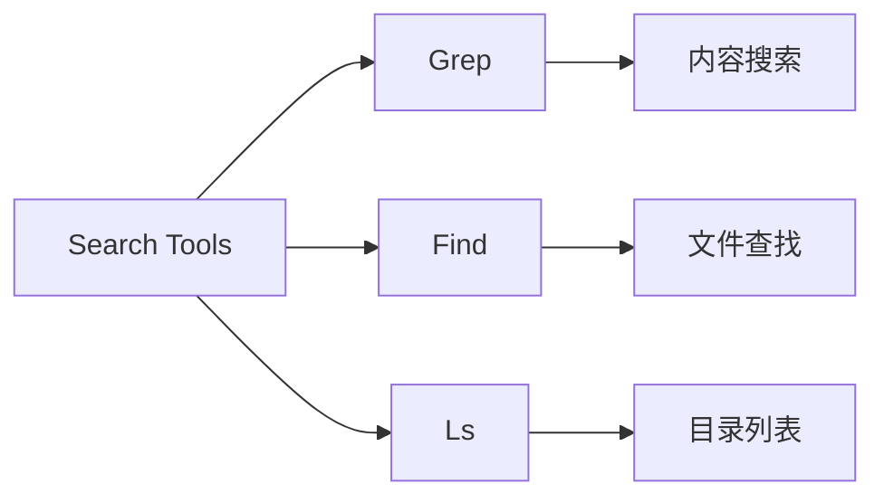
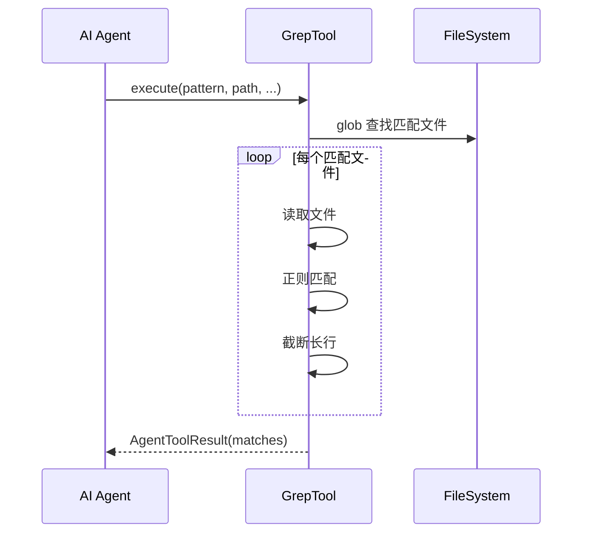

# Search Tools 搜索工具详解

> Search Tools 包含 Grep、Find、Ls 三个搜索工具，用于文件内容搜索、文件查找和目录列表。

## 1. 高层架构



## 2. Grep 工具

### 2.1 核心功能

| 功能 | 说明 |
|------|------|
| **内容搜索** | 在文件中搜索匹配的行 |
| **正则支持** | 支持正则表达式 |
| **上下文** | 可选显示匹配行前后内容 |
| **计数模式** | 只显示匹配数量 |

### 2.2 工作流程



### 2.3 参数说明

| 参数 | 类型 | 说明 |
|------|------|------|
| pattern | string | 搜索模式（正则） |
| path | string | 搜索路径 |
| file_pattern | string | 文件名过滤（如 *.py） |
| context | int | 上下文行数 |
| case_sensitive | bool | 是否大小写敏感 |

## 3. Find 工具

### 3.1 核心功能

| 功能 | 说明 |
|------|------|
| **名称搜索** | 按文件名模式搜索 |
| **类型过滤** | 文件/目录/链接 |
| **深度限制** | 限制搜索深度 |
| **正则支持** | 支持正则表达式 |

### 3.2 参数说明

| 参数 | 类型 | 说明 |
|------|------|------|
| path | string | 搜索起始路径 |
| name | string | 文件名模式 |
| type | string | 类型过滤 (f/d/l) |
| max_depth | int | 最大深度 |

## 4. Ls 工具

### 4.1 核心功能

| 功能 | 说明 |
|------|------|
| **目录列表** | 列出目录内容 |
| **详细信息** | 显示文件大小、修改时间 |
| **排序** | 按名称/时间排序 |
| **过滤** | 过滤隐藏文件等 |

### 4.2 参数说明

| 参数 | 类型 | 说明 |
|------|------|------|
| path | string | 目录路径 |
| show_hidden | bool | 显示隐藏文件 |
| long_format | bool | 详细格式 |

## 5. 共享设计

### 5.1 错误处理

| 场景 | 处理 |
|------|------|
| 目录不存在 | 返回 error result |
| 无权限 | 返回 error result |
| 取消信号 | raise CancelledError |

### 5.2 截断机制

大量结果时使用 `truncate_tail` 截断，防止输出过大。

## 6. 使用示例

### 6.1 Grep

```python
from coding_agent.tools.grep import create_grep_tool

tool = create_grep_tool("/project")
result = await tool.execute("call_1", {
    "pattern": "def\\s+\\w+",
    "path": "src",
    "file_pattern": "*.py"
})
```

### 6.2 Find

```python
from coding_agent.tools.find import create_find_tool

tool = create_find_tool("/project")
result = await tool.execute("call_2", {
    "path": "src",
    "name": "*.py",
    "max_depth": 3
})
```

### 6.3 Ls

```python
from coding_agent.tools.ls import create_ls_tool

tool = create_ls_tool("/project")
result = await tool.execute("call_3", {
    "path": "src",
    "long_format": True
})
```

## 7. 扩展阅读

- [Read 工具](./03-read-tool.md) - 文件读取工具
- [Bash 工具](./03-bash-tool.md) - 命令执行工具
