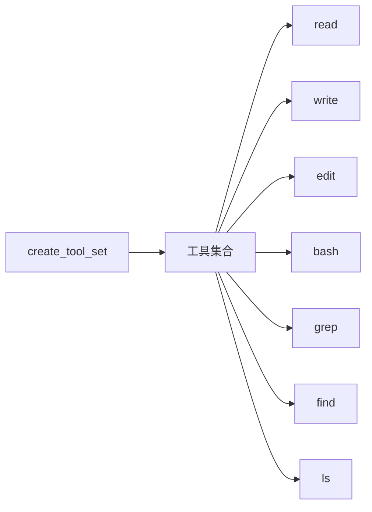

# Tool Set 工具集详解

> Tool Set 是所有文件操作工具的统一入口，提供一站式工具创建和管理。

## 1. 高层设计

### 1.1 核心功能



| 工具 | 功能 |
|------|------|
| **read** | 读取文件内容 |
| **write** | 写入文件内容 |
| **edit** | 编辑文件内容 |
| **bash** | 执行 shell 命令 |
| **grep** | 搜索文件内容 |
| **find** | 查找文件 |
| **ls** | 列出目录 |

### 1.2 工具接口

所有工具遵循统一的 `AgentTool` 接口：

```python
@dataclass
class AgentTool:
    name: str                    # 工具名称
    label: str                  # 显示标签
    description: str            # 工具描述
    parameters: dict            # JSON Schema 参数定义
    execute: Callable            # 执行函数
```

## 2. 使用方式

### 2.1 创建工具集

```python
from coding_agent.tools import create_tool_set

tools = create_tool_set("/project")
# {'read': AgentTool, 'write': AgentTool, ...}
```

### 2.2 单独创建工具

```python
from coding_agent.tools import (
    create_read_tool,
    create_write_tool,
    create_edit_tool,
    create_bash_tool,
)

read_tool = create_read_tool("/project")
write_tool = create_write_tool("/project")
```

## 3. 工具执行

### 3.1 统一执行接口

```python
result = await tool.execute(
    tool_call_id="call_1",       # 工具调用 ID
    params={"path": "file.txt"}, # 参数
    signal=abort_signal,         # 取消信号
    on_update=callback           # 进度回调
)
```

### 3.2 返回结果

```python
@dataclass
class AgentToolResult:
    content: list[Content]       # 输出内容
    details: Any                 # 详细信息
```

## 4. 扩展阅读

- [Read 工具](./03-read-tool.md) - 文件读取
- [Write 工具](./04-write-tool.md) - 文件写入
- [Edit 工具](./05-edit-tool.md) - 文件编辑
- [Bash 工具](./06-bash-tool.md) - 命令执行
- [Search Tools](./07-search-tools.md) - 搜索工具
