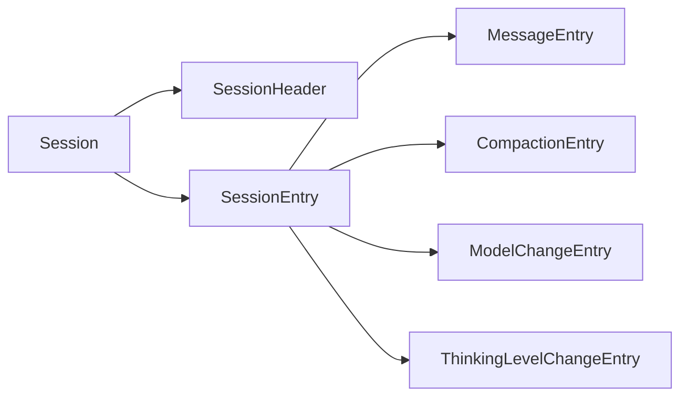

# Session Types 会话类型详解

> Session Types 定义了会话数据的核心类型，包括会话条目、头部、上下文等。

## 1. 高层设计

### 1.1 核心概念



### 1.2 条目类型

| 类型 | 说明 |
|------|------|
| **SessionMessageEntry** | 用户/助手消息 |
| **ThinkingLevelChangeEntry** | 思考级别变更 |
| **ModelChangeEntry** | 模型变更 |
| **CompactionEntry** | 上下文压缩 |

## 2. 核心类型

### 2.1 SessionEntryBase

所有条目的基类：

```python
@dataclass
class SessionEntryBase:
    type: str           # 条目类型
    id: str            # 唯一 ID
    parent_id: str | None  # 父条目 ID
    timestamp: str     # ISO 时间戳
```

### 2.2 SessionHeader

会话头部信息：

```python
@dataclass
class SessionHeader:
    id: str           # 会话 ID
    version: int      # 版本号
    timestamp: str   # 创建时间
    cwd: str         # 工作目录
```

### 2.3 会话条目

```python
# 消息条目
SessionMessageEntry(
    message={
        "role": "user|assistant",
        "content": [...],
        "timestamp": 1234567890
    }
)

# 压缩条目
CompactionEntry(
    summary="对话摘要",
    first_kept_entry_id="msg001",
    tokens_before=10000
)

# 模型变更
ModelChangeEntry(
    provider="anthropic",
    model_id="claude-3-sonnet"
)

# 思考级别变更
ThinkingLevelChangeEntry(
    thinking_level="high|medium|off"
)
```

## 3. 上下文类型

### 3.1 SessionContext

当前会话状态：

```python
@dataclass
class SessionContext:
    messages: list              # 消息列表
    thinking_level: str         # 思考级别
    model: dict                 # 当前模型
```

### 3.2 SessionInfo

会话元信息：

```python
@dataclass
class SessionInfo:
    path: str                   # 会话文件路径
    id: str                    # 会话 ID
    cwd: str                   # 工作目录
    name: str                  # 会话名称
    created: str               # 创建时间
    modified: str              # 修改时间
    message_count: int          # 消息数量
```

## 4. 配置函数

```python
def get_agent_dir() -> str           # 获取 Agent 目录
def get_sessions_dir() -> str       # 获取会话目录
def get_default_session_dir(cwd) -> str  # 获取默认会话目录
def is_valid_session_file(path) -> bool  # 验证会话文件
```

## 5. 扩展阅读

- [Session Manager](./09-session-manager.md) - 会话管理器
- [Session Parser](./10-session-parser.md) - 会话解析器
- [Session Context](./11-session-context.md) - 会话上下文
