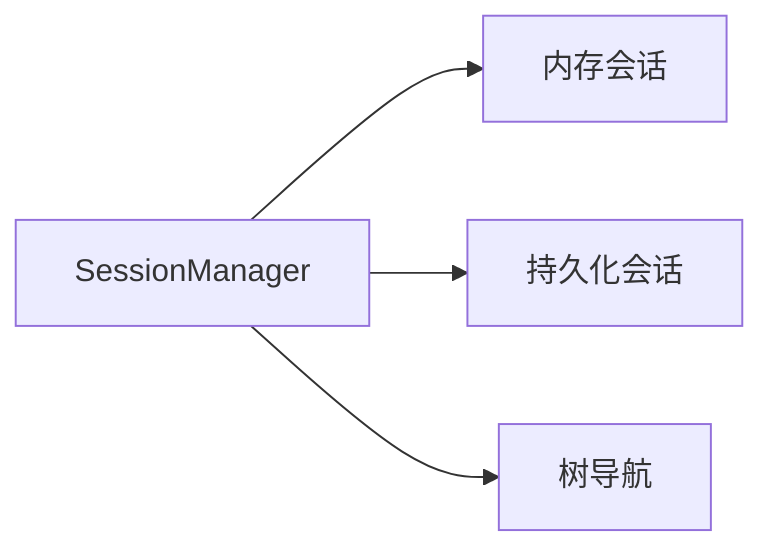
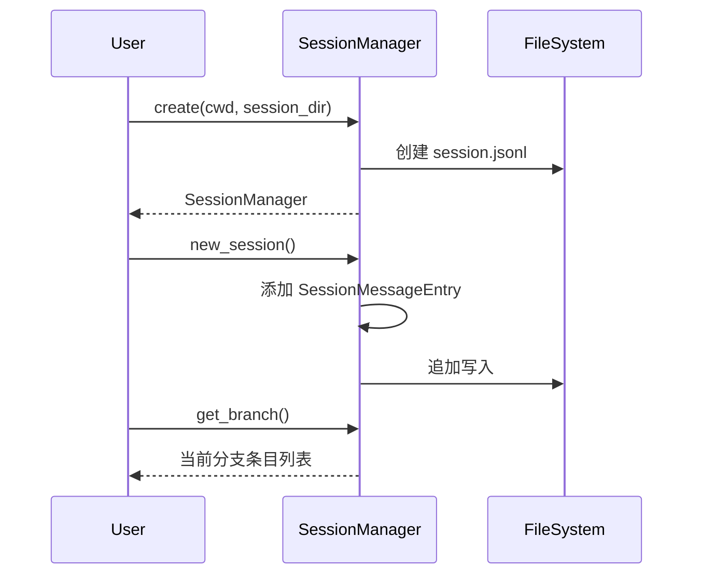

# Session Manager 会话管理器详解

> Session Manager 负责会话的创建、持久化和树形结构管理。

## 1. 高层设计

### 1.1 核心功能



| 功能 | 说明 |
|------|------|
| **内存会话** | 仅在内存中管理会话 |
| **持久化会话** | 自动保存到 JSONL 文件 |
| **树形结构** | 支持分支和时间旅行 |
| **会话打开** | 从文件加载现有会话 |

### 1.2 工作流程



## 2. 创建会话

### 2.1 内存会话

```python
from coding_agent.session import SessionManager

manager = SessionManager.in_memory("/project")
# 不持久化，仅内存管理
```

### 2.2 持久化会话

```python
manager = SessionManager.create(
    cwd="/project",
    session_dir="/sessions",
)
# 自动创建 session.jsonl 文件
```

### 2.3 打开现有会话

```python
manager = SessionManager.open("/sessions/session-123.jsonl")
```

## 3. 会话操作

### 3.1 获取信息

```python
manager.session_id      # 会话 ID
manager.session_file    # 会话文件路径
manager.session_dir     # 会话目录
manager.cwd            # 工作目录
manager.is_persisted() # 是否持久化
```

### 3.2 树导航

```python
manager.get_leaf_id()       # 获取当前叶子节点 ID
manager.get_entries()       # 获取所有条目
manager.get_branch()        # 获取当前分支
```

## 4. 新建会话

```python
path = manager.new_session(parent_session=None)
# 创建新会话，返回会话文件路径
```

## 5. 扩展阅读

- [Session Types](./09-session-types.md) - 会话类型定义
- [Session Parser](./10-session-parser.md) - 会话解析器
- [Session Context](./11-session-context.md) - 会话上下文
