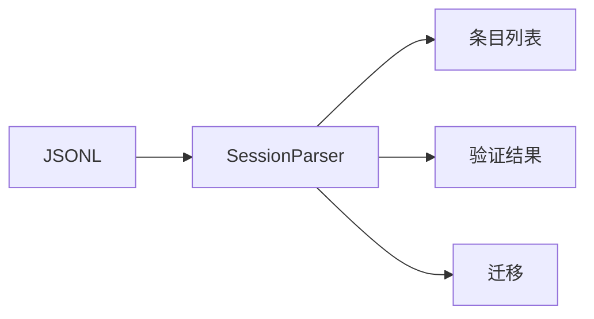

# Session Parser 会话解析器详解

> Session Parser 负责解析和验证会话 JSONL 文件，支持版本迁移。

## 1. 高层设计

### 1.1 核心功能



| 功能 | 说明 |
|------|------|
| **解析** | 解析 JSONL 为条目对象 |
| **验证** | 验证条目格式正确性 |
| **迁移** | 版本迁移支持 |

## 2. 核心函数

### 2.1 解析

```python
def parse_session_entries(content: str) -> list[SessionEntry]:
    """解析 JSONL 内容为条目列表."""
    ...
```

### 2.2 验证

```python
def is_valid_session_header(entry: dict) -> bool:
    """验证会话头部是否有效."""
    ...

def validate_session_entries(entries: list) -> list[str]:
    """验证条目列表，返回错误列表."""
    ...
```

### 2.3 迁移

```python
def migrate_session_entries(entries: list) -> bool:
    """执行版本迁移.

    Returns:
        是否发生了迁移

    """
    ...
```

## 3. JSONL 格式

```jsonl
{"type": "session", "version": 3, "id": "session-123", "timestamp": "...", "cwd": "/project"}
{"type": "message", "id": "msg001", "parent_id": null, "timestamp": "...", "message": {...}}
{"type": "thinking_level_change", "id": "think001", "parent_id": "msg001", "thinking_level": "high"}
{"type": "model_change", "id": "model001", "parent_id": "think001", "provider": "anthropic", "model_id": "claude-3"}
```

## 4. 版本迁移

当会话格式版本变化时，自动执行迁移：

```python
# v1 -> v2: 添加 id/parent_id
# v2 -> v3: 规范化字段结构

entries = parse_session_entries(content)
migrated = migrate_session_entries(entries)
# migrated = True 表示发生了迁移
```

## 5. 扩展阅读

- [Session Types](./09-session-types.md) - 会话类型
- [Session Manager](./10-session-manager.md) - 会话管理器
- [Session Context](./11-session-context.md) - 会话上下文
