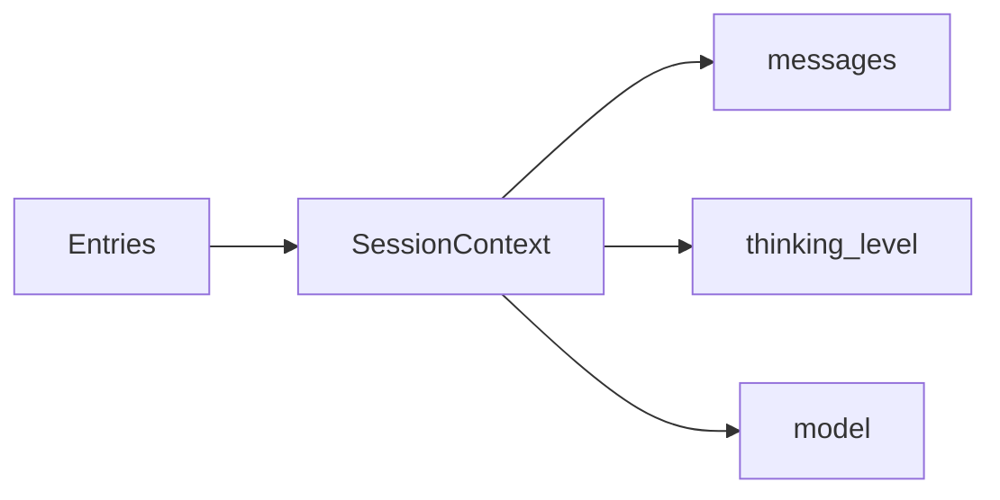
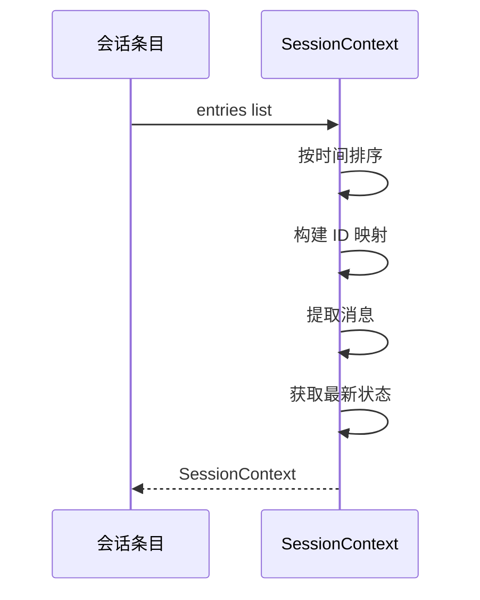

# Session Context 会话上下文详解

> Session Context 从会话条目构建 AI 所需的上下文信息。

## 1. 高层设计

### 1.1 核心功能



| 功能 | 说明 |
|------|------|
| **消息构建** | 从条目构建消息列表 |
| **状态追踪** | 当前思考级别、模型 |
| **压缩处理** | 处理压缩条目 |

## 2. 核心函数

### 2.1 构建上下文

```python
def build_session_context(
    entries: list[SessionEntry],
    leaf_id: str | None = None,
    by_id: dict[str, SessionEntry] | None = None,
) -> SessionContext:
    """从条目构建上下文."""
    ...
```

### 2.2 获取最新压缩

```python
def get_latest_compaction_entry(
    entries: list[SessionEntry],
) -> CompactionEntry | None:
    """获取最新的压缩条目."""
    ...
```

## 3. 会话上下文结构

```python
@dataclass
class SessionContext:
    messages: list              # 消息列表
    thinking_level: str        # 思考级别 (high/medium/off)
    model: dict | None         # 当前模型信息
```

## 4. 工作流程



## 5. 使用示例

```python
from coding_agent.session.context import build_session_context

# 构建 ID 映射
by_id = {e.id: e for e in entries}

# 构建上下文
context = build_session_context(
    entries=entries,
    leaf_id="msg002",
    by_id=by_id,
)

print(context.messages)
print(context.thinking_level)
print(context.model)
```

## 6. 扩展阅读

- [Session Types](./09-session-types.md) - 会话类型
- [Session Manager](./10-session-manager.md) - 会话管理器
- [Session Parser](./11-session-parser.md) - 会话解析器
