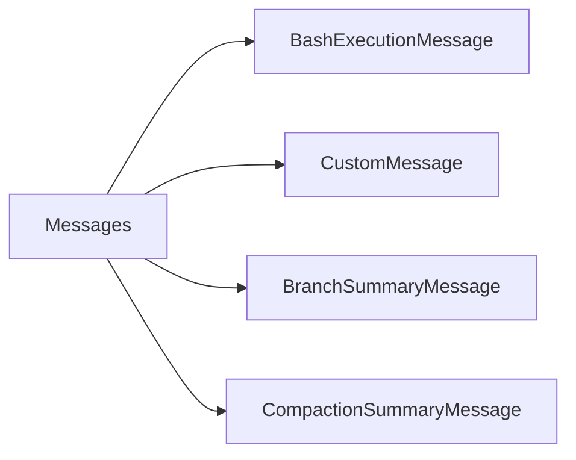

# Messages 消息处理详解

> Messages 定义了 AI 消息类型，支持 Bash 执行、摘要、自定义消息等。

## 1. 高层设计

### 1.1 消息类型



| 类型 | 说明 |
|------|------|
| **BashExecutionMessage** | Bash 命令执行结果 |
| **CustomMessage** | 自定义消息类型 |
| **BranchSummaryMessage** | 分支摘要 |
| **CompactionSummaryMessage** | 压缩摘要 |

## 2. Bash 执行消息

### 2.1 消息结构

```python
@dataclass
class BashExecutionMessage:
    command: str              # 执行命令
    output: str              # 命令输出
    exit_code: int | None    # 退出码
    cancelled: bool          # 是否被取消
    truncated: bool          # 输出是否被截断
    full_output_path: str | None  # 完整输出路径
    timestamp: int          # 时间戳
```

### 2.2 转换为文本

```python
def bash_execution_to_text(msg: BashExecutionMessage) -> str:
    """将 Bash 执行消息转换为文本."""
    ...
```

## 3. 自定义消息

### 3.1 消息结构

```python
@dataclass
class CustomMessage:
    custom_type: str           # 自定义类型
    content: str | list        # 内容
    display: bool             # 是否显示
    details: dict | None       # 详情
    timestamp: int            # 时间戳
```

### 3.2 工厂函数

```python
def create_custom_message(
    custom_type: str,
    content: str | list,
    display: bool = True,
    details: dict | None = None,
    timestamp: str | int = ...,
) -> CustomMessage:
    """创建自定义消息."""
    ...
```

## 4. 摘要消息

### 4.1 分支摘要

```python
@dataclass
class BranchSummaryMessage:
    summary: str       # 摘要内容
    from_id: str     # 起始消息 ID
    timestamp: int   # 时间戳
```

### 4.2 压缩摘要

```python
@dataclass
class CompactionSummaryMessage:
    summary: str          # 摘要内容
    tokens_before: int   # 压缩前的 token 数
    timestamp: int      # 时间戳
```

## 5. LLM 转换

### 5.1 转换为 LLM 格式

```python
def convert_to_llm(messages: list) -> list[dict]:
    """将消息转换为 LLM API 格式.

    Returns:
        符合 LLM API 的消息格式列表

    """
    ...
```

### 5.2 转换规则

| 原消息 | LLM 格式 |
|--------|----------|
| User 消息 | `{"role": "user", ...}` |
| Assistant 消息 | `{"role": "assistant", ...}` |
| BashExecutionMessage | 转为文本描述 |
| CompactionSummaryMessage | 转为带前缀/后缀的摘要 |

### 5.3 上下文排除

```python
msg = BashExecutionMessage(
    command="secret",
    output="secret output",
    exclude_from_context=True,  # 不包含在上下文中
    timestamp=5000,
)
```

## 6. 扩展阅读

- [Session Context](./12-session-context.md) - 会话上下文
- [Compaction](./21-compaction.md) - 上下文压缩
